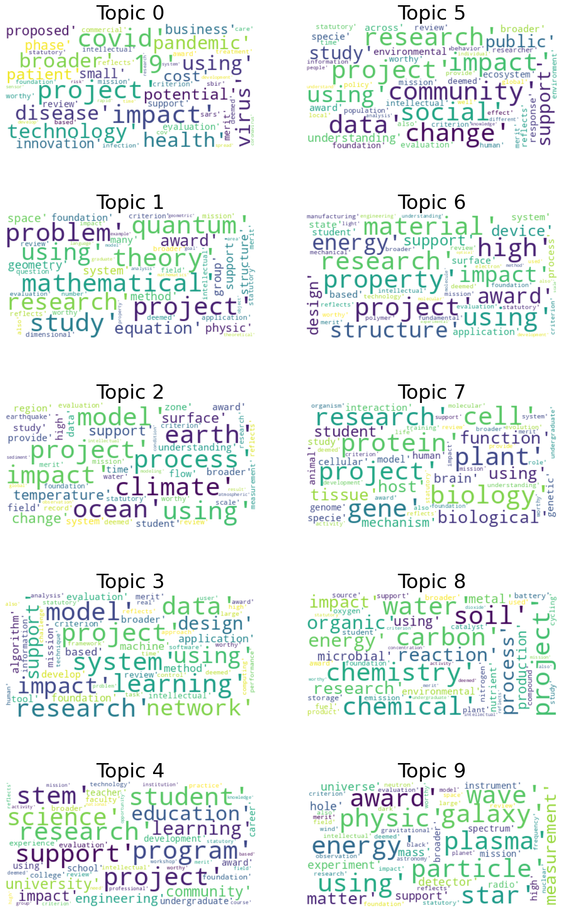

# Topic Modelling using LDA(Latent Dirichlet Allocation)

>LDA starts from a fixed number of topics. Each topic is represented as a distribution over words, and each document is then represented as a distribution over topics. Although the tokens themselves are meaningless, the probability distributions over words provided by the topics provide a sense of the different ideas contained in the documents.
>Reference: https://medium.com/intuitionmachine/the-two-paths-from-natural-language-processing-to-artificial-intelligence-d5384ddbfc18

I'll start by reading the data in from the CSV that was previously processed by another notebook.


```python
import pandas as pd
import os

abstracts_df = pd.read_csv(os.path.join('data', 'processed', 'abstracts.csv'))
# https://www.nsf.gov/awardsearch/showAward?AWD_ID=2053734&HistoricalAwards=false
abstracts_df.dropna(subset=['award_id', 'abstract'], inplace=True)
```

In NLP tasks, usually, we need to normalize the texts before processing them. My normalization process consist in: converting the text in string, convert the text to lowercase, exclude the punctuation, apply a lemmatizer, and finally remove the words with less than 3 letters.


```python
from nltk.corpus import stopwords  #stopwords
from nltk.stem import WordNetLemmatizer  # lemmatizer from WordNet
#from nltk.stem import PorterStemmer
from nltk.tokenize import word_tokenize
import nltk
nltk.download('punkt')
nltk.download('stopwords')
nltk.download('wordnet')
nltk.download('omw-1.4')
#stop-words
stop_words=set(nltk.corpus.stopwords.words('english'))


def normalize_text(text):
    # Convert to text
    normalized_text = str(text)
    # Convert to lowercase
    normalized_text = normalized_text.lower()
    # Convert the words in tokens separated by spaces and transform each word in its lemma
    # -- e.g., "criteria" -> "criterion"
    lemmatizer = WordNetLemmatizer()
    # "geocoordinates" -> "geocoordin"
    # stemmer = PorterStemmer() I avoid this because some words are cut
    word_tokens=word_tokenize(normalized_text)
    tokens=[lemmatizer.lemmatize(w) for w in word_tokens if w not in stop_words and len(w)>3]
    normalized_text=" ".join(tokens)
    return normalized_text
    
text = "National efforts to digitize natural history collections have transformed previously siloed, unstandardized resources into a networked, openly available information nexus usable to meet grand scientific and societal challenges. Despite these enormous strides, major bottlenecks in this digitization process still exist, especially in areas where automation approaches have been most challenging. In particular, capturing analog specimen data into digital format and converting text descriptions of collecting locations into mappable geocoordinates, have remained boutique efforts. Because of these bottlenecks, as many as 91% of digitized specimens are missing key elements that hamper ability to use these specimen records more effectively. This project will develop key workflows to dramatically  increase the speed at which specimen data can be captured and made available broadly to data providers and consumers.  These workflows include novel approaches that use both computer and human intelligence to advance our ability to capture specimen information.  One key workflow focuses on the challenge of automated conversion of imaged specimen labels into properly formatted and usable digital text.  Critical to the success of this workflow are human validation checkpoints that will be implemented using a popular citizen science platform, Notes from Nature.  A second workflow focuses on new tools that take advantage of previous efforts to assign mappable coordinates based on specimen collection location to automatically add such mapping information for specimens missing those data.  Finally, this effort will create tools for easy access to these new data in and out of common use databases, making the data immediately available for museum providers and researchers alike. This effort will connect public participation in science to these novel tools and technologies. Further, it will train diverse graduate students and undergraduate students in bioinformatics and museum science.&lt;br/&gt;&lt;br/&gt;This effort has three design goals that together will dramatically reduce the digitization gap in museum specimen data. The first design goal will combine machine learning methods with public participation in scientific research (PPSR) via the successful Notes from Nature (NfN) project to speed up label digitization and facilitate obtaining locality data. A key part of the first design goal utilizes supervised machine learning approaches and object character recognition (OCR) when possible but also includes “humans in the loop” using the NfN platform to gather fast quality feedback from human volunteers at key points. This approach also provides a means to create high-quality training datasets needed for improving automation steps, ultimately further reducing human effort. The second design goal will integrate locality data interpretation through GEOLocate with a Biodiversity Enhanced Locality Service (BELS), which will make it possible to look up pre-existing localities that have been georeferenced using best practices. A third goal is to connect these workflows and services to Symbiota, a community digitization hub, to allow easy inflow and outflow of content back to digitization networks. Providers will be able to easily access new data along with associated metadata about processing steps, all returned using established standards and best practices. The key to this effort will be engagement with the community, including researchers, collections staff, and Zooniverse volunteers. Engagement will focus on virtual training and working with an advisory committee in order to grow capacity and community involvement.&lt;br/&gt;&lt;br/&gt;This award reflects NSF's statutory mission and has been deemed worthy of support through evaluation using the Foundation's intellectual merit and broader impacts review criteria."
normalized_text = normalize_text(text)

print(f'Original text: {text}')
print('-------------------------------------------------------------------------------------------')
print(f'Normalized text: {normalized_text}')

normalized_abstracts = abstracts_df['abstract'].apply(normalize_text)
```

    [nltk_data] Downloading package punkt to /home/juan/nltk_data...
    [nltk_data]   Package punkt is already up-to-date!
    [nltk_data] Downloading package stopwords to /home/juan/nltk_data...
    [nltk_data]   Package stopwords is already up-to-date!
    [nltk_data] Downloading package wordnet to /home/juan/nltk_data...
    [nltk_data]   Package wordnet is already up-to-date!
    [nltk_data] Downloading package omw-1.4 to /home/juan/nltk_data...
    [nltk_data]   Package omw-1.4 is already up-to-date!


    Original text: National efforts to digitize natural history collections have transformed previously siloed, unstandardized resources into a networked, openly available information nexus usable to meet grand scientific and societal challenges. Despite these enormous strides, major bottlenecks in this digitization process still exist, especially in areas where automation approaches have been most challenging. In particular, capturing analog specimen data into digital format and converting text descriptions of collecting locations into mappable geocoordinates, have remained boutique efforts. Because of these bottlenecks, as many as 91% of digitized specimens are missing key elements that hamper ability to use these specimen records more effectively. This project will develop key workflows to dramatically  increase the speed at which specimen data can be captured and made available broadly to data providers and consumers.  These workflows include novel approaches that use both computer and human intelligence to advance our ability to capture specimen information.  One key workflow focuses on the challenge of automated conversion of imaged specimen labels into properly formatted and usable digital text.  Critical to the success of this workflow are human validation checkpoints that will be implemented using a popular citizen science platform, Notes from Nature.  A second workflow focuses on new tools that take advantage of previous efforts to assign mappable coordinates based on specimen collection location to automatically add such mapping information for specimens missing those data.  Finally, this effort will create tools for easy access to these new data in and out of common use databases, making the data immediately available for museum providers and researchers alike. This effort will connect public participation in science to these novel tools and technologies. Further, it will train diverse graduate students and undergraduate students in bioinformatics and museum science.&lt;br/&gt;&lt;br/&gt;This effort has three design goals that together will dramatically reduce the digitization gap in museum specimen data. The first design goal will combine machine learning methods with public participation in scientific research (PPSR) via the successful Notes from Nature (NfN) project to speed up label digitization and facilitate obtaining locality data. A key part of the first design goal utilizes supervised machine learning approaches and object character recognition (OCR) when possible but also includes “humans in the loop” using the NfN platform to gather fast quality feedback from human volunteers at key points. This approach also provides a means to create high-quality training datasets needed for improving automation steps, ultimately further reducing human effort. The second design goal will integrate locality data interpretation through GEOLocate with a Biodiversity Enhanced Locality Service (BELS), which will make it possible to look up pre-existing localities that have been georeferenced using best practices. A third goal is to connect these workflows and services to Symbiota, a community digitization hub, to allow easy inflow and outflow of content back to digitization networks. Providers will be able to easily access new data along with associated metadata about processing steps, all returned using established standards and best practices. The key to this effort will be engagement with the community, including researchers, collections staff, and Zooniverse volunteers. Engagement will focus on virtual training and working with an advisory committee in order to grow capacity and community involvement.&lt;br/&gt;&lt;br/&gt;This award reflects NSF's statutory mission and has been deemed worthy of support through evaluation using the Foundation's intellectual merit and broader impacts review criteria.
    -------------------------------------------------------------------------------------------
    Normalized text: national effort digitize natural history collection transformed previously siloed unstandardized resource networked openly available information nexus usable meet grand scientific societal challenge despite enormous stride major bottleneck digitization process still exist especially area automation approach challenging particular capturing analog specimen data digital format converting text description collecting location mappable geocoordinates remained boutique effort bottleneck many digitized specimen missing element hamper ability specimen record effectively project develop workflow dramatically increase speed specimen data captured made available broadly data provider consumer workflow include novel approach computer human intelligence advance ability capture specimen information workflow focus challenge automated conversion imaged specimen label properly formatted usable digital text critical success workflow human validation checkpoint implemented using popular citizen science platform note nature second workflow focus tool take advantage previous effort assign mappable coordinate based specimen collection location automatically mapping information specimen missing data finally effort create tool easy access data common database making data immediately available museum provider researcher alike effort connect public participation science novel tool technology train diverse graduate student undergraduate student bioinformatics museum science. effort three design goal together dramatically reduce digitization museum specimen data first design goal combine machine learning method public participation scientific research ppsr successful note nature project speed label digitization facilitate obtaining locality data part first design goal utilizes supervised machine learning approach object character recognition possible also includes human loop using platform gather fast quality feedback human volunteer point approach also provides mean create high-quality training datasets needed improving automation step ultimately reducing human effort second design goal integrate locality data interpretation geolocate biodiversity enhanced locality service bel make possible look pre-existing locality georeferenced using best practice third goal connect workflow service symbiota community digitization allow easy inflow outflow content back digitization network provider able easily access data along associated metadata processing step returned using established standard best practice effort engagement community including researcher collection staff zooniverse volunteer engagement focus virtual training working advisory committee order grow capacity community involvement. award reflects statutory mission deemed worthy support evaluation using foundation intellectual merit broader impact review criterion


The input for LDA is a bag of words where each document is a row and each column has the count of words in the corpus.


```python
from sklearn.feature_extraction.text import CountVectorizer

vectorizer = CountVectorizer()
vectorized_text = vectorizer.fit_transform(normalized_abstracts)
# (num_abstracts, num_words)
print(vectorized_text.shape)
```

    (13159, 43923)


```python
from sklearn.decomposition import LatentDirichletAllocation

num_topics = 10
lda_model=LatentDirichletAllocation(
    n_components=num_topics,
    learning_method='online',
    random_state=92
)

lda_topics = lda_model.fit_transform(vectorized_text)
print(lda_topics.shape)  # (num_abstracts, num_topics)
```

    (13159, 10)


After calculating the topics, we can get the top 10 words associated with each topic


```python
# Most important words for each topic
vocabulary = vectorizer.get_feature_names_out()
n_top_words = 100
topic_word_freq = {}

for index, component in enumerate(lda_model.components_):
    vocab_comp = zip(vocabulary, component)
    sorted_words = sorted(vocab_comp, key= lambda x:x[1], reverse=True)[:n_top_words]
    import_words = [x[0] for x in sorted_words]
    topic_word_freq[index] = import_words[:100]
    print(f"Topic {index}: {', '.join(import_words[:10])}")
    print("\n")
```

    Topic 0: covid, 19, project, impact, technology, health, broader, disease, using, virus
    
    
    Topic 1: quantum, theory, project, problem, mathematical, study, research, using, equation, award
    
    
    Topic 2: model, project, ocean, earth, climate, using, process, impact, temperature, change
    
    
    Topic 3: data, project, system, model, learning, research, network, using, impact, design
    
    
    Topic 4: student, research, project, stem, support, program, science, education, learning, university
    
    
    Topic 5: research, project, data, community, change, impact, social, using, study, support
    
    
    Topic 6: material, research, project, high, property, using, structure, impact, energy, award
    
    
    Topic 7: cell, protein, project, plant, research, gene, biology, biological, function, using
    
    
    Topic 8: water, carbon, chemical, soil, chemistry, project, organic, energy, process, reaction
    
    
    Topic 9: wave, physic, star, award, using, particle, plasma, galaxy, energy, matter
    
    


Sometimes, wordclouds are better to identify the topics.


```python
from wordcloud import WordCloud
import matplotlib.pyplot as plt

def generate_wordcloud(tup):
    wordcloud = WordCloud(background_color='white',
                          max_words=50, max_font_size=40,
                          random_state=42
                         ).generate(str(tup))
    return wordcloud


fig,axes = plt.subplots(5, 2, figsize=(15, 25))

for i in range(5):
    for j in range(2):
        ax = axes[i, j]
        ax.imshow(generate_wordcloud(topic_word_freq[5*j + i]), interpolation="bilinear")
        ax.axis('off')
        ax.set_title(f"Topic {5*j + i}", fontsize=30)
```


    

    


We'll reduce the dimensions of the topics to see them in a 2D graph.


```python
from sklearn.manifold import TSNE
tsne_model = TSNE(n_components=2, verbose=1)
# reduce dimension to 2 using tsne
tsne_lda = tsne_model.fit_transform(lda_topics)
```

    [t-SNE] Computing 91 nearest neighbors...
    [t-SNE] Indexed 13159 samples in 0.009s...
    [t-SNE] Computed neighbors for 13159 samples in 0.615s...
    [t-SNE] Computed conditional probabilities for sample 1000 / 13159
    [t-SNE] Computed conditional probabilities for sample 2000 / 13159
    [t-SNE] Computed conditional probabilities for sample 3000 / 13159
    [t-SNE] Computed conditional probabilities for sample 4000 / 13159
    [t-SNE] Computed conditional probabilities for sample 5000 / 13159
    [t-SNE] Computed conditional probabilities for sample 6000 / 13159
    [t-SNE] Computed conditional probabilities for sample 7000 / 13159
    [t-SNE] Computed conditional probabilities for sample 8000 / 13159
    [t-SNE] Computed conditional probabilities for sample 9000 / 13159
    [t-SNE] Computed conditional probabilities for sample 10000 / 13159
    [t-SNE] Computed conditional probabilities for sample 11000 / 13159
    [t-SNE] Computed conditional probabilities for sample 12000 / 13159
    [t-SNE] Computed conditional probabilities for sample 13000 / 13159
    [t-SNE] Computed conditional probabilities for sample 13159 / 13159
    [t-SNE] Mean sigma: 0.000000
    [t-SNE] KL divergence after 250 iterations with early exaggeration: 78.629623
    [t-SNE] KL divergence after 1000 iterations: 1.161142


```python
import numpy as np

unnormalized = np.matrix(lda_topics)
doc_topic = unnormalized/unnormalized.sum(axis=1)

lda_keys = []
for index in range(abstracts_df.shape[0]):
    lda_keys += [doc_topic[index].argmax()]

lda_df = pd.DataFrame(tsne_lda, columns=['x','y'])
lda_df['abstract'] = abstracts_df['abstract']
lda_df['award_id'] = abstracts_df['award_id']
lda_df['topic'] = lda_keys
lda_df['topic'] = lda_df['topic'].map(int)
lda_df
```


<div>
<style scoped>
    .dataframe tbody tr th:only-of-type {
        vertical-align: middle;
    }

    .dataframe tbody tr th {
        vertical-align: top;
    }

    .dataframe thead th {
        text-align: right;
    }
</style>
<table border="1" class="dataframe">
  <thead>
    <tr style="text-align: right;">
      <th></th>
      <th>x</th>
      <th>y</th>
      <th>abstract</th>
      <th>award_id</th>
      <th>topic</th>
    </tr>
  </thead>
  <tbody>
    <tr>
      <th>0</th>
      <td>-1.275147</td>
      <td>16.423231</td>
      <td>National efforts to digitize natural history c...</td>
      <td>2027234.0</td>
      <td>3</td>
    </tr>
    <tr>
      <th>1</th>
      <td>33.612213</td>
      <td>5.749017</td>
      <td>An award is made to the Natural History Museum...</td>
      <td>2018207.0</td>
      <td>4</td>
    </tr>
    <tr>
      <th>2</th>
      <td>-6.057844</td>
      <td>24.984032</td>
      <td>Current software for user authentication relie...</td>
      <td>2039373.0</td>
      <td>3</td>
    </tr>
    <tr>
      <th>3</th>
      <td>25.468138</td>
      <td>15.642528</td>
      <td>This collaborative project comprised of ten aw...</td>
      <td>2001394.0</td>
      <td>5</td>
    </tr>
    <tr>
      <th>4</th>
      <td>27.775192</td>
      <td>32.858318</td>
      <td>Cyberlearning technologies that incorporate ro...</td>
      <td>2030441.0</td>
      <td>4</td>
    </tr>
    <tr>
      <th>...</th>
      <td>...</td>
      <td>...</td>
      <td>...</td>
      <td>...</td>
      <td>...</td>
    </tr>
    <tr>
      <th>13154</th>
      <td>7.274016</td>
      <td>-32.160351</td>
      <td>Recent advances in artificial intelligence (AI...</td>
      <td>2008228.0</td>
      <td>5</td>
    </tr>
    <tr>
      <th>13155</th>
      <td>29.610926</td>
      <td>-9.462381</td>
      <td>Data visualization is a key component to disco...</td>
      <td>2006710.0</td>
      <td>4</td>
    </tr>
    <tr>
      <th>13156</th>
      <td>64.865776</td>
      <td>-51.218269</td>
      <td>The broader impact/commercial potential of thi...</td>
      <td>2035899.0</td>
      <td>2</td>
    </tr>
    <tr>
      <th>13157</th>
      <td>-38.417030</td>
      <td>-18.448893</td>
      <td>Gamma-ray astronomy impacts a broad range of k...</td>
      <td>2013109.0</td>
      <td>6</td>
    </tr>
    <tr>
      <th>13158</th>
      <td>40.571548</td>
      <td>-8.988461</td>
      <td>Controlling cell differentiation is critical w...</td>
      <td>2033997.0</td>
      <td>4</td>
    </tr>
  </tbody>
</table>
<p>13159 rows × 5 columns</p>
</div>


```python
import bokeh.plotting as bp
from bokeh.models import ColumnDataSource, HoverTool
from bokeh.plotting import show, output_notebook

output_notebook()
plot_lda = bp.figure(
    plot_width=700,
    plot_height=600,
    title="LDA topic visualization",
    tools="pan,wheel_zoom,box_zoom,reset,hover",
    x_axis_type=None, y_axis_type=None, min_border=1)


colormap = np.array(["#6d8dca", "#69de53", "#723bca", "#c3e14c", "#c84dc9", "#68af4e", "#6e6cd5",
"#e3be38", "#4e2d7c", "#5fdfa8", "#d34690", "#3f6d31", "#d44427", "#7fcdd8", "#cb4053", "#5e9981",
"#803a62", "#9b9e39", "#c88cca", "#e1c37b", "#34223b", "#bdd8a3", "#6e3326", "#cfbdce", "#d07d3c",
"#52697d", "#194196", "#d27c88", "#36422b", "#b68f79"])


source = ColumnDataSource(data=dict(x=lda_df['x'], y=lda_df['y'],
                                    color=colormap[lda_keys],
                                    abstract=lda_df['abstract'],
                                    topic=lda_df['topic'],
                                    award_id=lda_df['award_id']))

plot_lda.scatter(source=source, x='x', y='y', color='color')
hover = plot_lda.select(dict(type=HoverTool))
hover.tooltips={"abstract":"@abstract",
                "topic":"@topic", "award_id":"@award_id"}
show(plot_lda)
```


<div class="bk-root">
        <a href="https://bokeh.org" target="_blank" class="bk-logo bk-logo-small bk-logo-notebook"></a>
        <span id="1002">Loading BokehJS ...</span>
    </div>


<div class="bk-root" id="84e0a9cd-1668-4c2c-9136-b9b7c1f70b68" data-root-id="1003"></div>


I'll use the `pyLDAvis` library to expand the interpretation of the topics via an interactive tool.


```python
def prepareLDAData():
    data = {
        'vocab': vocabulary,
        'doc_topic_dists': doc_topic,
        'doc_lengths': list(lda_df['len_docs']),
        'term_frequency':vectorizer.vocabulary_,
        'topic_term_dists': lda_model.components_
    } 
    return data

import pyLDAvis

lda_df['len_docs'] = abstracts_df['abstract'].apply(lambda x: len(word_tokenize(x)))
ldadata = prepareLDAData()
pyLDAvis.enable_notebook()
prepared_data = pyLDAvis.prepare(**ldadata)
pyLDAvis.display(prepared_data)
```


<link rel="stylesheet" type="text/css" href="https://cdn.jsdelivr.net/gh/bmabey/pyLDAvis@3.4.0/pyLDAvis/js/ldavis.v1.0.0.css">


<div id="ldavis_el204555140239936620352320547094" style="background-color:white;"></div>
<script type="text/javascript">

var ldavis_el204555140239936620352320547094_data = {"mdsDat": {"x": [0.29028237665716383, 0.22873093641106887, 0.17831187507159255, 0.083382433338715, -0.024609207636427873, -0.02905583469680633, -0.07512897123773511, -0.04294039831610581, -0.24737060984184192, -0.36160259974962333], "y": [-0.01331537324392721, -0.04993805132312593, 0.023200064023664126, -0.006196195759704085, -0.03489698780783577, 0.18451248096915068, -0.17768153418701374, 0.02993722762347635, 0.17642692563022802, -0.1320485559249126], "topics": [1, 2, 3, 4, 5, 6, 7, 8, 9, 10], "cluster": [1, 1, 1, 1, 1, 1, 1, 1, 1, 1], "Freq": [19.566425617943967, 19.56208029763561, 14.406916408628332, 12.533372957023046, 7.760023469195768, 6.9915201345933475, 6.3828394960388115, 6.075405902605166, 3.8117417686640525, 2.909673947671907]}, "tinfo": {"Term": ["student", "stem", "data", "learning", "material", "education", "program", "teacher", "community", "science", "engineering", "network", "university", "faculty", "algorithm", "cell", "machine", "college", "social", "design", "research", "technology", "system", "change", "career", "professional", "application", "software", "covid", "19", "instructor", "session", "technician", "district", "instructional", "learner", "graduation", "alliance", "pursuing", "noyce", "curricular", "achievement", "frontera", "talented", "iuse", "attend", "ethic", "hbcus", "introductory", "pedagogy", "competency", "hbcu", "belonging", "committee", "drk", "grfp", "poster", "talent", "prek", "earn", "faculty", "teacher", "stem", "college", "leadership", "retention", "professional", "conference", "scholarship", "symposium", "meeting", "teaching", "academic", "inclusive", "workshop", "student", "mentor", "skill", "education", "institution", "career", "program", "university", "workforce", "school", "experience", "mathematics", "classroom", "science", "participation", "engineering", "participant", "practice", "course", "research", "undergraduate", "support", "project", "development", "community", "learning", "impact", "award", "national", "technology", "field", "evaluation", "foundation", "using", "broader", "review", "intellectual", "robot", "wireless", "privacy", "inference", "estimation", "algorithmic", "guarantee", "automatically", "reinforcement", "server", "query", "latency", "scheduling", "controller", "kernel", "processor", "adversarial", "trustworthy", "abstraction", "fairness", "workload", "crowd", "cryptographic", "graphical", "semantic", "github", "runtime", "adversary", "compiler", "principled", "hardware", "software", "traffic", "intelligent", "autonomous", "node", "algorithm", "verification", "machine", "text", "user", "task", "grid", "internet", "optimization", "secure", "attack", "intelligence", "distributed", "vehicle", "code", "error", "real", "data", "system", "domain", "network", "security", "neural", "model", "application", "performance", "memory", "power", "efficient", "learning", "tool", "framework", "computing", "method", "design", "technique", "project", "control", "information", "large", "based", "using", "develop", "time", "research", "impact", "foundation", "evaluation", "support", "broader", "approach", "mission", "intellectual", "merit", "criterion", "review", "statutory", "deemed", "reflects", "ecological", "forest", "ecology", "biodiversity", "coral", "habitat", "drought", "reef", "freshwater", "archaeological", "flood", "microbiomes", "governance", "predator", "invertebrate", "farmer", "neon", "stressor", "dispersal", "fishery", "wildlife", "hydrology", "geo", "taxon", "reproduction", "urbanization", "desert", "larval", "biogeochemistry", "herbarium", "hurricane", "arctic", "political", "specimen", "housing", "extinction", "bird", "conservation", "ecosystem", "tree", "food", "resident", "specie", "environmental", "land", "social", "crop", "change", "resilience", "coastal", "disaster", "crisis", "fire", "policy", "urban", "response", "history", "population", "collection", "public", "global", "community", "whether", "risk", "people", "study", "influence", "data", "across", "natural", "understanding", "research", "effect", "impact", "local", "project", "climate", "using", "researcher", "human", "support", "award", "environment", "broader", "foundation", "mission", "evaluation", "reflects", "review", "deemed", "worthy", "intellectual", "statutory", "criterion", "polymer", "semiconductor", "plastic", "nanoparticles", "nanoscale", "nano", "alloy", "printing", "photonic", "nanomaterials", "silicon", "tunable", "microscope", "ceramic", "nanoparticle", "coating", "harvesting", "metallic", "manufacture", "nanostructures", "photonics", "perovskite", "phage", "hydrogel", "dna", "graphene", "polymeric", "voltage", "entanglement", "nanometer", "film", "defect", "optical", "additive", "fabrication", "electron", "molecule", "mechanical", "atomic", "spin", "liquid", "thin", "atom", "composite", "membrane", "material", "assembly", "fiber", "crystal", "solid", "charge", "property", "thermal", "electronic", "metal", "manufacturing", "magnetic", "light", "molecular", "structure", "surface", "energy", "particle", "device", "characterization", "chemical", "fundamental", "high", "experimental", "research", "structural", "phase", "application", "state", "using", "design", "project", "process", "award", "impact", "support", "based", "system", "technology", "broader", "foundation", "student", "intellectual", "merit", "evaluation", "mission", "earthquake", "rock", "seismic", "mantle", "plate", "circulation", "magma", "subduction", "melt", "volcanic", "glacier", "ice", "volcano", "slip", "antarctic", "tectonic", "eruption", "geologic", "glacial", "melting", "turbulent", "antarctica", "tectonics", "geochemistry", "sedimentary", "eddy", "convection", "vortex", "anisotropy", "convective", "shallow", "crust", "sediment", "dust", "zone", "atmospheric", "oceanic", "sheet", "earth", "ocean", "atmosphere", "aerosol", "continental", "precipitation", "fault", "climate", "flux", "temperature", "isotope", "record", "flow", "surface", "region", "model", "wave", "observation", "water", "process", "measurement", "change", "project", "using", "understanding", "impact", "high", "study", "support", "provide", "field", "broader", "time", "data", "student", "system", "award", "scale", "patient", "sbir", "corps", "hospital", "vaccine", "infected", "symptom", "sars", "sttr", "disinfection", "surgical", "cardiac", "cov", "illness", "clinic", "clinician", "infection", "smoke", "antibody", "complication", "nursing", "physician", "diabetes", "sterilization", "coronavirus", "leakage", "rt", "breast", "ultrasonic", "cov2", "respiratory", "virus", "covid", "19", "viral", "care", "mask", "infectious", "outbreak", "disease", "clinical", "immune", "treatment", "therapy", "commercial", "business", "pandemic", "spread", "health", "drug", "innovation", "medical", "cost", "small", "phase", "technology", "healthcare", "potential", "impact", "proposed", "broader", "project", "using", "rapid", "merit", "review", "intellectual", "evaluation", "support", "criterion", "mission", "deemed", "worthy", "reflects", "equation", "geometric", "algebraic", "topological", "algebra", "symmetry", "invariant", "conjecture", "manifold", "combinatorial", "polynomial", "modulus", "combinatorics", "singularity", "harmonic", "asymptotic", "curvature", "arithmetic", "theorem", "string", "singular", "knot", "symplectic", "qubits", "hyperbolic", "sponsoring", "homotopy", "regularity", "functions", "infinite", "chiral", "classical", "quantum", "geometry", "mathematical", "nonlinear", "theory", "random", "curve", "topology", "dynamical", "approximation", "dimensional", "problem", "differential", "physic", "finite", "space", "object", "numerical", "theoretical", "study", "language", "phenomenon", "question", "structure", "project", "number", "many", "group", "method", "award", "using", "field", "research", "system", "foundation", "application", "support", "broader", "criterion", "reflects", "deemed", "statutory", "worthy", "gene", "signaling", "muscle", "microbiome", "phenotype", "organ", "bone", "metabolic", "primate", "neuron", "mutation", "lineage", "crispr", "mammalian", "chromosome", "genetically", "limb", "conserved", "chromatin", "hormone", "epigenetic", "extracellular", "vesicle", "nervous", "drosophila", "transcriptional", "neuronal", "stimulation", "intracellular", "methylation", "genome", "receptor", "genetic", "tissue", "mouse", "brain", "genomic", "genetics", "sequencing", "cellular", "cell", "protein", "bacteria", "bacterial", "expression", "enzyme", "organism", "plant", "biological", "evolutionary", "host", "animal", "biology", "function", "molecular", "evolution", "mechanism", "specie", "project", "interaction", "research", "using", "human", "life", "study", "understanding", "student", "model", "training", "also", "system", "impact", "award", "methane", "electrochemical", "oxidation", "drinking", "lithium", "electrolyte", "phytoplankton", "redox", "sulfur", "carbonate", "pfas", "mercury", "cycling", "nitrate", "geotraces", "sulfide", "ms", "solute", "photosynthetic", "flame", "sequestration", "diatom", "fertilizer", "soluble", "bloom", "peatlands", "li", "zinc", "rdoc", "anion", "contaminant", "carbon", "nitrogen", "biogeochemical", "dissolved", "combustion", "dioxide", "fuel", "organic", "soil", "water", "oxygen", "reactivity", "nutrient", "iron", "catalyst", "reaction", "hydrogen", "chemical", "waste", "compound", "chemistry", "battery", "salt", "emission", "microbial", "concentration", "production", "energy", "metal", "process", "storage", "project", "environmental", "impact", "plant", "using", "research", "product", "broader", "student", "star", "galaxy", "universe", "detector", "gravitational", "neutron", "dark", "astronomy", "neutrino", "telescope", "astrophysics", "cosmic", "ligo", "stellar", "astronomical", "relativity", "merger", "einstein", "gamma", "astrophysical", "tornado", "disk", "astronomer", "quark", "relativistic", "magnetosphere", "dwarf", "galactic", "collider", "boson", "plasma", "hole", "wave", "radio", "nuclear", "wind", "gravity", "physic", "matter", "planet", "mass", "particle", "instrument", "spectrum", "measurement", "black", "frequency", "experiment", "energy", "award", "using", "observation", "high", "support", "mission", "broader", "also", "research", "impact"], "Freq": [25641958448.0, 11296804679.0, 21724013509.0, 13235035006.0, 7796035743.0, 9066027704.0, 12555801786.0, 5191849155.0, 11182656447.0, 14235757843.0, 7477310349.0, 8457617743.0, 7173216789.0, 3781248749.0, 4234467116.0, 2393669431.0, 3924526265.0, 3779692302.0, 4742519691.0, 8225403377.0, 36254779176.0, 8052059823.0, 14883841235.0, 6371987529.0, 4760045019.0, 3399305961.0, 6295199225.0, 3126400571.0, 1819301020.0, 1790755281.0, 804258162.7514043, 756668678.4966913, 713444523.8349686, 659603236.7815664, 653904265.3068733, 622696507.7409495, 562258014.9790957, 477320456.25414103, 459904423.6183215, 429076576.2578936, 415228440.00140357, 396806630.21890175, 384151137.46748304, 341354137.4641661, 321839480.7903997, 319278929.04193765, 307427684.1895658, 292884849.920735, 289880410.6292821, 275832432.48073, 270079689.0197784, 257765326.84587297, 247480333.63280585, 224118014.04630834, 223996820.25263616, 218720520.99052706, 213157174.13561994, 211194333.295861, 210171768.07892403, 203134877.0776033, 3770292339.4181085, 5150741307.764714, 11032961654.85451, 3721719591.5244446, 974813822.3403305, 1310553154.9713788, 3325010825.832767, 2439770126.4041333, 805622652.7141169, 407291874.4472262, 1363988134.180446, 2515997132.6768456, 2367846761.739517, 745752534.6146573, 3090898448.217417, 21782048230.572834, 1054552215.9548036, 2593409008.1123414, 7988323427.212166, 3178521297.1188145, 4251256462.3000755, 10423649034.60205, 6103507527.537507, 2543015068.6315913, 4804604849.041359, 4089133640.862776, 2083205424.280473, 1258322378.2742176, 10165368267.114517, 2538232633.229086, 5569470867.152206, 2079301393.3571455, 3377185219.239941, 3066942390.49925, 17501822629.977005, 4327695322.729241, 10531911459.059671, 15483228122.757385, 5524777204.426308, 5835488601.092035, 6325658480.17681, 5622066653.047391, 4504675561.259771, 2863743862.6032143, 3460359352.1548524, 3234609838.9911036, 3863047206.6846604, 3801586823.444246, 4113972313.4483385, 3705253873.141016, 3409833633.7722197, 3402526886.7095804, 1812062485.57325, 1414577824.9582646, 1218309954.4889257, 939968778.8595624, 523816174.30357385, 460581957.4535955, 450466597.41738325, 418379858.93483984, 321206861.2862202, 283723236.35017455, 283099498.12364143, 257923957.7359188, 240895406.79646164, 222492217.36207584, 221193124.6858996, 220905102.10145688, 201897896.58503428, 198539969.49349654, 198101507.67650253, 196927693.5145223, 191684084.76357526, 187503186.32482323, 166541475.3152659, 155885625.6684801, 147513369.1872349, 146973307.94679368, 144394802.4600601, 141476913.51797384, 139600493.4231741, 135604938.7652352, 1455588588.0364316, 3060870935.132753, 551379366.723487, 496471813.1987937, 785791493.4220386, 526194802.2739687, 4094523269.749908, 356779554.2186242, 3775661525.886839, 382974760.31426364, 2911895665.760265, 2277244352.716683, 610733590.2596728, 869635648.5811621, 1678821721.9461339, 699141528.438908, 621126436.5527208, 1314383901.2915115, 1133934885.0241113, 1091972105.8968198, 1040666525.7718059, 690123182.624658, 2313413504.8345375, 14488776050.238647, 10131387703.999485, 1454351048.761411, 5943059154.98988, 1901449775.391775, 1048747907.0173087, 7632725767.082808, 4100886346.384802, 2746728701.458333, 1068766886.9293267, 1759755460.725201, 1657362478.1595886, 6900093204.900433, 3382010299.587813, 2604740322.610913, 2568155413.9701366, 3824837165.4932523, 4334244957.47224, 2713798767.7655096, 12422617928.31565, 2462049171.83637, 3158301900.8938537, 2630855110.2848024, 3807243813.9625516, 5138413057.492781, 3512472969.5391545, 2964219372.5791516, 6480344452.325447, 4731335981.408175, 3725251237.324233, 3591887345.22032, 4152142966.620868, 3549530809.7019105, 2996999733.673234, 3310059359.1442475, 3281817961.7614007, 3228851898.0153217, 3192210425.8349013, 3154342316.1631083, 3111669896.158814, 3107653142.754879, 3096419340.9552646, 1033235340.61479, 803383812.6495838, 678243537.1327398, 586909618.3723348, 502397296.962828, 501597404.1766339, 339018190.8296465, 321941253.2861329, 268077838.2848707, 206419144.1411441, 238058430.60122406, 201321240.20068192, 184736375.9401706, 171622818.03550008, 165177185.39564645, 164491498.17705587, 161927171.74373704, 161542386.23622283, 147662604.375033, 146137510.96180862, 144258796.4590148, 132694713.44786978, 127567739.77422018, 127158561.33914068, 124681423.97176088, 108771209.5596691, 108160574.03491426, 104551607.96827777, 103618341.58589938, 101160721.96179985, 369120506.01201296, 1065975878.9257394, 296181774.63581026, 639153140.0646316, 239082996.03146213, 272356519.86426073, 258020710.64618084, 376052529.78387374, 1825179924.1401842, 685740951.1368684, 1002885210.657801, 288479238.8968937, 1865362887.1760614, 2223110069.4483066, 605157054.392812, 3286115897.1755934, 426424147.3066737, 4084099898.6858435, 809357749.7356924, 671089169.7910241, 574624039.5841392, 487371598.41138005, 490951801.066813, 1496296960.8185828, 802362260.5778848, 1830159475.0795274, 754915120.7822783, 1694712246.6416738, 1142371177.4868224, 2307386634.1875377, 1370070009.4991875, 4200367192.6390777, 948960551.3313581, 1142726990.4181063, 1245889276.7736702, 2826526023.5094604, 1018538635.5960083, 4572559294.382052, 1942876509.9611256, 1170105632.9348202, 2271917557.2431474, 5261240703.70831, 1401467062.8195152, 3534486435.5832243, 1369747526.7651443, 5095116997.399073, 1168880450.4259217, 2829240203.962869, 1686274416.3033762, 1551645332.108095, 2603671712.7903194, 2180742386.0979095, 1498687958.9062529, 1928755658.2551754, 1806752643.0204442, 1761085670.8690016, 1768487698.3937638, 1716912177.169162, 1715017394.2474105, 1703865783.9057014, 1703120194.914084, 1708250710.199969, 1696695060.5408268, 1696600735.0646005, 1251765226.1356432, 447093435.02015436, 424023125.4193596, 406432382.42595327, 355157325.84401745, 343253644.70108116, 281257135.2012249, 271902708.9249998, 211387925.41445592, 208364401.27138227, 251732763.41892514, 193146060.91238153, 191921483.62764916, 182601001.6165303, 170937996.1191873, 447833602.8747363, 151208110.80441946, 149125270.694866, 148053528.43042615, 140878589.36653125, 138858080.70903432, 124956137.99117984, 119054562.758898, 118547557.47685847, 118376001.44282602, 166048905.3540898, 117867242.37488194, 180106602.43277735, 122118735.011498, 112863490.73150013, 472392346.70978403, 429803112.7947136, 987145629.0893042, 334245438.7779468, 459185461.39545757, 1148362416.6783953, 1071079918.0548788, 1207644462.3474538, 461027235.7392944, 500862280.42419297, 658011611.7862482, 361554866.3836627, 447467189.3720966, 404368101.9333313, 745696079.0700135, 6168616126.629107, 522566559.82164556, 310249820.84058225, 523270970.2526017, 700647647.9824332, 389633479.82933956, 2502427359.074811, 754273380.8583006, 690980710.69971, 835228294.3726099, 1396192770.3361745, 664168467.7185135, 1095877066.7902787, 1012994656.4967091, 2237918100.366994, 1406666202.1725638, 1797645094.601114, 870165063.5312158, 1667159149.7210474, 627649135.2038165, 916182103.28639, 1389082656.074555, 2526779033.734068, 1012401462.3384309, 4592001149.978522, 726748753.1433729, 984999375.95629, 1562309425.0642326, 1530418251.5207052, 2322143399.7635136, 1647746999.312606, 2826257627.382544, 1433148380.2532666, 1769302859.1469145, 1844825939.932746, 1719622157.9571693, 1402318382.9567435, 1441214647.7621613, 1260804810.323329, 1348102244.1006973, 1299946694.1763663, 1401943514.3131666, 1257154846.0959134, 1242297986.9826717, 1245860941.6642578, 1222024359.8276558, 490563973.1841518, 397249631.70683444, 368346633.2940888, 326441399.6045283, 278768856.0642176, 256186777.84817213, 235303097.3150499, 220981151.6358416, 200100892.49142432, 187229445.37342352, 182468178.15946043, 178395249.2047002, 161416957.65066412, 158084006.62607023, 278587089.63322884, 156414791.7549582, 149320165.60281065, 142444794.37704435, 137162371.71991774, 109980049.14962308, 138039611.11479214, 97421502.75153689, 91974062.87581259, 84432943.47850041, 82297077.01767108, 80515991.55359383, 77034879.60815229, 73801835.95437145, 72287430.41836663, 71175962.17568842, 104162049.75200851, 160518622.63924766, 445744844.71314317, 148545350.89346898, 593842901.4942569, 425040876.08328897, 161580482.3095451, 331521170.6227366, 1072604720.31074, 1244942857.9746196, 349580879.3041445, 268542123.35220146, 215999306.40642834, 200830466.77440965, 324618421.9866887, 1005700054.1490376, 242052962.03094915, 738509224.6385598, 240648591.88821062, 485864574.30399525, 598340228.2071068, 679164889.8352863, 581115216.187678, 1319774683.9699771, 355962619.00159097, 424396430.28024346, 484880051.7486327, 773551794.0721997, 453857436.1335854, 700913816.5719409, 1288251777.5779688, 848015019.4176286, 643268019.0184084, 738530488.230529, 601564967.7675016, 574008926.9255844, 675786644.915627, 546830801.1464449, 523727173.5377794, 575477026.146615, 505587298.2633888, 561430168.0028133, 566623359.7490569, 531713565.82606083, 515128851.60736597, 483234347.23327595, 648067011.9607487, 446264771.8683682, 254466239.4669306, 206076355.23161632, 150817326.05676958, 117144643.16455388, 98794132.50775799, 509816675.7893826, 82266793.7397192, 66693341.444955766, 65985803.20571805, 60077724.608777225, 447123164.1462279, 53311703.88446234, 52920840.9120012, 52862418.98705879, 479604250.9450579, 50541441.642328784, 141493531.4383091, 49976046.563818686, 49263003.6209131, 43545426.49556535, 42573342.077877976, 41355205.81475425, 360794555.14766645, 36395957.7185052, 33909874.824978404, 33254767.194339834, 31755817.269547362, 59707148.37770185, 126627473.30171832, 799004235.4793031, 1703700996.5569265, 1664499719.894555, 333104449.7236264, 457419965.8505123, 151749246.41726452, 188575449.0956168, 236004863.46333212, 893386093.9710507, 240736670.30371773, 198368694.13443497, 468435646.71120244, 150607686.86335683, 518933041.1672227, 602811268.3225199, 766828457.0406238, 389909027.0425402, 1039597701.1992238, 290756414.87116736, 628813140.271551, 343463416.6907509, 641130475.9616787, 593516133.3594773, 617547101.0841892, 1117990259.280906, 276274183.61346745, 688832874.4884907, 1254134288.5219853, 619981259.9901992, 1021418642.4945873, 1541828987.3713999, 839387747.1450349, 392510100.7470568, 539913180.8262405, 537759808.3186977, 531337764.168805, 535192841.8848395, 562463824.2371309, 522148370.0278951, 512932913.6889949, 511734214.364871, 511184420.113183, 511166439.04650587, 518498886.66033614, 288168385.5356854, 253970300.83775628, 243586854.09010702, 235011222.347339, 154847646.7499581, 128948398.11694449, 127423137.92641528, 106983026.01774263, 96710630.68999054, 89062928.5773771, 75315370.07522166, 64063667.208750024, 63699387.155519985, 62942567.9152621, 61547959.7212103, 61547175.82241765, 57448907.37910858, 53997867.45379372, 53877684.27330052, 52354690.2486225, 43766226.836892344, 43131850.15954601, 43943039.30766717, 40332470.9215151, 40063268.36356189, 39701723.80704221, 37785293.324966095, 36713672.746055596, 36483176.879544474, 37443780.09925591, 213954163.7876447, 1391152739.747125, 486894955.73125356, 762354062.4049598, 229636183.3141712, 1352787300.3152518, 191546764.36202225, 93373735.38424608, 184131113.63626784, 148370164.0345936, 117086002.43287776, 394337958.976019, 955959071.6528614, 181530722.1229282, 449597952.7314474, 127097858.5760813, 437468717.62343377, 279652015.52649045, 219295926.2434609, 337895724.15432626, 729029025.1863745, 299444516.2151339, 219592448.05854842, 397808436.7258897, 464957670.5680452, 1174748939.384407, 354670540.45968986, 406466717.1584407, 420326894.47897846, 438935982.99726874, 507988399.1571419, 521602208.03845793, 391478204.97827995, 561157732.6115432, 449307297.19118255, 418349734.0590894, 374015989.7386434, 420139627.4838759, 392075511.38837415, 378076184.604757, 373919907.2830099, 373439549.2442663, 373066059.3539248, 373040976.05584985, 660612148.7293652, 177224172.10713005, 165803820.6447352, 170335340.44242844, 140569736.83840522, 115614421.59063286, 106105844.6055217, 123602172.81160113, 90883785.07306643, 89888284.19340175, 89485579.91413663, 69801078.2816348, 68011458.9042569, 62144878.441420205, 53000913.62628057, 50938250.07803328, 49624337.08914013, 49485356.79375358, 49333071.08445248, 48324239.80514251, 45431467.81224359, 45039623.57978094, 45010868.701443404, 42186559.72511027, 39830979.21234331, 39720505.09996752, 39635017.86603669, 38890151.420919724, 38106525.09568414, 36000651.21673592, 386970421.6257924, 118456077.36230794, 401175805.2733812, 523021897.947554, 69215067.45327565, 438210132.2955051, 177295088.32127988, 96067980.26345493, 143590792.11889014, 394980397.29545707, 1788526237.4570382, 924795033.2918851, 237698115.40217286, 180076498.45828724, 254845578.99846354, 190954663.3232465, 304506893.25489724, 716777270.4040306, 649662771.0499817, 267113635.77090967, 468244156.3429009, 397134696.0429924, 656148483.0131276, 605315914.6725268, 375832558.4774418, 314722378.8117951, 460637065.7605666, 424128165.99527353, 907270870.1221235, 396110712.997002, 716013850.9436038, 560660543.5971501, 402086080.75726396, 308936979.5969683, 410497912.5612884, 380424397.0198915, 467053010.9756803, 405414755.2230098, 328923731.4824621, 328362226.9644835, 335567632.51852816, 330557245.3145206, 329416883.0865473, 90968658.80256332, 88302199.5512399, 64543623.82949756, 53761721.56612139, 50646376.49762843, 49302469.86092881, 60412189.00435298, 47137308.44255762, 47050938.75171102, 44492319.83648484, 44273352.03939368, 47711682.003591664, 117182320.48855671, 34161871.43452321, 27693174.462030362, 25400124.531621538, 24985860.02985123, 24859188.26503485, 25474569.51365751, 24012826.023691792, 23777600.98931365, 23107565.06421382, 23100443.620539293, 21529965.785426594, 21469942.372757178, 21272277.66019711, 19731607.62153683, 19710804.513851658, 19453685.50783118, 18151215.49162375, 49053343.09260381, 597069956.6302232, 135679263.0967068, 82839668.46094055, 68516397.848408, 51591975.14767375, 111546383.38242584, 131996824.8190297, 298097288.0970762, 365245628.61734915, 889733285.7231191, 145114040.6236022, 49445401.93363408, 151899451.5374176, 94606867.79188323, 127467962.03344598, 254858778.40971923, 89618723.08708622, 490869614.4685749, 96237842.81716678, 128104417.48502703, 335592807.44765115, 149320628.03890255, 74766210.50618887, 128122378.69417071, 177241135.60710782, 115041797.53326915, 190735842.99568966, 294023265.37882143, 174420312.08616096, 282758882.0321479, 141579026.17093295, 310258409.5610372, 171742870.1067596, 213490901.9135547, 137021683.15366805, 196643704.27019125, 199024996.1267168, 127261925.62650856, 140738438.78482795, 135467917.0810873, 161217392.1121234, 111231030.5355241, 96952677.70988613, 95980964.042326, 89055065.05985372, 77528834.97966902, 71637319.50946422, 68813029.33444604, 60184310.738330305, 56065160.12928885, 52429367.79295114, 44074316.31925839, 37284497.216142155, 32338552.306721203, 30418929.45365456, 28802113.976403993, 26904680.45714114, 25544765.802183542, 23215913.25710552, 21816072.61439756, 21767218.98722439, 20378195.33146502, 19624210.7318401, 19606362.890948527, 18666905.282758098, 18288635.82607866, 17676271.2581545, 16885711.023781728, 15068504.726918375, 14575855.162672933, 120477139.1666327, 95373200.96646063, 221914230.5904348, 91874036.68407083, 70618374.54526679, 88540771.98482952, 49046510.58525755, 200137445.06983483, 111075753.68803577, 63266478.42531882, 98485449.02778904, 121568717.12093194, 91095481.35562646, 93716138.48117588, 109970374.94134223, 86987218.05866893, 78397886.63821262, 99193544.62909189, 111078001.59792608, 138906285.71141967, 126042044.9544977, 80432429.07875496, 92456818.08791603, 99187504.56114246, 93170469.14038995, 89671109.21819848, 84798081.66180122, 86548925.64104937, 81574113.49518721], "Total": [25641958448.0, 11296804679.0, 21724013509.0, 13235035006.0, 7796035743.0, 9066027704.0, 12555801786.0, 5191849155.0, 11182656447.0, 14235757843.0, 7477310349.0, 8457617743.0, 7173216789.0, 3781248749.0, 4234467116.0, 2393669431.0, 3924526265.0, 3779692302.0, 4742519691.0, 8225403377.0, 36254779176.0, 8052059823.0, 14883841235.0, 6371987529.0, 4760045019.0, 3399305961.0, 6295199225.0, 3126400571.0, 1819301020.0, 1790755281.0, 804770755.9994293, 757181480.7516216, 713957167.5000029, 660115861.3254141, 654416982.2924677, 623209209.0817472, 562770590.7200259, 477833096.81973785, 460417138.2110379, 429589139.8576045, 415741083.97904223, 397320906.3176398, 384663716.9040968, 341866733.1224476, 322352053.13422, 319791635.0988747, 307940507.0730926, 293397494.7782701, 290393056.49582046, 276345053.54999995, 270592332.3247673, 258277954.988522, 247992956.38943705, 224630685.50240183, 224509395.1819457, 219233082.9044445, 213669794.93635297, 211706982.54699838, 210684341.28814274, 203647520.83634672, 3781248749.5261183, 5191849155.46187, 11296804679.708422, 3779692302.5735974, 980997395.9992229, 1323378706.9690983, 3399305961.997072, 2486699825.0034795, 819223453.3318943, 410075783.6792922, 1411664076.0027816, 2645640131.2290964, 2492768847.73698, 765706717.2375574, 3329077821.7673874, 25641958448.760098, 1097762258.9624422, 2805966295.6641946, 9066027704.023125, 3502920413.110262, 4760045019.256006, 12555801786.246672, 7173216789.581231, 2875225111.3308473, 5840278760.78848, 4941646122.982312, 2366666403.4932656, 1356004763.955791, 14235757843.762737, 3014394746.0675282, 7477310349.000459, 2409548144.827299, 4227515267.980651, 3904978687.5507965, 36254779176.56619, 6634129456.476622, 21157654236.558403, 41079842793.99245, 10046985005.85587, 11182656447.553469, 13235035006.023195, 18715994981.303753, 13645743970.306149, 4156136225.7410293, 8052059823.894081, 6399663799.399828, 12263844560.542793, 12480181764.881496, 17496120242.090466, 13078737785.680145, 11272346331.618187, 11457564023.372564, 1812638688.3204036, 1415106526.5322747, 1218822581.2748609, 940498826.3893365, 524328902.91106874, 461094604.4731944, 450979281.9834069, 418895435.31649303, 321719515.69764334, 284235926.6116302, 283612486.3161828, 258436599.80440962, 241408092.2928188, 223004921.86235362, 221705828.94542372, 221417790.7074176, 202410508.27584943, 199052616.51593214, 198614192.7929038, 197440338.6291093, 192196752.93497986, 188016276.06042337, 167054094.60957533, 156398276.10658655, 148026084.75031596, 147486078.35195705, 144907407.34648174, 141989517.18283677, 140113136.45158368, 136117559.50441927, 1462077525.5731812, 3126400571.8042197, 554168038.0065528, 498462254.3117204, 797987676.3325466, 532356981.6600103, 4234467116.4076457, 360530194.0984393, 3924526265.3214426, 387568652.2856791, 3075889919.2058306, 2428289669.1013083, 628422460.0870699, 908024268.0554866, 1791316933.5606115, 727408098.437609, 643694938.3127054, 1419254358.1225765, 1222026773.866863, 1182701027.6899743, 1127479041.1292465, 729723975.3120914, 2782251280.728682, 21724013509.559013, 14883841235.842121, 1698841255.5944111, 8457617743.959453, 2390360446.4122977, 1194532117.4382386, 12914311990.110525, 6295199225.093707, 3918847644.9329085, 1243877407.2943459, 2323347444.031456, 2168602514.0359626, 13235035006.023195, 5498611119.335517, 3904951005.5435815, 3897157938.6902766, 6911565496.331034, 8225403377.592914, 4335258016.589413, 41079842793.99245, 3875917117.5421715, 5949757049.950987, 4561649643.239118, 9600294893.157196, 17496120242.090466, 8583516988.156996, 6480355432.460584, 36254779176.56619, 18715994981.303753, 12480181764.881496, 12263844560.542793, 21157654236.558403, 13078737785.680145, 7135765555.540756, 11418463941.407036, 11457564023.372564, 11265354518.277956, 11114039816.608545, 11272346331.618187, 10963737774.99157, 10974496306.67394, 11007569123.413254, 1033800530.689355, 803929306.2591523, 678789124.658014, 587455089.8618033, 502942776.39502245, 502142917.0540456, 339563682.29808563, 322486725.5301561, 268623396.55488116, 206964631.28948075, 238721942.29299042, 201888209.17759988, 185282013.18181452, 172168318.0235457, 165722683.87423968, 165037036.97771275, 162472675.35265455, 162087890.99204823, 148208416.45581093, 146683005.95094562, 144804297.49724013, 133240277.46364188, 128113386.46130136, 127704058.38822143, 125226987.41868174, 109316701.86503339, 108706098.79207338, 105097109.19577049, 104163922.54521735, 101706190.9951171, 373984014.6776105, 1102081221.289977, 303193871.59047145, 665473265.7761998, 244791209.86753803, 280444109.7999399, 265479862.27000955, 393996560.3369831, 2081932399.7194333, 747760197.4848503, 1150621918.7878637, 305077490.8352318, 2353961377.477137, 2900931027.4293346, 706673942.1212448, 4742519691.48956, 479236843.72159976, 6371987529.596907, 997959223.1937565, 808630551.544897, 686680396.6952454, 567275023.8487892, 575658800.1186678, 2223030279.242671, 1041232063.8397722, 2873275409.4526544, 977434698.7130901, 2740622584.7355747, 1664030104.4943826, 4152931570.1557455, 2325363016.5040617, 11182656447.553469, 1432001694.3414276, 1900395990.4909701, 2223805106.4977756, 8495665232.055211, 1650850720.6536484, 21724013509.559013, 4979490462.908899, 2109869617.73396, 7256725725.599679, 36254779176.56619, 3026688589.8292794, 18715994981.303753, 2933215961.3850665, 41079842793.99245, 2257735705.328541, 17496120242.090466, 5867487048.415039, 4940977218.622898, 21157654236.558403, 13645743970.306149, 4676283947.707389, 13078737785.680145, 12480181764.881496, 11418463941.407036, 12263844560.542793, 11007569123.413254, 11272346331.618187, 10974496306.67394, 10963685039.641273, 11457564023.372564, 10963737774.99157, 11114039816.608545, 1252323840.9673011, 447651334.53290784, 424581125.60198677, 406992547.5366185, 355714759.74465644, 343811110.545716, 281815898.97147524, 272460146.48932225, 211945440.3362861, 208921804.96816334, 252457189.6999222, 193703875.38091427, 192479342.33740258, 183158462.29120418, 171495415.22259808, 449449186.92300653, 151765700.2798554, 149687762.77994153, 148614004.6267889, 141435991.53916243, 139415993.7915269, 125513535.731896, 119612073.66755967, 119104968.88562843, 118933479.13334674, 166833271.40403566, 118424650.84603919, 180977246.45385373, 122715114.28772014, 113420897.09396835, 477762841.9179012, 434307952.09775645, 1011106702.2093694, 339632388.96674734, 470180753.46822697, 1209035774.8090396, 1132286981.4933538, 1290021433.9861672, 479755670.62657, 523564758.78345853, 696731429.1055274, 375950507.99174714, 469797301.5939308, 423084932.8307493, 812542518.198352, 7796035743.287156, 564870058.166105, 322796647.5025198, 571190798.6323966, 788032936.742845, 413721963.51249504, 3279432672.084428, 870975858.994983, 799036069.8568175, 1010224720.89116, 1922879714.6619275, 792201829.3022387, 1476381495.1935043, 1414272197.303749, 4227447538.494158, 2313809209.5589137, 3337149424.50677, 1229363639.351684, 3261154626.4806857, 788784683.3165091, 1494594843.2223313, 3171128199.9166865, 9410388496.643465, 2007452168.6394029, 36254779176.56619, 1096294026.4842, 2117566335.0745165, 6295199225.093707, 6136827380.678393, 17496120242.090466, 8225403377.592914, 41079842793.99245, 6258609795.509949, 13645743970.306149, 18715994981.303753, 21157654236.558403, 9600294893.157196, 14883841235.842121, 8052059823.894081, 13078737785.680145, 12480181764.881496, 25641958448.760098, 11457564023.372564, 11265354518.277956, 12263844560.542793, 11418463941.407036, 491185979.80719435, 397837482.9598986, 368934503.09807163, 327029203.40116906, 279356722.44540787, 256787395.1062591, 235890913.36588705, 221568955.1898355, 200688742.67918786, 187817313.98696405, 183057278.88934225, 178985914.3471103, 162004779.4770419, 158671836.1722772, 279626246.7551456, 157002644.17027727, 149908025.12053293, 143032629.95232898, 137750188.4604051, 110567904.54232514, 138830301.62192288, 98016169.11862026, 92561888.89181225, 85020828.94798861, 82885625.12788714, 81103813.77106863, 77622707.91441008, 74389774.46399163, 72879904.22365735, 71763771.36150305, 105334834.73853543, 165253969.95919597, 480476118.15742826, 154535054.0815918, 666980128.8824823, 470160424.044031, 169233571.64046693, 374403284.27618563, 1371672772.312241, 1700327903.0254412, 408803813.95903605, 305689361.2076699, 243283859.17616534, 228833161.05918115, 439877904.43017125, 2257735705.328541, 306676662.62886727, 1632121924.2729504, 308737087.6988463, 1077593361.560352, 1675688268.3705468, 2313809209.5589137, 1912541679.5374284, 12914311990.110525, 786899607.7236685, 1225429945.2564301, 1745636728.8411856, 6258609795.509949, 1663511520.4210453, 6371987529.596907, 41079842793.99245, 17496120242.090466, 7256725725.599679, 18715994981.303753, 9410388496.643465, 8495665232.055211, 21157654236.558403, 7585739791.883217, 6399663799.399828, 13078737785.680145, 6480355432.460584, 21724013509.559013, 25641958448.760098, 14883841235.842121, 13645743970.306149, 5050287819.85644, 648660129.132799, 446857491.51190025, 255058983.4835776, 206677576.59025833, 151460646.5329536, 117820347.10397822, 99386918.07387745, 513438429.7597169, 82859512.77044952, 67287721.50193147, 66578577.503882885, 60670547.451306455, 451919956.6106802, 53904720.3999594, 53513609.50770312, 53455198.868918255, 485089872.2445352, 51134516.2817848, 143161734.73759615, 50568891.061710335, 49855769.50577665, 44138217.783898525, 43166112.6193901, 41952247.58184991, 366627906.7680229, 36988979.50170467, 34502618.05072397, 33847518.51410034, 32348663.26284027, 60917768.36696527, 130244642.45312168, 839278602.3714877, 1819301020.6595657, 1790755281.9318464, 359141459.85576737, 498923953.15559286, 160392951.8334668, 210816501.96230295, 272469343.86179024, 1160332700.1474493, 288331417.23206687, 232862890.71545443, 618294714.739917, 176992024.25263974, 746123257.5403326, 902840170.7343633, 1230195410.9222832, 654949877.7737714, 2522536761.0342574, 462284430.2293068, 1904948801.0298398, 696485709.78813, 2191026357.457877, 1923242885.4995518, 2117566335.0745165, 8052059823.894081, 495193279.3015132, 4186837665.8055778, 18715994981.303753, 3370589629.275901, 13078737785.680145, 41079842793.99245, 17496120242.090466, 1284173274.602077, 11265354518.277956, 11272346331.618187, 11457564023.372564, 12263844560.542793, 21157654236.558403, 11114039816.608545, 11418463941.407036, 10974496306.67394, 10963685039.641273, 11007569123.413254, 519100840.7197021, 288765052.4439594, 254566881.8687347, 244183519.8338243, 235607830.0799564, 155444280.73157567, 129545043.65663643, 128019733.53399667, 107579628.04725237, 97307281.66072875, 89659531.47034556, 75912062.94397241, 64660250.55975663, 64295969.51698309, 63539207.46626509, 62144576.10804124, 62143863.60516473, 58045500.92374901, 54594467.69384031, 54474339.40819192, 52951343.34106854, 44362822.66593083, 43728429.38280565, 44552897.30919748, 40929055.00994598, 40660009.94807953, 40298302.32939913, 38381924.89089206, 37310509.2044141, 37079892.013578564, 38059628.28318336, 246839479.65608996, 2000372634.885911, 639252725.404249, 1259785573.855744, 320215409.7777224, 2707870914.9241357, 283225339.72266585, 116800180.71534204, 286474401.296185, 219147671.12873143, 168159615.47459418, 1042077407.7561557, 4104167418.4033566, 337559272.1377596, 1621741006.9337592, 206365048.24350703, 1705877869.8855965, 866784181.1499089, 593209303.2690605, 1566995119.960657, 8495665232.055211, 1428363712.4611254, 718749552.1254805, 2865406596.800239, 4227447538.494158, 41079842793.99245, 2359312641.7348533, 4099703318.804414, 5390407389.1574545, 6911565496.331034, 13645743970.306149, 17496120242.090466, 6399663799.399828, 36254779176.56619, 14883841235.842121, 12480181764.881496, 6295199225.093707, 21157654236.558403, 13078737785.680145, 11114039816.608545, 11007569123.413254, 10974496306.67394, 10963737774.99157, 10963685039.641273, 661216260.0708532, 177822797.91331524, 166402402.7059473, 171023475.69085568, 141175897.18498796, 116213051.38422638, 106704475.95994723, 124306810.75067176, 91484946.3848724, 90486897.73740071, 90117345.9233868, 70402320.06946863, 68610034.54487555, 62743486.851691686, 53599476.08173124, 51540494.939568646, 50222974.31509822, 50083994.192411296, 49931620.9622854, 48922812.358359925, 46030076.16993841, 45638303.403763875, 45621869.58783277, 42785138.91435345, 40429529.4676663, 40319068.272506595, 40233567.53156645, 39488810.7494791, 38705117.26405946, 36599230.4861335, 394848089.7037201, 120541213.55199939, 414042630.29120696, 554455749.1628003, 71095304.14397864, 485184777.5030381, 190526543.82431713, 101888946.7452546, 157731436.9173963, 470737805.34171885, 2393669431.3301945, 1216763670.181894, 284648232.3267285, 209614175.67008778, 317745746.51108676, 239734876.829878, 467295948.07500815, 1415501612.8003345, 1311659620.0783029, 409530868.6943553, 927865505.4082336, 742055198.4964255, 1561687738.0766652, 1966655351.1442058, 1414272197.303749, 1008938107.052434, 2506050328.8538113, 2353961377.477137, 41079842793.99245, 3542860771.539811, 36254779176.56619, 17496120242.090466, 4940977218.622898, 2326582483.229661, 8495665232.055211, 7256725725.599679, 25641958448.760098, 12914311990.110525, 5351846757.469829, 8542282420.614858, 14883841235.842121, 18715994981.303753, 13645743970.306149, 91581639.5145481, 88915228.65024848, 65156616.41214827, 54407328.17833107, 51259395.9119523, 49915488.95381713, 61177848.306385055, 47750307.092689425, 47663944.807892404, 45105318.43833028, 44886323.394951545, 48373319.57856157, 119132615.40312888, 34774845.06023406, 28306282.751219556, 26013114.103652064, 25600048.716435693, 25472197.509725984, 26105140.53299724, 24625870.668956988, 24390664.51019648, 23721174.194807008, 23713873.07070165, 22143176.077525478, 22083016.8903808, 21885252.677077435, 20344623.331317905, 20323841.604092598, 20070232.773399923, 18764210.92133023, 51037974.46404731, 644371374.7071025, 143641273.68945378, 89718441.87920514, 74145049.76606521, 55128173.415482484, 131514765.77703206, 161357297.1172957, 439479118.45661503, 598254212.2381874, 1745636728.8411856, 209805995.94236633, 57779076.273941495, 230005282.40879682, 133451127.84780918, 198302803.21937388, 515133986.0236427, 128634620.08751789, 1494594843.2223313, 152712952.30277005, 264042326.98177645, 1406519094.7234797, 356151990.896444, 105922265.1998111, 298757932.335374, 615113296.8127161, 315535915.8271314, 1029032072.7709363, 3337149424.50677, 1010224720.89116, 6258609795.509949, 813504432.5617862, 41079842793.99245, 2900931027.4293346, 18715994981.303753, 1415501612.8003345, 17496120242.090466, 36254779176.56619, 1259956949.5841808, 13078737785.680145, 25641958448.760098, 161836168.87747866, 111849762.12716436, 97571416.83862084, 96599762.09871699, 89673794.91922869, 78147636.65715612, 72256094.03960703, 69431834.89811783, 60803021.68695632, 56683880.230560236, 53048118.62141307, 44693042.8469568, 37903211.092033304, 32957275.56467098, 31037763.36229186, 29420851.01479507, 27523421.888687484, 26163824.90132991, 23834696.259101626, 22434791.29012642, 22386145.723700143, 20997019.643789914, 20242929.81697195, 20225076.429401737, 19285620.38717783, 18907381.320978295, 18294982.828516528, 17504423.382123258, 15687227.426507406, 15194584.540087854, 156732227.28266826, 121954417.55560865, 786899607.7236685, 212460093.21724564, 183663127.71938127, 281007852.8631674, 105064306.68860641, 1621741006.9337592, 636977880.9256738, 204942620.3473459, 528466992.03036505, 1229363639.351684, 649782664.5387825, 826025433.6211843, 1663511520.4210453, 861697916.7975122, 632933517.334034, 1970842234.481053, 3337149424.50677, 13645743970.306149, 17496120242.090466, 1225429945.2564301, 9410388496.643465, 21157654236.558403, 11418463941.407036, 13078737785.680145, 8542282420.614858, 36254779176.56619, 18715994981.303753], "Category": ["Default", "Default", "Default", "Default", "Default", "Default", "Default", "Default", "Default", "Default", "Default", "Default", "Default", "Default", "Default", "Default", "Default", "Default", "Default", "Default", "Default", "Default", "Default", "Default", "Default", "Default", "Default", "Default", "Default", "Default", "Topic1", "Topic1", "Topic1", "Topic1", "Topic1", "Topic1", "Topic1", "Topic1", "Topic1", "Topic1", "Topic1", "Topic1", "Topic1", "Topic1", "Topic1", "Topic1", "Topic1", "Topic1", "Topic1", "Topic1", "Topic1", "Topic1", "Topic1", "Topic1", "Topic1", "Topic1", "Topic1", "Topic1", "Topic1", "Topic1", "Topic1", "Topic1", "Topic1", "Topic1", "Topic1", "Topic1", "Topic1", "Topic1", "Topic1", "Topic1", "Topic1", "Topic1", "Topic1", "Topic1", "Topic1", "Topic1", "Topic1", "Topic1", "Topic1", "Topic1", "Topic1", "Topic1", "Topic1", "Topic1", "Topic1", "Topic1", "Topic1", "Topic1", "Topic1", "Topic1", "Topic1", "Topic1", "Topic1", "Topic1", "Topic1", "Topic1", "Topic1", "Topic1", "Topic1", "Topic1", "Topic1", "Topic1", "Topic1", "Topic1", "Topic1", "Topic1", "Topic1", "Topic1", "Topic1", "Topic1", "Topic1", "Topic1", "Topic2", "Topic2", "Topic2", "Topic2", "Topic2", "Topic2", "Topic2", "Topic2", "Topic2", "Topic2", "Topic2", "Topic2", "Topic2", "Topic2", "Topic2", "Topic2", "Topic2", "Topic2", "Topic2", "Topic2", "Topic2", "Topic2", "Topic2", "Topic2", "Topic2", "Topic2", "Topic2", "Topic2", "Topic2", "Topic2", "Topic2", "Topic2", "Topic2", "Topic2", "Topic2", "Topic2", "Topic2", "Topic2", "Topic2", "Topic2", "Topic2", "Topic2", "Topic2", "Topic2", "Topic2", "Topic2", "Topic2", "Topic2", "Topic2", "Topic2", "Topic2", "Topic2", "Topic2", "Topic2", "Topic2", "Topic2", "Topic2", "Topic2", "Topic2", "Topic2", "Topic2", "Topic2", "Topic2", "Topic2", "Topic2", "Topic2", "Topic2", "Topic2", "Topic2", "Topic2", "Topic2", "Topic2", "Topic2", "Topic2", "Topic2", "Topic2", "Topic2", "Topic2", "Topic2", "Topic2", "Topic2", "Topic2", "Topic2", "Topic2", "Topic2", "Topic2", "Topic2", "Topic2", "Topic2", "Topic2", "Topic2", "Topic2", "Topic2", "Topic2", "Topic2", "Topic3", "Topic3", "Topic3", "Topic3", "Topic3", "Topic3", "Topic3", "Topic3", "Topic3", "Topic3", "Topic3", "Topic3", "Topic3", "Topic3", "Topic3", "Topic3", "Topic3", "Topic3", "Topic3", "Topic3", "Topic3", "Topic3", "Topic3", "Topic3", "Topic3", "Topic3", "Topic3", "Topic3", "Topic3", "Topic3", "Topic3", "Topic3", "Topic3", "Topic3", "Topic3", "Topic3", "Topic3", "Topic3", "Topic3", "Topic3", "Topic3", "Topic3", "Topic3", "Topic3", "Topic3", "Topic3", "Topic3", "Topic3", "Topic3", "Topic3", "Topic3", "Topic3", "Topic3", "Topic3", "Topic3", "Topic3", "Topic3", "Topic3", "Topic3", "Topic3", "Topic3", "Topic3", "Topic3", "Topic3", "Topic3", "Topic3", "Topic3", "Topic3", "Topic3", "Topic3", "Topic3", "Topic3", "Topic3", "Topic3", "Topic3", "Topic3", "Topic3", "Topic3", "Topic3", "Topic3", "Topic3", "Topic3", "Topic3", "Topic3", "Topic3", "Topic3", "Topic3", "Topic3", "Topic3", "Topic3", "Topic3", "Topic3", "Topic3", "Topic3", "Topic4", "Topic4", "Topic4", "Topic4", "Topic4", "Topic4", "Topic4", "Topic4", "Topic4", "Topic4", "Topic4", "Topic4", "Topic4", "Topic4", "Topic4", "Topic4", "Topic4", "Topic4", "Topic4", "Topic4", "Topic4", "Topic4", "Topic4", "Topic4", "Topic4", "Topic4", "Topic4", "Topic4", "Topic4", "Topic4", "Topic4", "Topic4", "Topic4", "Topic4", "Topic4", "Topic4", "Topic4", "Topic4", "Topic4", "Topic4", "Topic4", "Topic4", "Topic4", "Topic4", "Topic4", "Topic4", "Topic4", "Topic4", "Topic4", "Topic4", "Topic4", "Topic4", "Topic4", "Topic4", "Topic4", "Topic4", "Topic4", "Topic4", "Topic4", "Topic4", "Topic4", "Topic4", "Topic4", "Topic4", "Topic4", "Topic4", "Topic4", "Topic4", "Topic4", "Topic4", "Topic4", "Topic4", "Topic4", "Topic4", "Topic4", "Topic4", "Topic4", "Topic4", "Topic4", "Topic4", "Topic4", "Topic4", "Topic4", "Topic4", "Topic4", "Topic4", "Topic4", "Topic4", "Topic4", "Topic4", "Topic4", "Topic5", "Topic5", "Topic5", "Topic5", "Topic5", "Topic5", "Topic5", "Topic5", "Topic5", "Topic5", "Topic5", "Topic5", "Topic5", "Topic5", "Topic5", "Topic5", "Topic5", "Topic5", "Topic5", "Topic5", "Topic5", "Topic5", "Topic5", "Topic5", "Topic5", "Topic5", "Topic5", "Topic5", "Topic5", "Topic5", "Topic5", "Topic5", "Topic5", "Topic5", "Topic5", "Topic5", "Topic5", "Topic5", "Topic5", "Topic5", "Topic5", "Topic5", "Topic5", "Topic5", "Topic5", "Topic5", "Topic5", "Topic5", "Topic5", "Topic5", "Topic5", "Topic5", "Topic5", "Topic5", "Topic5", "Topic5", "Topic5", "Topic5", "Topic5", "Topic5", "Topic5", "Topic5", "Topic5", "Topic5", "Topic5", "Topic5", "Topic5", "Topic5", "Topic5", "Topic5", "Topic5", "Topic5", "Topic5", "Topic5", "Topic5", "Topic5", "Topic6", "Topic6", "Topic6", "Topic6", "Topic6", "Topic6", "Topic6", "Topic6", "Topic6", "Topic6", "Topic6", "Topic6", "Topic6", "Topic6", "Topic6", "Topic6", "Topic6", "Topic6", "Topic6", "Topic6", "Topic6", "Topic6", "Topic6", "Topic6", "Topic6", "Topic6", "Topic6", "Topic6", "Topic6", "Topic6", "Topic6", "Topic6", "Topic6", "Topic6", "Topic6", "Topic6", "Topic6", "Topic6", "Topic6", "Topic6", "Topic6", "Topic6", "Topic6", "Topic6", "Topic6", "Topic6", "Topic6", "Topic6", "Topic6", "Topic6", "Topic6", "Topic6", "Topic6", "Topic6", "Topic6", "Topic6", "Topic6", "Topic6", "Topic6", "Topic6", "Topic6", "Topic6", "Topic6", "Topic6", "Topic6", "Topic6", "Topic6", "Topic6", "Topic6", "Topic6", "Topic6", "Topic6", "Topic6", "Topic6", "Topic7", "Topic7", "Topic7", "Topic7", "Topic7", "Topic7", "Topic7", "Topic7", "Topic7", "Topic7", "Topic7", "Topic7", "Topic7", "Topic7", "Topic7", "Topic7", "Topic7", "Topic7", "Topic7", "Topic7", "Topic7", "Topic7", "Topic7", "Topic7", "Topic7", "Topic7", "Topic7", "Topic7", "Topic7", "Topic7", "Topic7", "Topic7", "Topic7", "Topic7", "Topic7", "Topic7", "Topic7", "Topic7", "Topic7", "Topic7", "Topic7", "Topic7", "Topic7", "Topic7", "Topic7", "Topic7", "Topic7", "Topic7", "Topic7", "Topic7", "Topic7", "Topic7", "Topic7", "Topic7", "Topic7", "Topic7", "Topic7", "Topic7", "Topic7", "Topic7", "Topic7", "Topic7", "Topic7", "Topic7", "Topic7", "Topic7", "Topic7", "Topic7", "Topic7", "Topic7", "Topic7", "Topic7", "Topic7", "Topic7", "Topic7", "Topic8", "Topic8", "Topic8", "Topic8", "Topic8", "Topic8", "Topic8", "Topic8", "Topic8", "Topic8", "Topic8", "Topic8", "Topic8", "Topic8", "Topic8", "Topic8", "Topic8", "Topic8", "Topic8", "Topic8", "Topic8", "Topic8", "Topic8", "Topic8", "Topic8", "Topic8", "Topic8", "Topic8", "Topic8", "Topic8", "Topic8", "Topic8", "Topic8", "Topic8", "Topic8", "Topic8", "Topic8", "Topic8", "Topic8", "Topic8", "Topic8", "Topic8", "Topic8", "Topic8", "Topic8", "Topic8", "Topic8", "Topic8", "Topic8", "Topic8", "Topic8", "Topic8", "Topic8", "Topic8", "Topic8", "Topic8", "Topic8", "Topic8", "Topic8", "Topic8", "Topic8", "Topic8", "Topic8", "Topic8", "Topic8", "Topic8", "Topic8", "Topic8", "Topic8", "Topic8", "Topic8", "Topic8", "Topic8", "Topic9", "Topic9", "Topic9", "Topic9", "Topic9", "Topic9", "Topic9", "Topic9", "Topic9", "Topic9", "Topic9", "Topic9", "Topic9", "Topic9", "Topic9", "Topic9", "Topic9", "Topic9", "Topic9", "Topic9", "Topic9", "Topic9", "Topic9", "Topic9", "Topic9", "Topic9", "Topic9", "Topic9", "Topic9", "Topic9", "Topic9", "Topic9", "Topic9", "Topic9", "Topic9", "Topic9", "Topic9", "Topic9", "Topic9", "Topic9", "Topic9", "Topic9", "Topic9", "Topic9", "Topic9", "Topic9", "Topic9", "Topic9", "Topic9", "Topic9", "Topic9", "Topic9", "Topic9", "Topic9", "Topic9", "Topic9", "Topic9", "Topic9", "Topic9", "Topic9", "Topic9", "Topic9", "Topic9", "Topic9", "Topic9", "Topic9", "Topic9", "Topic9", "Topic9", "Topic9", "Topic9", "Topic10", "Topic10", "Topic10", "Topic10", "Topic10", "Topic10", "Topic10", "Topic10", "Topic10", "Topic10", "Topic10", "Topic10", "Topic10", "Topic10", "Topic10", "Topic10", "Topic10", "Topic10", "Topic10", "Topic10", "Topic10", "Topic10", "Topic10", "Topic10", "Topic10", "Topic10", "Topic10", "Topic10", "Topic10", "Topic10", "Topic10", "Topic10", "Topic10", "Topic10", "Topic10", "Topic10", "Topic10", "Topic10", "Topic10", "Topic10", "Topic10", "Topic10", "Topic10", "Topic10", "Topic10", "Topic10", "Topic10", "Topic10", "Topic10", "Topic10", "Topic10", "Topic10", "Topic10", "Topic10", "Topic10", "Topic10", "Topic10", "Topic10", "Topic10"], "logprob": [30.0, 29.0, 28.0, 27.0, 26.0, 25.0, 24.0, 23.0, 22.0, 21.0, 20.0, 19.0, 18.0, 17.0, 16.0, 15.0, 14.0, 13.0, 12.0, 11.0, 10.0, 9.0, 8.0, 7.0, 6.0, 5.0, 4.0, 3.0, 2.0, 1.0, 6.4693, 6.4083, 6.3495, 6.271, 6.2623, 6.2134, 6.1113, 5.9476, 5.9104, 5.841, 5.8082, 5.7628, 5.7304, 5.6123, 5.5534, 5.5454, 5.5076, 5.4591, 5.4488, 5.3992, 5.3781, 5.3314, 5.2907, 5.1915, 5.191, 5.1672, 5.1414, 5.1321, 5.1273, 5.0932, 8.0143, 8.3263, 9.088, 8.0013, 6.6616, 6.9576, 7.8886, 7.579, 6.471, 5.7889, 6.9975, 7.6098, 7.5491, 6.3938, 7.8156, 9.7682, 6.7402, 7.6401, 8.7651, 7.8435, 8.1343, 9.0312, 8.496, 7.6205, 8.2567, 8.0955, 7.421, 6.9169, 9.0061, 7.6186, 8.4044, 7.4192, 7.9042, 7.8078, 9.5494, 8.1522, 9.0415, 9.4269, 8.3964, 8.4511, 8.5317, 8.4138, 8.1922, 7.7393, 7.9285, 7.861, 8.0386, 8.0225, 8.1015, 7.9969, 7.9138, 7.9116, 7.2818, 7.0342, 6.8848, 6.6254, 6.0407, 5.9121, 5.8899, 5.816, 5.5517, 5.4276, 5.4254, 5.3323, 5.264, 5.1845, 5.1786, 5.1773, 5.0873, 5.0706, 5.0684, 5.0624, 5.0354, 5.0134, 4.8948, 4.8287, 4.7735, 4.7698, 4.7521, 4.7317, 4.7184, 4.6893, 7.0628, 7.806, 6.092, 5.9871, 6.4463, 6.0453, 8.097, 5.6567, 8.0159, 5.7276, 7.7561, 7.5103, 6.1942, 6.5477, 7.2054, 6.3294, 6.2111, 6.9607, 6.813, 6.7753, 6.7272, 6.3165, 7.5261, 9.3607, 9.003, 7.0619, 8.4696, 7.33, 6.7349, 8.7198, 8.0985, 7.6978, 6.7538, 7.2525, 7.1926, 8.6189, 7.9058, 7.6447, 7.6305, 8.0289, 8.1539, 7.6857, 9.2069, 7.5883, 7.8374, 7.6547, 8.0242, 8.3241, 7.9437, 7.774, 8.5561, 8.2416, 8.0025, 7.966, 8.111, 7.9542, 7.785, 7.8843, 7.8757, 7.8595, 7.8481, 7.8361, 7.8225, 7.8212, 7.8176, 7.0259, 6.7743, 6.605, 6.4603, 6.3049, 6.3033, 5.9115, 5.8598, 5.6767, 5.4154, 5.558, 5.3904, 5.3044, 5.2308, 5.1925, 5.1883, 5.1726, 5.1702, 5.0804, 5.07, 5.0571, 4.9735, 4.9341, 4.9309, 4.9112, 4.7747, 4.7691, 4.7352, 4.7262, 4.7022, 5.9966, 7.0571, 5.7764, 6.5456, 5.5623, 5.6926, 5.6385, 6.0152, 7.5949, 6.616, 6.9961, 5.7501, 7.6167, 7.7921, 6.491, 8.1829, 6.1409, 8.4003, 6.7817, 6.5944, 6.4392, 6.2745, 6.2818, 7.3962, 6.773, 7.5976, 6.7121, 7.5207, 7.1263, 7.8293, 7.3081, 8.4284, 6.9408, 7.1266, 7.2131, 8.0323, 7.0116, 8.5133, 7.6574, 7.1503, 7.8139, 8.6536, 7.3307, 8.2558, 7.3079, 8.6215, 7.1493, 8.0332, 7.5157, 7.4325, 7.9501, 7.7729, 7.3978, 7.6501, 7.5848, 7.5592, 7.5634, 7.5338, 7.5327, 7.5261, 7.5257, 7.5287, 7.5219, 7.5219, 7.3571, 6.3276, 6.2746, 6.2322, 6.0973, 6.0633, 5.8641, 5.8302, 5.5785, 5.5641, 5.7532, 5.4882, 5.4819, 5.4321, 5.3661, 6.3292, 5.2434, 5.2296, 5.2224, 5.1727, 5.1582, 5.0527, 5.0044, 5.0001, 4.9987, 5.3371, 4.9943, 5.4183, 5.0298, 4.951, 6.3826, 6.2881, 7.1196, 6.0367, 6.3542, 7.2709, 7.2012, 7.3212, 6.3582, 6.4411, 6.714, 6.1152, 6.3284, 6.2271, 6.8391, 8.952, 6.4835, 5.9622, 6.4849, 6.7768, 6.19, 8.0498, 6.8505, 6.7629, 6.9525, 7.4663, 6.7233, 7.2241, 7.1455, 7.9381, 7.4738, 7.719, 6.9935, 7.6437, 6.6668, 7.045, 7.4612, 8.0595, 7.1449, 8.6569, 6.8134, 7.1174, 7.5787, 7.5581, 7.975, 7.6319, 8.1715, 7.4924, 7.7031, 7.7449, 7.6746, 7.4707, 7.498, 7.3643, 7.4312, 7.3949, 7.4704, 7.3614, 7.3495, 7.3524, 7.333, 6.8998, 6.6888, 6.6132, 6.4924, 6.3346, 6.2501, 6.1651, 6.1023, 6.003, 5.9365, 5.9108, 5.8882, 5.7882, 5.7673, 6.3339, 5.7567, 5.7103, 5.6631, 5.6254, 5.4045, 5.6317, 5.2832, 5.2257, 5.1402, 5.1145, 5.0927, 5.0485, 5.0056, 4.9848, 4.9694, 5.3501, 5.7826, 6.8039, 5.7051, 7.0908, 6.7564, 5.7892, 6.5079, 7.682, 7.831, 6.5609, 6.2972, 6.0795, 6.0067, 6.4868, 7.6176, 6.1934, 7.3088, 6.1875, 6.8901, 7.0984, 7.2251, 7.0691, 7.8894, 6.579, 6.7549, 6.8881, 7.3552, 6.822, 7.2566, 7.8652, 7.4471, 7.1708, 7.3089, 7.1037, 7.0568, 7.2201, 7.0083, 6.9652, 7.0594, 6.9299, 7.0347, 7.0439, 6.9803, 6.9486, 6.8847, 7.2825, 6.9094, 6.3477, 6.1367, 5.8246, 5.5719, 5.4015, 7.0425, 5.2184, 5.0086, 4.9979, 4.9041, 6.9113, 4.7846, 4.7773, 4.7762, 6.9814, 4.7313, 5.7607, 4.72, 4.7057, 4.5823, 4.5597, 4.5307, 6.6968, 4.4029, 4.3322, 4.3127, 4.2666, 4.8979, 5.6497, 7.4918, 8.249, 8.2258, 6.6169, 6.9341, 5.8307, 6.048, 6.2723, 7.6035, 6.2922, 6.0986, 6.9579, 5.8232, 7.0603, 7.2101, 7.4507, 6.7744, 7.7551, 6.481, 7.2523, 6.6476, 7.2717, 7.1945, 7.2342, 7.8278, 6.4299, 7.3435, 7.9427, 7.2382, 7.7374, 8.1492, 7.5412, 6.781, 7.0999, 7.0959, 7.0839, 7.0911, 7.1408, 7.0664, 7.0486, 7.0463, 7.0452, 7.0452, 7.1505, 6.5631, 6.4368, 6.395, 6.3592, 5.942, 5.759, 5.7471, 5.5722, 5.4713, 5.3889, 5.2213, 5.0594, 5.0537, 5.0418, 5.0194, 5.0194, 4.9505, 4.8885, 4.8863, 4.8576, 4.6784, 4.6638, 4.6825, 4.5967, 4.59, 4.581, 4.5315, 4.5027, 4.4964, 4.5224, 6.2653, 8.1375, 7.0876, 7.536, 6.3361, 8.1095, 6.1547, 5.4362, 6.1152, 5.8993, 5.6625, 6.8768, 7.7623, 6.101, 7.0079, 5.7445, 6.9806, 6.5331, 6.29, 6.7223, 7.4913, 6.6015, 6.2913, 6.8855, 7.0415, 7.9684, 6.7708, 6.9071, 6.9406, 6.9839, 7.13, 7.1565, 6.8695, 7.2296, 7.0073, 6.9359, 6.8239, 6.9402, 6.871, 6.8347, 6.8236, 6.8223, 6.8213, 6.8213, 7.4421, 6.1263, 6.0597, 6.0867, 5.8946, 5.6992, 5.6134, 5.766, 5.4585, 5.4475, 5.443, 5.1946, 5.1686, 5.0784, 4.9192, 4.8795, 4.8534, 4.8506, 4.8475, 4.8269, 4.7651, 4.7565, 4.7558, 4.691, 4.6336, 4.6308, 4.6286, 4.6097, 4.5893, 4.5325, 6.9073, 5.7235, 6.9433, 7.2086, 5.1862, 7.0316, 6.1267, 5.514, 5.9159, 6.9278, 8.4381, 7.7785, 6.4199, 6.1423, 6.4896, 6.201, 6.6676, 7.5237, 7.4254, 6.5366, 7.0979, 6.9332, 7.4353, 7.3547, 6.8781, 6.7006, 7.0815, 6.999, 7.7594, 6.9306, 7.5226, 7.278, 6.9456, 6.6821, 6.9663, 6.8902, 7.0954, 6.9538, 6.7448, 6.743, 6.7648, 6.7497, 6.7463, 5.9256, 5.8959, 5.5824, 5.3997, 5.34, 5.3131, 5.5163, 5.2682, 5.2663, 5.2104, 5.2055, 5.2803, 6.1788, 4.9462, 4.7363, 4.6498, 4.6334, 4.6283, 4.6528, 4.5937, 4.5838, 4.5553, 4.5549, 4.4845, 4.4817, 4.4725, 4.3973, 4.3963, 4.3831, 4.3138, 5.308, 7.8071, 6.3254, 5.832, 5.6422, 5.3585, 6.1295, 6.2979, 7.1125, 7.3157, 8.206, 6.3926, 5.316, 6.4383, 5.9648, 6.263, 6.9558, 5.9107, 7.6113, 5.9819, 6.2679, 7.231, 6.4212, 5.7295, 6.2681, 6.5926, 6.1604, 6.666, 7.0988, 6.5766, 7.0597, 6.368, 7.1525, 6.5611, 6.7787, 6.3352, 6.6965, 6.7085, 6.2613, 6.362, 6.3238, 6.7679, 6.3967, 6.2594, 6.2493, 6.1744, 6.0358, 5.9568, 5.9165, 5.7826, 5.7117, 5.6446, 5.471, 5.3037, 5.1614, 5.1002, 5.0456, 4.9774, 4.9256, 4.83, 4.7678, 4.7655, 4.6996, 4.6619, 4.661, 4.6119, 4.5914, 4.5574, 4.5116, 4.3977, 4.3645, 6.4766, 6.2429, 7.0874, 6.2056, 5.9424, 6.1686, 5.5779, 6.9841, 6.3954, 5.8325, 6.275, 6.4856, 6.197, 6.2254, 6.3854, 6.1509, 6.0469, 6.2822, 6.3954, 6.6189, 6.5218, 6.0726, 6.2119, 6.2822, 6.2196, 6.1813, 6.1254, 6.1458, 6.0867], "loglift": [30.0, 29.0, 28.0, 27.0, 26.0, 25.0, 24.0, 23.0, 22.0, 21.0, 20.0, 19.0, 18.0, 17.0, 16.0, 15.0, 14.0, 13.0, 12.0, 11.0, 10.0, 9.0, 8.0, 7.0, 6.0, 5.0, 4.0, 3.0, 2.0, 1.0, 14.6647, 14.6647, 14.6646, 14.6646, 14.6646, 14.6645, 14.6644, 14.6643, 14.6642, 14.6641, 14.6641, 14.664, 14.664, 14.6638, 14.6638, 14.6637, 14.6637, 14.6636, 14.6636, 14.6635, 14.6634, 14.6634, 14.6633, 14.6631, 14.6631, 14.663, 14.6629, 14.6629, 14.6629, 14.6628, 14.6624, 14.6574, 14.6417, 14.6499, 14.659, 14.6556, 14.6432, 14.6463, 14.6486, 14.6585, 14.631, 14.6151, 14.6139, 14.6389, 14.5911, 14.5022, 14.6252, 14.5866, 14.5388, 14.5682, 14.5523, 14.4792, 14.5039, 14.5426, 14.4701, 14.476, 14.5378, 14.5906, 14.3286, 14.4934, 14.3708, 14.5179, 14.4408, 14.4238, 13.9371, 14.2382, 13.9678, 13.6896, 14.0673, 14.0149, 13.9271, 13.4627, 13.557, 14.2929, 13.8208, 13.983, 13.5101, 13.4766, 13.2178, 13.4041, 13.4697, 13.4512, 14.6652, 14.6652, 14.6651, 14.665, 14.6646, 14.6645, 14.6644, 14.6643, 14.664, 14.6638, 14.6638, 14.6636, 14.6634, 14.6633, 14.6633, 14.6632, 14.663, 14.663, 14.663, 14.663, 14.6629, 14.6628, 14.6625, 14.6623, 14.6621, 14.6621, 14.662, 14.6619, 14.6619, 14.6618, 14.6611, 14.6444, 14.6605, 14.6616, 14.6502, 14.6539, 14.632, 14.6551, 14.6269, 14.6536, 14.6108, 14.6013, 14.637, 14.6224, 14.6007, 14.6259, 14.6299, 14.5888, 14.5907, 14.5857, 14.5854, 14.6098, 14.481, 14.2605, 14.2809, 14.5102, 14.3127, 14.4367, 14.5354, 14.1397, 14.237, 14.3102, 14.5138, 14.3877, 14.3967, 14.0142, 14.1795, 14.2607, 14.2485, 14.0739, 14.0249, 14.1971, 13.4696, 14.2118, 14.0322, 14.1152, 13.7407, 13.4403, 13.772, 13.8834, 12.9438, 13.2904, 13.4566, 13.4376, 13.0372, 13.3614, 13.7981, 13.4273, 13.4153, 13.416, 13.4181, 13.392, 13.4061, 13.4039, 13.3972, 14.9709, 14.9708, 14.9706, 14.9705, 14.9704, 14.9704, 14.9698, 14.9698, 14.9694, 14.9688, 14.9687, 14.9686, 14.9685, 14.9683, 14.9682, 14.9681, 14.9681, 14.9681, 14.9678, 14.9677, 14.9677, 14.9673, 14.9672, 14.9672, 14.9671, 14.9664, 14.9664, 14.9662, 14.9662, 14.9661, 14.9584, 14.9381, 14.9481, 14.9311, 14.9479, 14.9422, 14.943, 14.9248, 14.8398, 14.8849, 14.834, 14.9155, 14.7388, 14.7053, 14.8164, 14.6046, 14.8547, 14.5266, 14.762, 14.785, 14.7933, 14.8196, 14.8123, 14.5756, 14.7109, 14.5204, 14.7131, 14.4908, 14.5953, 14.3838, 14.4424, 13.9923, 14.56, 14.4628, 14.3921, 13.8709, 14.4885, 13.4131, 14.0303, 14.3819, 13.8101, 13.0412, 14.2015, 13.3046, 14.21, 12.8842, 14.3131, 13.1495, 13.7245, 13.8132, 12.8764, 13.1377, 13.8335, 13.0573, 13.0388, 13.1021, 13.0349, 13.1134, 13.0885, 13.1088, 13.1093, 13.0683, 13.1055, 13.0919, 15.1103, 15.1095, 15.1094, 15.1094, 15.1092, 15.1091, 15.1088, 15.1087, 15.1081, 15.1081, 15.1079, 15.1079, 15.1079, 15.1077, 15.1075, 15.1072, 15.1071, 15.107, 15.107, 15.1068, 15.1068, 15.1063, 15.1061, 15.1061, 15.1061, 15.1061, 15.106, 15.1059, 15.1059, 15.1058, 15.0995, 15.1003, 15.0868, 15.0948, 15.0871, 15.0593, 15.0552, 15.0448, 15.0709, 15.0664, 15.0536, 15.0717, 15.0621, 15.0655, 15.0249, 14.8766, 15.0329, 15.0711, 15.0231, 14.9932, 15.0508, 14.8404, 14.9669, 14.9655, 14.9205, 14.7907, 14.9345, 14.8127, 14.7771, 14.4747, 14.6131, 14.4921, 14.7652, 14.4398, 14.8823, 14.6214, 14.2853, 13.7959, 14.4262, 13.0445, 14.6997, 14.3454, 13.7171, 13.722, 13.0913, 13.5029, 12.4342, 13.6367, 13.0679, 12.7938, 12.6009, 13.1871, 12.776, 13.2566, 12.8385, 12.8489, 12.2044, 12.901, 12.906, 12.8239, 12.876, 15.5889, 15.5887, 15.5886, 15.5884, 15.5881, 15.5878, 15.5877, 15.5875, 15.5872, 15.587, 15.5869, 15.5869, 15.5865, 15.5865, 15.5864, 15.5864, 15.5862, 15.5861, 15.5859, 15.5848, 15.5845, 15.5841, 15.5838, 15.5832, 15.583, 15.5829, 15.5826, 15.5822, 15.582, 15.5819, 15.579, 15.5611, 15.5151, 15.5506, 15.474, 15.4893, 15.5439, 15.4685, 15.3442, 15.2784, 15.4337, 15.4606, 15.4712, 15.4596, 15.2863, 14.7815, 15.3535, 14.7972, 15.341, 14.7936, 14.5604, 14.3644, 14.3989, 13.3093, 14.7969, 14.5298, 14.3092, 13.4995, 14.2913, 13.3829, 12.1279, 12.5633, 13.1671, 12.3577, 12.8401, 12.8955, 12.1463, 12.9603, 13.0871, 12.4666, 13.0394, 11.9345, 11.7779, 12.2582, 12.3134, 13.2435, 15.6935, 15.6931, 15.6921, 15.6915, 15.6902, 15.6887, 15.6885, 15.6874, 15.6873, 15.6856, 15.6855, 15.6846, 15.6838, 15.6834, 15.6833, 15.6833, 15.6831, 15.6828, 15.6827, 15.6827, 15.6825, 15.6809, 15.6806, 15.6801, 15.6784, 15.6783, 15.6771, 15.6768, 15.676, 15.6744, 15.6663, 15.6453, 15.6288, 15.6213, 15.6192, 15.6076, 15.6391, 15.583, 15.5508, 15.433, 15.5141, 15.5341, 15.4169, 15.533, 15.3313, 15.2905, 15.2218, 15.1758, 14.808, 15.2308, 14.5861, 14.9875, 14.4656, 14.5188, 14.4622, 13.7201, 15.1109, 13.8898, 12.9915, 14.0013, 13.1447, 12.4119, 12.6574, 14.5092, 12.6564, 12.6518, 12.6235, 12.5627, 12.067, 12.6364, 12.5916, 12.6289, 12.6288, 12.6248, 15.7844, 15.7835, 15.7832, 15.7831, 15.783, 15.7817, 15.7809, 15.7809, 15.78, 15.7794, 15.7789, 15.7777, 15.7763, 15.7762, 15.7761, 15.7759, 15.7759, 15.7752, 15.7746, 15.7745, 15.7742, 15.772, 15.7718, 15.7718, 15.7709, 15.7708, 15.7706, 15.7699, 15.7694, 15.7693, 15.7692, 15.6426, 15.4223, 15.5133, 15.2833, 15.453, 15.0915, 15.3944, 15.5617, 15.3435, 15.3955, 15.4235, 14.8138, 14.3285, 15.1652, 14.5026, 15.3009, 14.4247, 14.6543, 14.7904, 14.2514, 13.3299, 14.2232, 14.5998, 13.8111, 13.5781, 12.2311, 13.8906, 13.4744, 13.2342, 13.0289, 12.4948, 12.2727, 12.9915, 11.6172, 12.2852, 12.39, 12.9623, 11.8664, 12.2783, 12.4047, 12.4032, 12.405, 12.405, 12.4049, 15.834, 15.8315, 15.8313, 15.8309, 15.8306, 15.8297, 15.8293, 15.8292, 15.8283, 15.8283, 15.8279, 15.8263, 15.8261, 15.8253, 15.8237, 15.8232, 15.8229, 15.8229, 15.8228, 15.8226, 15.8218, 15.8217, 15.8214, 15.8208, 15.82, 15.82, 15.8199, 15.8196, 15.8193, 15.8184, 15.8148, 15.8175, 15.8033, 15.7765, 15.8081, 15.7331, 15.7629, 15.7761, 15.741, 15.6594, 15.5435, 15.5605, 15.6547, 15.683, 15.6143, 15.6074, 15.4066, 15.1544, 15.1323, 15.4076, 15.151, 15.2098, 14.9678, 14.6566, 14.5097, 14.6699, 14.1411, 14.1211, 12.0221, 13.6439, 11.9103, 12.3943, 13.3263, 13.8159, 12.805, 12.8865, 11.8294, 12.3737, 13.0455, 12.5762, 12.0427, 11.7986, 12.1111, 16.2944, 16.2942, 16.2916, 16.2891, 16.289, 16.2887, 16.2885, 16.2882, 16.2881, 16.2874, 16.2873, 16.2873, 16.2846, 16.2833, 16.2792, 16.2772, 16.2768, 16.2767, 16.2766, 16.2759, 16.2756, 16.2749, 16.2749, 16.273, 16.2729, 16.2727, 16.2705, 16.2704, 16.2699, 16.2679, 16.2614, 16.2248, 16.244, 16.2213, 16.2221, 16.2348, 16.1364, 16.1002, 15.9129, 15.8076, 15.6271, 15.9324, 16.1453, 15.8862, 15.9571, 15.8591, 15.5974, 15.9397, 15.1876, 15.8393, 15.5778, 14.8681, 15.4318, 15.9527, 15.4544, 15.0568, 15.2921, 14.6156, 13.8719, 14.5446, 13.204, 14.5526, 11.4152, 13.4743, 11.8275, 13.966, 11.8127, 11.0962, 14.0085, 11.7692, 11.0578, 16.5673, 16.5656, 16.5648, 16.5647, 16.5642, 16.5632, 16.5625, 16.5622, 16.5609, 16.5601, 16.5594, 16.5572, 16.5547, 16.5522, 16.551, 16.5499, 16.5484, 16.5472, 16.5448, 16.5432, 16.5431, 16.5412, 16.5401, 16.54, 16.5385, 16.5378, 16.5367, 16.5351, 16.5309, 16.5295, 16.308, 16.3253, 15.3053, 15.7328, 15.6153, 15.4162, 15.8093, 14.4789, 14.8246, 15.3957, 14.891, 14.2573, 14.6064, 14.3948, 13.8546, 14.278, 14.4825, 13.582, 13.1685, 11.9837, 11.638, 13.8475, 11.9483, 11.2084, 11.7626, 11.5885, 11.9586, 10.5335, 11.1355]}, "token.table": {"Topic": [1, 2, 3, 4, 5, 6, 7, 8, 9, 10, 1, 2, 3, 4, 5, 6, 7, 8, 9, 10, 1, 2, 3, 4, 5, 6, 7, 8, 9, 10, 1, 2, 3, 4, 5, 6, 7, 8, 9, 10, 1, 2, 3, 4, 5, 6, 7, 8, 9, 10, 1, 2, 3, 4, 5, 6, 7, 8, 9, 10, 1, 2, 3, 4, 5, 6, 7, 8, 9, 10, 1, 2, 3, 4, 5, 6, 7, 8, 9, 10, 1, 2, 3, 4, 5, 6, 7, 8, 9, 10, 1, 2, 3, 4, 5, 6, 7, 8, 9, 10, 1, 2, 3, 4, 5, 6, 7, 8, 9, 10, 1, 2, 3, 4, 5, 6, 7, 8, 9, 10, 1, 2, 3, 4, 5, 6, 7, 8, 9, 10, 1, 2, 3, 4, 5, 6, 7, 8, 9, 10, 1, 2, 3, 4, 5, 6, 7, 8, 9, 10, 1, 2, 3, 4, 5, 6, 7, 8, 9, 10, 1, 2, 3, 4, 5, 6, 7, 8, 9, 10, 1, 2, 3, 4, 5, 6, 7, 8, 9, 10, 1, 2, 3, 4, 5, 6, 7, 8, 9, 10, 1, 2, 3, 4, 5, 6, 7, 8, 9, 10, 1, 2, 3, 4, 5, 6, 7, 8, 9, 10, 1, 2, 3, 4, 5, 6, 7, 8, 9, 10, 1, 2, 3, 4, 5, 6, 7, 8, 9, 10, 1, 2, 3, 4, 5, 6, 7, 8, 9, 10, 1, 2, 3, 4, 5, 6, 7, 8, 9, 10, 1, 2, 3, 4, 5, 6, 7, 8, 9, 10, 1, 2, 3, 4, 5, 6, 7, 8, 9, 10, 1, 2, 3, 4, 5, 6, 7, 8, 9, 10, 1, 2, 3, 4, 5, 6, 7, 8, 9, 10, 1, 2, 3, 4, 5, 6, 7, 8, 9, 10, 1, 2, 3, 4, 5, 6, 7, 8, 9, 10, 1, 2, 3, 4, 5, 6, 7, 8, 9, 10, 1, 2, 3, 4, 5, 6, 7, 8, 9, 10, 1, 2, 3, 4, 5, 6, 7, 8, 9, 10, 1, 2, 3, 4, 5, 6, 7, 8, 9, 10, 1, 2, 3, 4, 5, 6, 7, 8, 9, 10, 1, 2, 3, 4, 5, 6, 7, 8, 9, 10, 1, 2, 3, 4, 5, 6, 7, 8, 9, 10, 1, 2, 3, 4, 5, 6, 7, 8, 9, 10, 1, 2, 3, 4, 5, 6, 7, 8, 9, 10, 1, 2, 3, 4, 5, 6, 7, 8, 9, 10, 1, 2, 3, 4, 5, 6, 7, 8, 9, 10, 1, 2, 3, 4, 5, 6, 7, 8, 9, 10, 1, 2, 3, 4, 5, 6, 7, 8, 9, 10, 1, 2, 3, 4, 5, 6, 7, 8, 9, 10, 1, 2, 3, 4, 5, 6, 7, 8, 9, 10, 1, 2, 3, 4, 5, 6, 7, 8, 9, 10, 1, 2, 3, 4, 5, 6, 7, 8, 9, 10, 1, 2, 3, 4, 5, 6, 7, 8, 9, 10, 1, 2, 3, 4, 5, 6, 7, 8, 9, 10, 1, 2, 3, 4, 5, 6, 7, 8, 9, 10, 1, 2, 3, 4, 5, 6, 7, 8, 9, 10, 1, 2, 3, 4, 5, 6, 7, 8, 9, 10, 1, 2, 3, 4, 5, 6, 7, 8, 9, 10, 1, 2, 3, 4, 5, 6, 7, 8, 9, 10, 1, 2, 3, 4, 5, 6, 7, 8, 9, 10, 1, 2, 3, 4, 5, 6, 7, 8, 9, 10, 1, 2, 3, 4, 5, 6, 7, 8, 9, 10, 1, 2, 3, 4, 5, 6, 7, 8, 9, 10, 1, 2, 3, 4, 5, 6, 7, 8, 9, 10, 1, 2, 3, 4, 5, 6, 7, 8, 9, 10, 1, 2, 3, 4, 5, 6, 7, 8, 9, 10, 1, 2, 3, 4, 5, 6, 7, 8, 9, 10, 1, 2, 3, 4, 5, 6, 7, 8, 9, 10, 1, 2, 3, 4, 5, 6, 7, 8, 9, 10, 1, 2, 3, 4, 5, 6, 7, 8, 9, 10, 1, 2, 3, 4, 5, 6, 7, 8, 9, 10, 1, 2, 3, 4, 5, 6, 7, 8, 9, 10, 1, 2, 3, 4, 5, 6, 7, 8, 9, 10, 1, 2, 3, 4, 5, 6, 7, 8, 9, 10, 1, 2, 3, 4, 5, 6, 7, 8, 9, 10, 1, 2, 3, 4, 5, 6, 7, 8, 9, 10, 1, 2, 3, 4, 5, 6, 7, 8, 9, 10, 1, 2, 3, 4, 5, 6, 7, 8, 9, 10, 1, 2, 3, 4, 5, 6, 7, 8, 9, 10, 1, 2, 3, 4, 5, 6, 7, 8, 9, 10, 1, 2, 3, 4, 5, 6, 7, 8, 9, 10, 1, 2, 3, 4, 5, 6, 7, 8, 9, 10, 1, 2, 3, 4, 5, 6, 7, 8, 9, 10, 1, 2, 3, 4, 5, 6, 7, 8, 9, 10, 1, 2, 3, 4, 5, 6, 7, 8, 9, 10, 1, 2, 3, 4, 5, 6, 7, 8, 9, 10, 1, 2, 3, 4, 5, 6, 7, 8, 9, 10, 1, 2, 3, 4, 5, 6, 7, 8, 9, 10, 1, 2, 3, 4, 5, 6, 7, 8, 9, 10, 1, 2, 3, 4, 5, 6, 7, 8, 9, 10, 1, 2, 3, 4, 5, 6, 7, 8, 9, 10, 1, 2, 3, 4, 5, 6, 7, 8, 9, 10, 1, 2, 3, 4, 5, 6, 7, 8, 9, 10, 1, 2, 3, 4, 5, 6, 7, 8, 9, 10, 1, 2, 3, 4, 5, 6, 7, 8, 9, 10, 1, 2, 3, 4, 5, 6, 7, 8, 9, 10, 1, 2, 3, 4, 5, 6, 7, 8, 9, 10, 1, 2, 3, 4, 5, 6, 7, 8, 9, 10, 1, 2, 3, 4, 5, 6, 7, 8, 9, 10, 1, 2, 3, 4, 5, 6, 7, 8, 9, 10, 1, 2, 3, 4, 5, 6, 7, 8, 9, 10, 1, 2, 3, 4, 5, 6, 7, 8, 9, 10, 1, 2, 3, 4, 5, 6, 7, 8, 9, 10, 1, 2, 3, 4, 5, 6, 7, 8, 9, 10, 1, 2, 3, 4, 5, 6, 7, 8, 9, 10, 1, 2, 3, 4, 5, 6, 7, 8, 9, 10, 1, 2, 3, 4, 5, 6, 7, 8, 9, 10, 1, 2, 3, 4, 5, 6, 7, 8, 9, 10, 1, 2, 3, 4, 5, 6, 7, 8, 9, 10, 1, 2, 3, 4, 5, 6, 7, 8, 9, 10, 1, 2, 3, 4, 5, 6, 7, 8, 9, 10, 1, 2, 3, 4, 5, 6, 7, 8, 9, 10, 1, 2, 3, 4, 5, 6, 7, 8, 9, 10, 1, 2, 3, 4, 5, 6, 7, 8, 9, 10, 1, 2, 3, 4, 5, 6, 7, 8, 9, 10, 1, 2, 3, 4, 5, 6, 7, 8, 9, 10, 1, 2, 3, 4, 5, 6, 7, 8, 9, 10, 1, 2, 3, 4, 5, 6, 7, 8, 9, 10, 1, 2, 3, 4, 5, 6, 7, 8, 9, 10, 1, 2, 3, 4, 5, 6, 7, 8, 9, 10, 1, 2, 3, 4, 5, 6, 7, 8, 9, 10, 1, 2, 3, 4, 5, 6, 7, 8, 9, 10, 1, 2, 3, 4, 5, 6, 7, 8, 9, 10, 1, 2, 3, 4, 5, 6, 7, 8, 9, 10, 1, 2, 3, 4, 5, 6, 7, 8, 9, 10, 1, 2, 3, 4, 5, 6, 7, 8, 9, 10, 1, 2, 3, 4, 5, 6, 7, 8, 9, 10, 1, 2, 3, 4, 5, 6, 7, 8, 9, 10, 1, 2, 3, 4, 5, 6, 7, 8, 9, 10, 1, 2, 3, 4, 5, 6, 7, 8, 9, 10, 1, 2, 3, 4, 5, 6, 7, 8, 9, 10, 1, 2, 3, 4, 5, 6, 7, 8, 9, 10, 1, 2, 3, 4, 5, 6, 7, 8, 9, 10, 1, 2, 3, 4, 5, 6, 7, 8, 9, 10, 1, 2, 3, 4, 5, 6, 7, 8, 9, 10, 1, 2, 3, 4, 5, 6, 7, 8, 9, 10, 1, 2, 3, 4, 5, 6, 7, 8, 9, 10, 1, 2, 3, 4, 5, 6, 7, 8, 9, 10, 1, 2, 3, 4, 5, 6, 7, 8, 9, 10, 1, 2, 3, 4, 5, 6, 7, 8, 9, 10, 1, 2, 3, 4, 5, 6, 7, 8, 9, 10, 1, 2, 3, 4, 5, 6, 7, 8, 9, 10, 1, 2, 3, 4, 5, 6, 7, 8, 9, 10, 1, 2, 3, 4, 5, 6, 7, 8, 9, 10, 1, 2, 3, 4, 5, 6, 7, 8, 9, 10, 1, 2, 3, 4, 5, 6, 7, 8, 9, 10, 1, 2, 3, 4, 5, 6, 7, 8, 9, 10, 1, 2, 3, 4, 5, 6, 7, 8, 9, 10, 1, 2, 3, 4, 5, 6, 7, 8, 9, 10, 1, 2, 3, 4, 5, 6, 7, 8, 9, 10, 1, 2, 3, 4, 5, 6, 7, 8, 9, 10, 1, 2, 3, 4, 5, 6, 7, 8, 9, 10, 1, 2, 3, 4, 5, 6, 7, 8, 9, 10, 1, 2, 3, 4, 5, 6, 7, 8, 9, 10, 1, 2, 3, 4, 5, 6, 7, 8, 9, 10, 1, 2, 3, 4, 5, 6, 7, 8, 9, 10, 1, 2, 3, 4, 5, 6, 7, 8, 9, 10, 1, 2, 3, 4, 5, 6, 7, 8, 9, 10, 1, 2, 3, 4, 5, 6, 7, 8, 9, 10, 1, 2, 3, 4, 5, 6, 7, 8, 9, 10, 1, 2, 3, 4, 5, 6, 7, 8, 9, 10, 1, 2, 3, 4, 5, 6, 7, 8, 9, 10, 1, 2, 3, 4, 5, 6, 7, 8, 9, 10, 1, 2, 3, 4, 5, 6, 7, 8, 9, 10, 1, 2, 3, 4, 5, 6, 7, 8, 9, 10, 1, 2, 3, 4, 5, 6, 7, 8, 9, 10, 1, 2, 3, 4, 5, 6, 7, 8, 9, 10, 1, 2, 3, 4, 5, 6, 7, 8, 9, 10, 1, 2, 3, 4, 5, 6, 7, 8, 9, 10, 1, 2, 3, 4, 5, 6, 7, 8, 9, 10, 1, 2, 3, 4, 5, 6, 7, 8, 9, 10, 1, 2, 3, 4, 5, 6, 7, 8, 9, 10, 1, 2, 3, 4, 5, 6, 7, 8, 9, 10, 1, 2, 3, 4, 5, 6, 7, 8, 9, 10, 1, 2, 3, 4, 5, 6, 7, 8, 9, 10, 1, 2, 3, 4, 5, 6, 7, 8, 9, 10, 1, 2, 3, 4, 5, 6, 7, 8, 9, 10, 1, 2, 3, 4, 5, 6, 7, 8, 9, 10, 1, 2, 3, 4, 5, 6, 7, 8, 9, 10, 1, 2, 3, 4, 5, 6, 7, 8, 9, 10, 1, 2, 3, 4, 5, 6, 7, 8, 9, 10, 1, 2, 3, 4, 5, 6, 7, 8, 9, 10, 1, 2, 3, 4, 5, 6, 7, 8, 9, 10, 1, 2, 3, 4, 5, 6, 7, 8, 9, 10, 1, 2, 3, 4, 5, 6, 7, 8, 9, 10, 1, 2, 3, 4, 5, 6, 7, 8, 9, 10, 1, 2, 3, 4, 5, 6, 7, 8, 9, 10, 1, 2, 3, 4, 5, 6, 7, 8, 9, 10, 1, 2, 3, 4, 5, 6, 7, 8, 9, 10, 1, 2, 3, 4, 5, 6, 7, 8, 9, 10, 1, 2, 3, 4, 5, 6, 7, 8, 9, 10, 1, 2, 3, 4, 5, 6, 7, 8, 9, 10, 1, 2, 3, 4, 5, 6, 7, 8, 9, 10, 1, 2, 3, 4, 5, 6, 7, 8, 9, 10, 1, 2, 3, 4, 5, 6, 7, 8, 9, 10, 1, 2, 3, 4, 5, 6, 7, 8, 9, 10, 1, 2, 3, 4, 5, 6, 7, 8, 9, 10, 1, 2, 3, 4, 5, 6, 7, 8, 9, 10, 1, 2, 3, 4, 5, 6, 7, 8, 9, 10, 1, 2, 3, 4, 5, 6, 7, 8, 9, 10, 1, 2, 3, 4, 5, 6, 7, 8, 9, 10, 1, 2, 3, 4, 5, 6, 7, 8, 9, 10, 1, 2, 3, 4, 5, 6, 7, 8, 9, 10, 1, 2, 3, 4, 5, 6, 7, 8, 9, 10, 1, 2, 3, 4, 5, 6, 7, 8, 9, 10, 1, 2, 3, 4, 5, 6, 7, 8, 9, 10, 1, 2, 3, 4, 5, 6, 7, 8, 9, 10, 1, 2, 3, 4, 5, 6, 7, 8, 9, 10, 1, 2, 3, 4, 5, 6, 7, 8, 9, 10, 1, 2, 3, 4, 5, 6, 7, 8, 9, 10, 1, 2, 3, 4, 5, 6, 7, 8, 9, 10, 1, 2, 3, 4, 5, 6, 7, 8, 9, 10, 1, 2, 3, 4, 5, 6, 7, 8, 9, 10, 1, 2, 3, 4, 5, 6, 7, 8, 9, 10, 1, 2, 3, 4, 5, 6, 7, 8, 9, 10, 1, 2, 3, 4, 5, 6, 7, 8, 9, 10, 1, 2, 3, 4, 5, 6, 7, 8, 9, 10, 1, 2, 3, 4, 5, 6, 7, 8, 9, 10, 1, 2, 3, 4, 5, 6, 7, 8, 9, 10, 1, 2, 3, 4, 5, 6, 7, 8, 9, 10, 1, 2, 3, 4, 5, 6, 7, 8, 9, 10, 1, 2, 3, 4, 5, 6, 7, 8, 9, 10, 1, 2, 3, 4, 5, 6, 7, 8, 9, 10, 1, 2, 3, 4, 5, 6, 7, 8, 9, 10, 1, 2, 3, 4, 5, 6, 7, 8, 9, 10, 1, 2, 3, 4, 5, 6, 7, 8, 9, 10, 1, 2, 3, 4, 5, 6, 7, 8, 9, 10, 1, 2, 3, 4, 5, 6, 7, 8, 9, 10, 1, 2, 3, 4, 5, 6, 7, 8, 9, 10, 1, 2, 3, 4, 5, 6, 7, 8, 9, 10, 1, 2, 3, 4, 5, 6, 7, 8, 9, 10, 1, 2, 3, 4, 5, 6, 7, 8, 9, 10, 1, 2, 3, 4, 5, 6, 7, 8, 9, 10, 1, 2, 3, 4, 5, 6, 7, 8, 9, 10, 1, 2, 3, 4, 5, 6, 7, 8, 9, 10, 1, 2, 3, 4, 5, 6, 7, 8, 9, 10, 1, 2, 3, 4, 5, 6, 7, 8, 9, 10, 1, 2, 3, 4, 5, 6, 7, 8, 9, 10, 1, 2, 3, 4, 5, 6, 7, 8, 9, 10, 1, 2, 3, 4, 5, 6, 7, 8, 9, 10, 1, 2, 3, 4, 5, 6, 7, 8, 9, 10, 1, 2, 3, 4, 5, 6, 7, 8, 9, 10, 1, 2, 3, 4, 5, 6, 7, 8, 9, 10, 1, 2, 3, 4, 5, 6, 7, 8, 9, 10, 1, 2, 3, 4, 5, 6, 7, 8, 9, 10, 1, 2, 3, 4, 5, 6, 7, 8, 9, 10, 1, 2, 3, 4, 5, 6, 7, 8, 9, 10, 1, 2, 3, 4, 5, 6, 7, 8, 9, 10, 1, 2, 3, 4, 5, 6, 7, 8, 9, 10, 1, 2, 3, 4, 5, 6, 7, 8, 9, 10, 1, 2, 3, 4, 5, 6, 7, 8, 9, 10, 1, 2, 3, 4, 5, 6, 7, 8, 9, 10, 1, 2, 3, 4, 5, 6, 7, 8, 9, 10, 1, 2, 3, 4, 5, 6, 7, 8, 9, 10, 1, 2, 3, 4, 5, 6, 7, 8, 9, 10, 1, 2, 3, 4, 5, 6, 7, 8, 9, 10, 1, 2, 3, 4, 5, 6, 7, 8, 9, 10, 1, 2, 3, 4, 5, 6, 7, 8, 9, 10, 1, 2, 3, 4, 5, 6, 7, 8, 9, 10, 1, 2, 3, 4, 5, 6, 7, 8, 9, 10, 1, 2, 3, 4, 5, 6, 7, 8, 9, 10, 1, 2, 3, 4, 5, 6, 7, 8, 9, 10, 1, 2, 3, 4, 5, 6, 7, 8, 9, 10, 1, 2, 3, 4, 5, 6, 7, 8, 9, 10, 1, 2, 3, 4, 5, 6, 7, 8, 9, 10, 1, 2, 3, 4, 5, 6, 7, 8, 9, 10, 1, 2, 3, 4, 5, 6, 7, 8, 9, 10, 1, 2, 3, 4, 5, 6, 7, 8, 9, 10, 1, 2, 3, 4, 5, 6, 7, 8, 9, 10, 1, 2, 3, 4, 5, 6, 7, 8, 9, 10, 1, 2, 3, 4, 5, 6, 7, 8, 9, 10, 1, 2, 3, 4, 5, 6, 7, 8, 9, 10, 1, 2, 3, 4, 5, 6, 7, 8, 9, 10, 1, 2, 3, 4, 5, 6, 7, 8, 9, 10, 1, 2, 3, 4, 5, 6, 7, 8, 9, 10, 1, 2, 3, 4, 5, 6, 7, 8, 9, 10, 1, 2, 3, 4, 5, 6, 7, 8, 9, 10, 1, 2, 3, 4, 5, 6, 7, 8, 9, 10, 1, 2, 3, 4, 5, 6, 7, 8, 9, 10, 1, 2, 3, 4, 5, 6, 7, 8, 9, 10, 1, 2, 3, 4, 5, 6, 7, 8, 9, 10, 1, 2, 3, 4, 5, 6, 7, 8, 9, 10, 1, 2, 3, 4, 5, 6, 7, 8, 9, 10, 1, 2, 3, 4, 5, 6, 7, 8, 9, 10, 1, 2, 3, 4, 5, 6, 7, 8, 9, 10, 1, 2, 3, 4, 5, 6, 7, 8, 9, 10, 1, 2, 3, 4, 5, 6, 7, 8, 9, 10, 1, 2, 3, 4, 5, 6, 7, 8, 9, 10, 1, 2, 3, 4, 5, 6, 7, 8, 9, 10, 1, 2, 3, 4, 5, 6, 7, 8, 9, 10, 1, 2, 3, 4, 5, 6, 7, 8, 9, 10, 1, 2, 3, 4, 5, 6, 7, 8, 9, 10, 1, 2, 3, 4, 5, 6, 7, 8, 9, 10, 1, 2, 3, 4, 5, 6, 7, 8, 9, 10, 1, 2, 3, 4, 5, 6, 7, 8, 9, 10, 1, 2, 3, 4, 5, 6, 7, 8, 9, 10, 1, 2, 3, 4, 5, 6, 7, 8, 9, 10, 1, 2, 3, 4, 5, 6, 7, 8, 9, 10, 1, 2, 3, 4, 5, 6, 7, 8, 9, 10, 1, 2, 3, 4, 5, 6, 7, 8, 9, 10, 1, 2, 3, 4, 5, 6, 7, 8, 9, 10, 1, 2, 3, 4, 5, 6, 7, 8, 9, 10, 1, 2, 3, 4, 5, 6, 7, 8, 9, 10, 1, 2, 3, 4, 5, 6, 7, 8, 9, 10, 1, 2, 3, 4, 5, 6, 7, 8, 9, 10, 1, 2, 3, 4, 5, 6, 7, 8, 9, 10, 1, 2, 3, 4, 5, 6, 7, 8, 9, 10, 1, 2, 3, 4, 5, 6, 7, 8, 9, 10, 1, 2, 3, 4, 5, 6, 7, 8, 9, 10, 1, 2, 3, 4, 5, 6, 7, 8, 9, 10, 1, 2, 3, 4, 5, 6, 7, 8, 9, 10, 1, 2, 3, 4, 5, 6, 7, 8, 9, 10, 1, 2, 3, 4, 5, 6, 7, 8, 9, 10, 1, 2, 3, 4, 5, 6, 7, 8, 9, 10, 1, 2, 3, 4, 5, 6, 7, 8, 9, 10, 1, 2, 3, 4, 5, 6, 7, 8, 9, 10, 1, 2, 3, 4, 5, 6, 7, 8, 9, 10, 1, 2, 3, 4, 5, 6, 7, 8, 9, 10, 1, 2, 3, 4, 5, 6, 7, 8, 9, 10, 1, 2, 3, 4, 5, 6, 7, 8, 9, 10, 1, 2, 3, 4, 5, 6, 7, 8, 9, 10, 1, 2, 3, 4, 5, 6, 7, 8, 9, 10, 1, 2, 3, 4, 5, 6, 7, 8, 9, 10, 1, 2, 3, 4, 5, 6, 7, 8, 9, 10, 1, 2, 3, 4, 5, 6, 7, 8, 9, 10, 1, 2, 3, 4, 5, 6, 7, 8, 9, 10, 1, 2, 3, 4, 5, 6, 7, 8, 9, 10, 1, 2, 3, 4, 5, 6, 7, 8, 9, 10, 1, 2, 3, 4, 5, 6, 7, 8, 9, 10, 1, 2, 3, 4, 5, 6, 7, 8, 9, 10, 1, 2, 3, 4, 5, 6, 7, 8, 9, 10, 1, 2, 3, 4, 5, 6, 7, 8, 9, 10, 1, 2, 3, 4, 5, 6, 7, 8, 9, 10, 1, 2, 3, 4, 5, 6, 7, 8, 9, 10, 1, 2, 3, 4, 5, 6, 7, 8, 9, 10, 1, 2, 3, 4, 5, 6, 7, 8, 9, 10, 1, 2, 3, 4, 5, 6, 7, 8, 9, 10, 1, 2, 3, 4, 5, 6, 7, 8, 9, 10, 1, 2, 3, 4, 5, 6, 7, 8, 9, 10, 1, 2, 3, 4, 5, 6, 7, 8, 9, 10, 1, 2, 3, 4, 5, 6, 7, 8, 9, 10, 1, 2, 3, 4, 5, 6, 7, 8, 9, 10, 1, 2, 3, 4, 5, 6, 7, 8, 9, 10, 1, 2, 3, 4, 5, 6, 7, 8, 9, 10, 1, 2, 3, 4, 5, 6, 7, 8, 9, 10, 1, 2, 3, 4, 5, 6, 7, 8, 9, 10, 1, 2, 3, 4, 5, 6, 7, 8, 9, 10, 1, 2, 3, 4, 5, 6, 7, 8, 9, 10, 1, 2, 3, 4, 5, 6, 7, 8, 9, 10, 1, 2, 3, 4, 5, 6, 7, 8, 9, 10, 1, 2, 3, 4, 5, 6, 7, 8, 9, 10, 1, 2, 3, 4, 5, 6, 7, 8, 9, 10, 1, 2, 3, 4, 5, 6, 7, 8, 9, 10, 1, 2, 3, 4, 5, 6, 7, 8, 9, 10, 1, 2, 3, 4, 5, 6, 7, 8, 9, 10, 1, 2, 3, 4, 5, 6, 7, 8, 9, 10, 1, 2, 3, 4, 5, 6, 7, 8, 9, 10, 1, 2, 3, 4, 5, 6, 7, 8, 9, 10, 1, 2, 3, 4, 5, 6, 7, 8, 9, 10, 1, 2, 3, 4, 5, 6, 7, 8, 9, 10, 1, 2, 3, 4, 5, 6, 7, 8, 9, 10, 1, 2, 3, 4, 5, 6, 7, 8, 9, 10, 1, 2, 3, 4, 5, 6, 7, 8, 9, 10, 1, 2, 3, 4, 5, 6, 7, 8, 9, 10, 1, 2, 3, 4, 5, 6, 7, 8, 9, 10, 1, 2, 3, 4, 5, 6, 7, 8, 9, 10, 1, 2, 3, 4, 5, 6, 7, 8, 9, 10, 1, 2, 3, 4, 5, 6, 7, 8, 9, 10, 1, 2, 3, 4, 5, 6, 7, 8, 9, 10, 1, 2, 3, 4, 5, 6, 7, 8, 9, 10, 1, 2, 3, 4, 5, 6, 7, 8, 9, 10, 1, 2, 3, 4, 5, 6, 7, 8, 9, 10, 1, 2, 3, 4, 5, 6, 7, 8, 9, 10, 1, 2, 3, 4, 5, 6, 7, 8, 9, 10, 1, 2, 3, 4, 5, 6, 7, 8, 9, 10, 1, 2, 3, 4, 5, 6, 7, 8, 9, 10, 1, 2, 3, 4, 5, 6, 7, 8, 9, 10, 1, 2, 3, 4, 5, 6, 7, 8, 9, 10, 1, 2, 3, 4, 5, 6, 7, 8, 9, 10, 1, 2, 3, 4, 5, 6, 7, 8, 9, 10, 1, 2, 3, 4, 5, 6, 7, 8, 9, 10, 1, 2, 3, 4, 5, 6, 7, 8, 9, 10, 1, 2, 3, 4, 5, 6, 7, 8, 9, 10, 1, 2, 3, 4, 5, 6, 7, 8, 9, 10, 1, 2, 3, 4, 5, 6, 7, 8, 9, 10, 1, 2, 3, 4, 5, 6, 7, 8, 9, 10, 1, 2, 3, 4, 5, 6, 7, 8, 9, 10, 1, 2, 3, 4, 5, 6, 7, 8, 9, 10, 1, 2, 3, 4, 5, 6, 7, 8, 9, 10, 1, 2, 3, 4, 5, 6, 7, 8, 9, 10, 1, 2, 3, 4, 5, 6, 7, 8, 9, 10, 1, 2, 3, 4, 5, 6, 7, 8, 9, 10, 1, 2, 3, 4, 5, 6, 7, 8, 9, 10, 1, 2, 3, 4, 5, 6, 7, 8, 9, 10, 1, 2, 3, 4, 5, 6, 7, 8, 9, 10, 1, 2, 3, 4, 5, 6, 7, 8, 9, 10, 1, 2, 3, 4, 5, 6, 7, 8, 9, 10, 1, 2, 3, 4, 5, 6, 7, 8, 9, 10, 1, 2, 3, 4, 5, 6, 7, 8, 9, 10, 1, 2, 3, 4, 5, 6, 7, 8, 9, 10, 1, 2, 3, 4, 5, 6, 7, 8, 9, 10, 1, 2, 3, 4, 5, 6, 7, 8, 9, 10, 1, 2, 3, 4, 5, 6, 7, 8, 9, 10, 1, 2, 3, 4, 5, 6, 7, 8, 9, 10, 1, 2, 3, 4, 5, 6, 7, 8, 9, 10, 1, 2, 3, 4, 5, 6, 7, 8, 9, 10, 1, 2, 3, 4, 5, 6, 7, 8, 9, 10, 1, 2, 3, 4, 5, 6, 7, 8, 9, 10, 1, 2, 3, 4, 5, 6, 7, 8, 9, 10, 1, 2, 3, 4, 5, 6, 7, 8, 9, 10, 1, 2, 3, 4, 5, 6, 7, 8, 9, 10, 1, 2, 3, 4, 5, 6, 7, 8, 9, 10, 1, 2, 3, 4, 5, 6, 7, 8, 9, 10, 1, 2, 3, 4, 5, 6, 7, 8, 9, 10, 1, 2, 3, 4, 5, 6, 7, 8, 9, 10, 1, 2, 3, 4, 5, 6, 7, 8, 9, 10, 1, 2, 3, 4, 5, 6, 7, 8, 9, 10, 1, 2, 3, 4, 5, 6, 7, 8, 9, 10, 1, 2, 3, 4, 5, 6, 7, 8, 9, 10, 1, 2, 3, 4, 5, 6, 7, 8, 9, 10, 1, 2, 3, 4, 5, 6, 7, 8, 9, 10, 1, 2, 3, 4, 5, 6, 7, 8, 9, 10, 1, 2, 3, 4, 5, 6, 7, 8, 9, 10, 1, 2, 3, 4, 5, 6, 7, 8, 9, 10, 1, 2, 3, 4, 5, 6, 7, 8, 9, 10, 1, 2, 3, 4, 5, 6, 7, 8, 9, 10, 1, 2, 3, 4, 5, 6, 7, 8, 9, 10, 1, 2, 3, 4, 5, 6, 7, 8, 9, 10, 1, 2, 3, 4, 5, 6, 7, 8, 9, 10, 1, 2, 3, 4, 5, 6, 7, 8, 9, 10, 1, 2, 3, 4, 5, 6, 7, 8, 9, 10, 1, 2, 3, 4, 5, 6, 7, 8, 9, 10, 1, 2, 3, 4, 5, 6, 7, 8, 9, 10, 1, 2, 3, 4, 5, 6, 7, 8, 9, 10, 1, 2, 3, 4, 5, 6, 7, 8, 9, 10, 1, 2, 3, 4, 5, 6, 7, 8, 9, 10, 1, 2, 3, 4, 5, 6, 7, 8, 9, 10, 1, 2, 3, 4, 5, 6, 7, 8, 9, 10, 1, 2, 3, 4, 5, 6, 7, 8, 9, 10, 1, 2, 3, 4, 5, 6, 7, 8, 9, 10, 1, 2, 3, 4, 5, 6, 7, 8, 9, 10, 1, 2, 3, 4, 5, 6, 7, 8, 9, 10, 1, 2, 3, 4, 5, 6, 7, 8, 9, 10, 1, 2, 3, 4, 5, 6, 7, 8, 9, 10, 1, 2, 3, 4, 5, 6, 7, 8, 9, 10, 1, 2, 3, 4, 5, 6, 7, 8, 9, 10, 1, 2, 3, 4, 5, 6, 7, 8, 9, 10, 1, 2, 3, 4, 5, 6, 7, 8, 9, 10, 1, 2, 3, 4, 5, 6, 7, 8, 9, 10, 1, 2, 3, 4, 5, 6, 7, 8, 9, 10, 1, 2, 3, 4, 5, 6, 7, 8, 9, 10, 1, 2, 3, 4, 5, 6, 7, 8, 9, 10, 1, 2, 3, 4, 5, 6, 7, 8, 9, 10, 1, 2, 3, 4, 5, 6, 7, 8, 9, 10, 1, 2, 3, 4, 5, 6, 7, 8, 9, 10, 1, 2, 3, 4, 5, 6, 7, 8, 9, 10, 1, 2, 3, 4, 5, 6, 7, 8, 9, 10, 1, 2, 3, 4, 5, 6, 7, 8, 9, 10, 1, 2, 3, 4, 5, 6, 7, 8, 9, 10, 1, 2, 3, 4, 5, 6, 7, 8, 9, 10, 1, 2, 3, 4, 5, 6, 7, 8, 9, 10, 1, 2, 3, 4, 5, 6, 7, 8, 9, 10, 1, 2, 3, 4, 5, 6, 7, 8, 9, 10, 1, 2, 3, 4, 5, 6, 7, 8, 9, 10, 1, 2, 3, 4, 5, 6, 7, 8, 9, 10, 1, 2, 3, 4, 5, 6, 7, 8, 9, 10, 1, 2, 3, 4, 5, 6, 7, 8, 9, 10, 1, 2, 3, 4, 5, 6, 7, 8, 9, 10, 1, 2, 3, 4, 5, 6, 7, 8, 9, 10, 1, 2, 3, 4, 5, 6, 7, 8, 9, 10, 1, 2, 3, 4, 5, 6, 7, 8, 9, 10, 1, 2, 3, 4, 5, 6, 7, 8, 9, 10, 1, 2, 3, 4, 5, 6, 7, 8, 9, 10, 1, 2, 3, 4, 5, 6, 7, 8, 9, 10, 1, 2, 3, 4, 5, 6, 7, 8, 9, 10, 1, 2, 3, 4, 5, 6, 7, 8, 9, 10, 1, 2, 3, 4, 5, 6, 7, 8, 9, 10, 1, 2, 3, 4, 5, 6, 7, 8, 9, 10, 1, 2, 3, 4, 5, 6, 7, 8, 9, 10, 1, 2, 3, 4, 5, 6, 7, 8, 9, 10, 1, 2, 3, 4, 5, 6, 7, 8, 9, 10, 1, 2, 3, 4, 5, 6, 7, 8, 9, 10, 1, 2, 3, 4, 5, 6, 7, 8, 9, 10, 1, 2, 3, 4, 5, 6, 7, 8, 9, 10, 1, 2, 3, 4, 5, 6, 7, 8, 9, 10, 1, 2, 3, 4, 5, 6, 7, 8, 9, 10, 1, 2, 3, 4, 5, 6, 7, 8, 9, 10, 1, 2, 3, 4, 5, 6, 7, 8, 9, 10, 1, 2, 3, 4, 5, 6, 7, 8, 9, 10, 1, 2, 3, 4, 5, 6, 7, 8, 9, 10, 1, 2, 3, 4, 5, 6, 7, 8, 9, 10, 1, 2, 3, 4, 5, 6, 7, 8, 9, 10, 1, 2, 3, 4, 5, 6, 7, 8, 9, 10, 1, 2, 3, 4, 5, 6, 7, 8, 9, 10, 1, 2, 3, 4, 5, 6, 7, 8, 9, 10, 1, 2, 3, 4, 5, 6, 7, 8, 9, 10, 1, 2, 3, 4, 5, 6, 7, 8, 9, 10, 1, 2, 3, 4, 5, 6, 7, 8, 9, 10, 1, 2, 3, 4, 5, 6, 7, 8, 9, 10, 1, 2, 3, 4, 5, 6, 7, 8, 9, 10, 1, 2, 3, 4, 5, 6, 7, 8, 9, 10, 1, 2, 3, 4, 5, 6, 7, 8, 9, 10, 1, 2, 3, 4, 5, 6, 7, 8, 9, 10, 1, 2, 3, 4, 5, 6, 7, 8, 9, 10, 1, 2, 3, 4, 5, 6, 7, 8, 9, 10, 1, 2, 3, 4, 5, 6, 7, 8, 9, 10, 1, 2, 3, 4, 5, 6, 7, 8, 9, 10, 1, 2, 3, 4, 5, 6, 7, 8, 9, 10, 1, 2, 3, 4, 5, 6, 7, 8, 9, 10, 1, 2, 3, 4, 5, 6, 7, 8, 9, 10, 1, 2, 3, 4, 5, 6, 7, 8, 9, 10, 1, 2, 3, 4, 5, 6, 7, 8, 9, 10, 1, 2, 3, 4, 5, 6, 7, 8, 9, 10, 1, 2, 3, 4, 5, 6, 7, 8, 9, 10, 1, 2, 3, 4, 5, 6, 7, 8, 9, 10, 1, 2, 3, 4, 5, 6, 7, 8, 9, 10, 1, 2, 3, 4, 5, 6, 7, 8, 9, 10, 1, 2, 3, 4, 5, 6, 7, 8, 9, 10, 1, 2, 3, 4, 5, 6, 7, 8, 9, 10, 1, 2, 3, 4, 5, 6, 7, 8, 9, 10, 1, 2, 3, 4, 5, 6, 7, 8, 9, 10, 1, 2, 3, 4, 5, 6, 7, 8, 9, 10, 1, 2, 3, 4, 5, 6, 7, 8, 9, 10, 1, 2, 3, 4, 5, 6, 7, 8, 9, 10, 1, 2, 3, 4, 5, 6, 7, 8, 9, 10, 1, 2, 3, 4, 5, 6, 7, 8, 9, 10, 1, 2, 3, 4, 5, 6, 7, 8, 9, 10, 1, 2, 3, 4, 5, 6, 7, 8, 9, 10, 1, 2, 3, 4, 5, 6, 7, 8, 9, 10, 1, 2, 3, 4, 5, 6, 7, 8, 9, 10, 1, 2, 3, 4, 5, 6, 7, 8, 9, 10, 1, 2, 3, 4, 5, 6, 7, 8, 9, 10, 1, 2, 3, 4, 5, 6, 7, 8, 9, 10, 1, 2, 3, 4, 5, 6, 7, 8, 9, 10, 1, 2, 3, 4, 5, 6, 7, 8, 9, 10, 1, 2, 3, 4, 5, 6, 7, 8, 9, 10, 1, 2, 3, 4, 5, 6, 7, 8, 9, 10, 1, 2, 3, 4, 5, 6, 7, 8, 9, 10, 1, 2, 3, 4, 5, 6, 7, 8, 9, 10, 1, 2, 3, 4, 5, 6, 7, 8, 9, 10, 1, 2, 3, 4, 5, 6, 7, 8, 9, 10, 1, 2, 3, 4, 5, 6, 7, 8, 9, 10, 1, 2, 3, 4, 5, 6, 7, 8, 9, 10, 1, 2, 3, 4, 5, 6, 7, 8, 9, 10, 1, 2, 3, 4, 5, 6, 7, 8, 9, 10, 1, 2, 3, 4, 5, 6, 7, 8, 9, 10, 1, 2, 3, 4, 5, 6, 7, 8, 9, 10, 1, 2, 3, 4, 5, 6, 7, 8, 9, 10, 1, 2, 3, 4, 5, 6, 7, 8, 9, 10, 1, 2, 3, 4, 5, 6, 7, 8, 9, 10, 1, 2, 3, 4, 5, 6, 7, 8, 9, 10, 1, 2, 3, 4, 5, 6, 7, 8, 9, 10, 1, 2, 3, 4, 5, 6, 7, 8, 9, 10, 1, 2, 3, 4, 5, 6, 7, 8, 9, 10, 1, 2, 3, 4, 5, 6, 7, 8, 9, 10, 1, 2, 3, 4, 5, 6, 7, 8, 9, 10, 1, 2, 3, 4, 5, 6, 7, 8, 9, 10, 1, 2, 3, 4, 5, 6, 7, 8, 9, 10, 1, 2, 3, 4, 5, 6, 7, 8, 9, 10, 1, 2, 3, 4, 5, 6, 7, 8, 9, 10, 1, 2, 3, 4, 5, 6, 7, 8, 9, 10, 1, 2, 3, 4, 5, 6, 7, 8, 9, 10, 1, 2, 3, 4, 5, 6, 7, 8, 9, 10, 1, 2, 3, 4, 5, 6, 7, 8, 9, 10, 1, 2, 3, 4, 5, 6, 7, 8, 9, 10, 1, 2, 3, 4, 5, 6, 7, 8, 9, 10, 1, 2, 3, 4, 5, 6, 7, 8, 9, 10, 1, 2, 3, 4, 5, 6, 7, 8, 9, 10, 1, 2, 3, 4, 5, 6, 7, 8, 9, 10, 1, 2, 3, 4, 5, 6, 7, 8, 9, 10, 1, 2, 3, 4, 5, 6, 7, 8, 9, 10, 1, 2, 3, 4, 5, 6, 7, 8, 9, 10, 1, 2, 3, 4, 5, 6, 7, 8, 9, 10, 1, 2, 3, 4, 5, 6, 7, 8, 9, 10, 1, 2, 3, 4, 5, 6, 7, 8, 9, 10, 1, 2, 3, 4, 5, 6, 7, 8, 9, 10, 1, 2, 3, 4, 5, 6, 7, 8, 9, 10, 1, 2, 3, 4, 5, 6, 7, 8, 9, 10, 1, 2, 3, 4, 5, 6, 7, 8, 9, 10, 1, 2, 3, 4, 5, 6, 7, 8, 9, 10, 1, 2, 3, 4, 5, 6, 7, 8, 9, 10, 1, 2, 3, 4, 5, 6, 7, 8, 9, 10, 1, 2, 3, 4, 5, 6, 7, 8, 9, 10, 1, 2, 3, 4, 5, 6, 7, 8, 9, 10, 1, 2, 3, 4, 5, 6, 7, 8, 9, 10, 1, 2, 3, 4, 5, 6, 7, 8, 9, 10, 1, 2, 3, 4, 5, 6, 7, 8, 9, 10, 1, 2, 3, 4, 5, 6, 7, 8, 9, 10, 1, 2, 3, 4, 5, 6, 7, 8, 9, 10, 1, 2, 3, 4, 5, 6, 7, 8, 9, 10, 1, 2, 3, 4, 5, 6, 7, 8, 9, 10, 1, 2, 3, 4, 5, 6, 7, 8, 9, 10, 1, 2, 3, 4, 5, 6, 7, 8, 9, 10, 1, 2, 3, 4, 5, 6, 7, 8, 9, 10, 1, 2, 3, 4, 5, 6, 7, 8, 9, 10, 1, 2, 3, 4, 5, 6, 7, 8, 9, 10, 1, 2, 3, 4, 5, 6, 7, 8, 9, 10, 1, 2, 3, 4, 5, 6, 7, 8, 9, 10, 1, 2, 3, 4, 5, 6, 7, 8, 9, 10, 1, 2, 3, 4, 5, 6, 7, 8, 9, 10, 1, 2, 3, 4, 5, 6, 7, 8, 9, 10, 1, 2, 3, 4, 5, 6, 7, 8, 9, 10, 1, 2, 3, 4, 5, 6, 7, 8, 9, 10, 1, 2, 3, 4, 5, 6, 7, 8, 9, 10, 1, 2, 3, 4, 5, 6, 7, 8, 9, 10, 1, 2, 3, 4, 5, 6, 7, 8, 9, 10, 1, 2, 3, 4, 5, 6, 7, 8, 9, 10, 1, 2, 3, 4, 5, 6, 7, 8, 9, 10, 1, 2, 3, 4, 5, 6, 7, 8, 9, 10, 1, 2, 3, 4, 5, 6, 7, 8, 9, 10, 1, 2, 3, 4, 5, 6, 7, 8, 9, 10, 1, 2, 3, 4, 5, 6, 7, 8, 9, 10, 1, 2, 3, 4, 5, 6, 7, 8, 9, 10, 1, 2, 3, 4, 5, 6, 7, 8, 9, 10, 1, 2, 3, 4, 5, 6, 7, 8, 9, 10, 1, 2, 3, 4, 5, 6, 7, 8, 9, 10, 1, 2, 3, 4, 5, 6, 7, 8, 9, 10, 1, 2, 3, 4, 5, 6, 7, 8, 9, 10, 1, 2, 3, 4, 5, 6, 7, 8, 9, 10, 1, 2, 3, 4, 5, 6, 7, 8, 9, 10, 1, 2, 3, 4, 5, 6, 7, 8, 9, 10, 1, 2, 3, 4, 5, 6, 7, 8, 9, 10, 1, 2, 3, 4, 5, 6, 7, 8, 9, 10, 1, 2, 3, 4, 5, 6, 7, 8, 9, 10, 1, 2, 3, 4, 5, 6, 7, 8, 9, 10, 1, 2, 3, 4, 5, 6, 7, 8, 9, 10, 1, 2, 3, 4, 5, 6, 7, 8, 9, 10, 1, 2, 3, 4, 5, 6, 7, 8, 9, 10, 1, 2, 3, 4, 5, 6, 7, 8, 9, 10, 1, 2, 3, 4, 5, 6, 7, 8, 9, 10, 1, 2, 3, 4, 5, 6, 7, 8, 9, 10, 1, 2, 3, 4, 5, 6, 7, 8, 9, 10, 1, 2, 3, 4, 5, 6, 7, 8, 9, 10, 1, 2, 3, 4, 5, 6, 7, 8, 9, 10, 1, 2, 3, 4, 5, 6, 7, 8, 9, 10, 1, 2, 3, 4, 5, 6, 7, 8, 9, 10, 1, 2, 3, 4, 5, 6, 7, 8, 9, 10, 1, 2, 3, 4, 5, 6, 7, 8, 9, 10, 1, 2, 3, 4, 5, 6, 7, 8, 9, 10, 1, 2, 3, 4, 5, 6, 7, 8, 9, 10, 1, 2, 3, 4, 5, 6, 7, 8, 9, 10, 1, 2, 3, 4, 5, 6, 7, 8, 9, 10, 1, 2, 3, 4, 5, 6, 7, 8, 9, 10, 1, 2, 3, 4, 5, 6, 7, 8, 9, 10, 1, 2, 3, 4, 5, 6, 7, 8, 9, 10, 1, 2, 3, 4, 5, 6, 7, 8, 9, 10, 1, 2, 3, 4, 5, 6, 7, 8, 9, 10, 1, 2, 3, 4, 5, 6, 7, 8, 9, 10, 1, 2, 3, 4, 5, 6, 7, 8, 9, 10, 1, 2, 3, 4, 5, 6, 7, 8, 9, 10, 1, 2, 3, 4, 5, 6, 7, 8, 9, 10, 1, 2, 3, 4, 5, 6, 7, 8, 9, 10, 1, 2, 3, 4, 5, 6, 7, 8, 9, 10], "Freq": [7.13576004992419e-05, 6.962816262950741e-05, 0.0702219495141413, 4.527754340198329e-05, 2.7615721979974095e-05, 0.9294959153795468, 2.2716113368721136e-05, 2.1621044701446566e-05, 1.3564667514924287e-05, 1.0354290274658356e-05, 0.0006278705375805122, 0.9974186900457894, 0.00046225800235601426, 0.0004021515223903664, 0.00024898019272753005, 0.00022432938640219816, 0.00020513136260348687, 0.00019493571660495805, 0.00012229740311321723, 9.335687313813396e-05, 0.949886213537052, 0.01703474232620885, 0.021497708481333817, 0.010247983892767031, 1.985663453911339e-05, 0.0012644413471635993, 1.631960381602634e-05, 1.5547771320708264e-05, 9.74699279560463e-06, 7.439518516462439e-06, 0.9987056399261591, 0.0003177104400821096, 0.0002311532027126117, 0.00020111954525774795, 0.00012448375913161488, 0.0001121637429377359, 0.00010240085370054353, 9.747284722299193e-05, 6.114704666604496e-05, 4.6707836675384335e-05, 0.3418974247829877, 0.17535079311908597, 0.39017576687254424, 0.032052676712380324, 0.029094650562974788, 0.0012237181786749175, 9.57708431318919e-06, 0.029635673990987585, 0.00014763398092152336, 0.0004120845326012107, 0.0003671646287310048, 0.00036708513101265663, 0.0002703364077829144, 0.9841388803254723, 0.00014565748617350948, 0.00013120362323383377, 0.014339518721451585, 0.00011399678375135976, 7.155677959318377e-05, 5.460315506544842e-05, 0.000616079674233389, 0.9974674670785826, 0.0004535782296187938, 0.00039459413782584564, 0.00024431043833261415, 0.00022012691129295577, 0.000200957946039866, 0.00019127465431407838, 0.00012000365103029662, 9.160591590793577e-05, 0.0008781634199054247, 0.9963898519200068, 0.0006465899865113251, 0.0005625133572160252, 0.0003482721892512884, 0.00031379781327537173, 0.00028649298065869575, 0.0002726680164011422, 0.00017106896679367043, 0.00013058710507567875, 0.00040790101267309473, 0.0004078094164203191, 0.00030036046932501576, 0.11985777279016638, 0.8784804349719126, 0.00014584086218726218, 0.00013306318492506115, 0.0001266579898202507, 7.949900481976685e-05, 6.0662889695405994e-05, 0.0005293075359918152, 0.0005291335180061392, 0.0003896644689985211, 0.0003389955247790158, 0.00020988691243078889, 0.00018909812965418166, 0.9974677917972677, 0.00016432391057148333, 0.00010309504566022652, 7.869857293667849e-05, 0.0004898084113875224, 0.0004897062771279158, 0.00036064392715207957, 0.000313744660788923, 0.00019425543353081962, 0.0001750149103172556, 0.9976564867183222, 0.00015208576903559507, 9.541696791700084e-05, 7.28374400624549e-05, 2.9448097380854855e-05, 0.9669512496943491, 2.168253937886082e-05, 1.8897537234363186e-05, 1.1679155520743698e-05, 0.0001228556004093712, 0.03282492299005471, 9.14377156218128e-06, 5.736731289250953e-06, 4.384022709272794e-06, 0.00027044775365019373, 0.9988881945955969, 0.00019911965811202095, 0.00017322909273956492, 0.00010724914045892913, 9.663309778024155e-05, 8.826171376803848e-05, 8.396758414519855e-05, 5.268116296384064e-05, 4.021734329593104e-05, 0.9989271550607319, 0.00026092374268297006, 0.00019216123916723877, 0.00016718599136747805, 0.00010350266720569507, 9.324385501242986e-05, 8.513223606891784e-05, 8.103247819731308e-05, 5.085666974878371e-05, 3.8808529847390855e-05, 0.0004424484227294101, 0.00044236326074923935, 0.0003257729614796949, 0.9980172730725465, 0.0001795924225166687, 0.00015810321618692582, 0.0001443389111418346, 0.0001373804676787194, 8.692909125925373e-05, 6.579472651355549e-05, 0.29190107716205926, 0.2572519413191945, 0.16559543823864611, 0.1223738866883258, 0.04714029262579865, 0.01337753019312779, 0.04099954306764668, 0.038439636016666036, 0.01299379012945473, 0.009926864721231774, 0.00016804410271994164, 0.00016802254098163372, 0.46380136234792224, 0.0001097667668996087, 6.664868071837682e-05, 6.005752683937929e-05, 5.4819372039202754e-05, 0.5351821492588237, 0.00036414272219575537, 2.4988707090216984e-05, 0.006645150202306532, 0.006643498121111646, 0.004892718398066886, 0.004257892875696583, 0.0026354425564352087, 0.0023744137276432557, 0.0021677969923989925, 0.0020632895335870247, 0.9673316440589886, 0.0009882110192505475, 0.0017110340817314282, 0.0017105401184039036, 0.0012597299760198934, 0.0010970513868217553, 0.9918705405835998, 0.0006113619450330835, 0.0005582471661206348, 0.0005313536071776228, 0.0003333291976543832, 0.0003168363109964748, 0.0004459238052470318, 0.0004458093667764971, 0.0019423927700020357, 0.0002856312700500467, 0.9962837653217312, 0.00015933411300625744, 0.00014546202465613687, 0.00013845982074029873, 8.690886596664875e-05, 6.631351747261821e-05, 0.0012721370476038373, 0.0012718411780523054, 0.0010065482143114875, 0.000814865554512138, 0.9939329793852626, 0.00045457805993292627, 0.00041498255201929653, 0.000395026660888387, 0.0002478468625987651, 0.00018919327460715021, 0.0008709729609559891, 0.0008707843630736744, 0.000641295665830527, 0.008070222131057977, 0.00034542051401262823, 0.9883474188081485, 0.00028411921715361984, 0.00027056811005397575, 0.0001696682430156466, 0.00012951784940288676, 0.033322865329472935, 0.6514307489512305, 1.4813669379718774e-05, 0.24817473905708587, 0.0028815626561413516, 0.003212862099642118, 0.059412891733292617, 6.285742291088648e-06, 0.0015402843743766766, 2.946531052752169e-06, 0.23622513097997372, 0.4199969450611924, 0.14742934949469155, 0.12206702171200907, 0.008966866204049653, 0.009802575554866194, 0.020537459065791047, 0.03185176898413053, 0.003120271795184097, 2.611072330639098e-06, 0.0007415038363883421, 0.30091454988873345, 0.0005459812675051645, 0.0004749891927058283, 0.00029408368864563346, 0.000264962546888861, 0.696278958949508, 0.0002302336377895041, 0.00014445204296789036, 0.00011028807331449899, 0.0006025087437552812, 0.0006023686231954574, 0.9973643453662487, 0.00038593067570217107, 0.0002389635354208162, 0.00021527349732371648, 0.0001965311645114281, 0.00018707061085160325, 0.00011737271169788842, 8.963367259622625e-05, 0.00011314411097037539, 0.00011312324136516328, 0.9672389461026147, 7.247469465681423e-05, 0.03231097246927008, 4.042714741827277e-05, 3.6908350504683376e-05, 3.512989719095589e-05, 2.2047376845382947e-05, 1.682634604579724e-05, 0.002148280194253272, 0.002147711674738842, 0.001581655744871645, 0.0013759895035606734, 0.0008519351063049813, 0.000767553028072351, 0.9897219609744997, 0.000666993985474584, 0.0004184648183484256, 0.0003194390556532115, 0.00022836048421258004, 0.0002207481140084303, 0.0001666383244061425, 0.9251093281462879, 8.75652714901999e-05, 7.889425073207769e-05, 7.201656276856098e-05, 0.07396059216811024, 4.3025824521315294e-05, 3.283232972236313e-05, 0.006159780285137209, 0.006158298286223453, 0.0045353612757687905, 0.003945525708093733, 0.0024429764093998846, 0.0022009165868196686, 0.0020093435272347544, 0.0019125195982026679, 0.0011999251205047864, 0.9694353128442303, 0.00401765418933177, 0.004016623187206182, 0.0029580095359429486, 0.002573349086649594, 0.0015963134785734598, 0.0014354771469818335, 0.0013106614521529152, 0.0012474159155114164, 0.0007826272697700704, 0.9800618892840812, 0.0017966542319246934, 0.0017957756723980798, 0.0013223041006293326, 0.0011503656804865052, 0.0007122381263949653, 0.0006417085198076453, 0.0005859127885600902, 0.0005576116497109818, 0.0003498539255896647, 0.9910875767718678, 0.005557930019829365, 0.005556592811044489, 0.004092215470727593, 0.0035600955215995653, 0.00220429953461454, 0.0019858887664182473, 0.001813121391412364, 0.0017257125105076844, 0.0010826933794873348, 0.9724214822359983, 0.0023508656525598397, 0.0023501116201636017, 0.001730674006654422, 0.0015056330379973133, 0.0009322291022784381, 0.0008398601337393334, 0.0007668697977835346, 0.0007298279563183631, 0.00045788617261527636, 0.9883360496565602, 0.0020064341541765826, 0.002006305422105322, 0.001477361432804434, 0.001285260999465807, 0.0007958055730241071, 0.0007169893623948062, 0.9903995465830518, 0.0006229988588656623, 0.00039087884287389724, 0.00029843312419988054, 0.00030502406225714663, 0.0003049506774232101, 0.00023037700917691818, 0.00019542381277295356, 0.8551311584265933, 0.00010898870920138873, 9.950249633452788e-05, 9.47104666784731e-05, 0.14098013773857576, 0.002549724255029692, 0.00026587095299261817, 0.0002660793924847325, 0.00025759930824942773, 0.0001701610682410556, 0.904033717564017, 9.477403397064105e-05, 8.651940469619464e-05, 8.234848792031486e-05, 0.09259731524302617, 0.002145612323817214, 0.00026542085188002896, 0.0002653633802855596, 0.00019542683554908287, 0.952468623131361, 0.0029041673831904915, 9.483664518471467e-05, 0.025022646916267148, 8.241000931389803e-05, 0.018661616340184747, 3.948937113316036e-05, 0.0002599448169880439, 0.00025986144121481383, 0.00019137449668930537, 0.9609625570405238, 0.00014187013133395263, 9.287018940664178e-05, 8.490154988017805e-05, 8.071191727536713e-05, 5.06674573919122e-05, 0.03787524382206574, 0.00019371909359247282, 0.9649391350320955, 0.00014264521054132334, 0.00012631293981140684, 7.68267653768249e-05, 6.923310616177385e-05, 0.015820088669165476, 0.018565490092753333, 3.773992702766682e-05, 2.8810231207676336e-05, 0.9983967494999794, 0.0003899007551008915, 0.0002872276505031173, 0.00024980015495183636, 0.00015466320744977498, 0.0001393532385117625, 0.00012721408421900013, 0.00012112574485578313, 7.596821596815272e-05, 5.7997139275595973e-05, 0.0002976757192538699, 0.9987692004423407, 0.00021919312615719218, 0.00019754333187583893, 0.00011805571469795604, 0.00010641080384731746, 9.720802989708956e-05, 9.244789208729592e-05, 5.799299288531426e-05, 4.4271191415558104e-05, 0.00015636457015659661, 0.9847163262112032, 0.00011507821827781101, 0.0001343003196396969, 0.014632351283497843, 9.23949105816446e-05, 5.0974471419090705e-05, 4.852831835445799e-05, 3.044407917632543e-05, 2.3239707266195567e-05, 0.33011579074049824, 0.22512229708286688, 0.15981117561236743, 0.1296596845763848, 0.037750147820518054, 0.037403423082732, 0.03722687455556907, 0.024140631959446723, 0.008590515933399125, 0.010179458613782241, 0.0004380670098694694, 0.0004379581035195279, 0.00032317081068120203, 0.01989866915280379, 0.00017373373302117062, 0.06345284441910093, 0.00014289918355547967, 0.8350591642781128, 0.0800083521118058, 6.514004969725893e-05, 0.000594873889618306, 0.0005947212281873808, 0.0004381239947461495, 0.03107799832322892, 0.0002359287001554502, 0.10757440868641495, 0.00019405653205450008, 0.8590854956461667, 0.00011592727410881707, 8.845775788171547e-05, 0.3067333370247737, 0.3965757152640894, 0.07292420824479111, 0.14607034456822057, 0.020818978606840524, 0.04489377261808898, 0.002422987237254558, 0.00458544362333883, 0.004011876658856853, 0.0009633360332078882, 0.0003501454524685211, 0.39337030700675163, 0.00025780566260177754, 0.18622173031537081, 0.00013886206244563713, 0.0001251797017553753, 0.00011421247399913422, 0.00010872043675100121, 0.41926096671299246, 5.206765783710561e-05, 0.9979329155275198, 0.0005027118584941799, 0.00037028471024716286, 0.00032208979304463106, 0.0001994088893490297, 0.0001796704255181735, 0.0001640530464748832, 0.0001561334667069973, 9.795842734279662e-05, 7.478034969218142e-05, 0.00021225622545773348, 0.000212210264497541, 0.9990714662767981, 0.00013596103153823958, 8.418345649474903e-05, 7.584239334870887e-05, 6.92427399166277e-05, 6.591823046270598e-05, 4.1352948368725246e-05, 3.156326384772994e-05, 0.0013898368873579542, 0.0013895025079441834, 0.07080173113742307, 0.0008903074811257263, 0.0006111229625880097, 0.0004965980133715038, 0.00045336275517093676, 0.00043153892543216127, 0.9233293207603119, 0.00020666876967128482, 0.0011972283392636689, 0.0011968251286416632, 0.9947622887859229, 0.0007668778022959323, 0.00047524131955102637, 0.0004277488684305099, 0.0003904902869066117, 0.0003717217924775416, 0.00023357415317609988, 0.00017801748961547142, 0.04722954572338042, 0.01075439373452535, 0.2304466885867504, 0.15593673912732764, 0.000750742025542583, 3.3989000894407774e-05, 3.4149103406359363e-05, 0.49529829313584933, 0.05950132245082065, 1.4137051805325096e-05, 0.49824052531672136, 0.0003463214743980075, 0.05475853841646923, 0.006831207507038955, 3.167342535513444e-05, 2.8537074930796568e-05, 0.019582304614662167, 0.4201534448929565, 1.557225519997401e-05, 1.1874332843797774e-05, 0.00046973054352863976, 0.00046964767471963895, 0.9719031371862656, 0.026342683547451985, 0.00018629284939774134, 0.000167850772631028, 0.000153341197527805, 0.00014596964029078334, 9.15022321930148e-05, 6.985463922359045e-05, 0.8175141964112891, 0.0811056689793796, 0.00010657098991406675, 9.270882340867074e-05, 5.758282459868105e-05, 5.171185763754263e-05, 4.7212601083216933e-05, 4.752129394972471e-05, 2.8202458804029642e-05, 0.10094862283442292, 0.005646511100315959, 0.005645560143293002, 0.004158852047068117, 0.0036168518276500175, 0.0022408622990980594, 0.002017704384377331, 0.0018428188594886436, 0.0017534288993306247, 0.9722377203520661, 0.000839649767603844, 0.001168573285030748, 0.001168320249722181, 0.0008606761728952445, 0.0007488251948305573, 0.0004634669685137026, 0.00041766757766308456, 0.0003811930065170634, 0.9943898233456305, 0.00022767554764168503, 0.00017377902691692457, 0.008206147372508485, 0.008204304610705678, 0.006042152699718973, 0.0052568071071154255, 0.003254580595443781, 0.002932228905795564, 0.0026775987124005142, 0.002547947256988716, 0.00159859586393532, 0.959279601330628, 0.0002570216663469396, 0.09346878571373982, 0.00018924336512067313, 0.0001646630391232745, 0.00010192405510844853, 9.184748175600163e-05, 0.00245628275094129, 0.9031819470000911, 5.006546191537902e-05, 3.821842906001701e-05, 0.0036839628272322196, 0.0036832537649123336, 0.002712488360461432, 0.002359877577634677, 0.0014610229101255701, 0.9824875931789974, 0.0012020083535237973, 0.001144278862979727, 0.0007176597005148472, 0.0005478392749020959, 0.2833036286618474, 0.2713970467307913, 0.14747261468241885, 0.10307586757156577, 0.044000960599583805, 0.07809764663363364, 0.029978084844646233, 0.025057041235188093, 0.010760857913528469, 0.006856250998332616, 0.14426163591509175, 0.16397615635509652, 0.023800317815413464, 8.847191628062969e-05, 5.4773814461286234e-05, 0.6676832594961718, 4.5055593801185016e-05, 4.288355929987906e-05, 2.690730960745827e-05, 2.0537411383587504e-05, 0.00019351418280596312, 0.00019348159290389066, 0.0007445473508472906, 0.00012641623013906692, 0.0719279763491473, 6.914646079716502e-05, 6.31297441145497e-05, 6.0084916120922845e-05, 0.9265929251922413, 2.8776883529980945e-05, 0.0027643968453626945, 0.0027637760759951467, 0.002035680118865358, 0.0017708333022680418, 0.001096677769111237, 0.000987777085775726, 0.0009017783580358139, 0.00085834667264203, 0.9864096195403566, 0.00041108234332391054, 0.0020553630260231773, 0.0020551157890914182, 0.001513238364524153, 0.0013168663108590356, 0.000815107199085198, 0.9902288264040761, 0.0006708197257106438, 0.0006386789245819735, 0.000400359004828412, 0.00030561781257836207, 0.000250016057980482, 0.047304838444266285, 0.03452604127552881, 0.0007619678261497364, 9.911931405020705e-05, 0.9168129994699823, 8.153547197465115e-05, 7.762906502090003e-05, 4.868878282222777e-05, 3.71659846810707e-05, 0.8931126585572651, 0.0035602419580999674, 0.011004833103067485, 0.044850696188030725, 0.036617824263192246, 9.361256000676379e-06, 0.0003179144301951426, 0.010515250548580584, 7.323460147746377e-06, 3.896181637983486e-06, 0.285534854176323, 0.0006287505671922779, 0.0004630494300094137, 0.0696108112235267, 0.00024937620243972735, 0.00022470181599352527, 0.00020513073612479232, 0.0001952569473118629, 0.6427945542403032, 9.351355451836739e-05, 5.209909036215501e-05, 5.211496557011089e-05, 3.8358262339079985e-05, 0.2525642451238726, 2.1636655137973267e-05, 1.9390730980846656e-05, 1.699733449718253e-05, 0.7471901564979638, 3.7254099848885486e-05, 7.747519251099887e-06, 0.0002649139257244782, 0.14917306025383867, 0.00019504488264618876, 0.009200922362409094, 0.00010505423494529186, 0.0018169265147062535, 8.641540904170683e-05, 0.8390666577401301, 5.160622266649092e-05, 3.9395603645085996e-05, 0.0006808858211624599, 0.0006806292127622142, 0.0005014182738332062, 0.9969564043930557, 0.0002700612321223632, 0.00024326476343288078, 0.00022208092102962246, 0.00021139072427045242, 0.00013262832465462654, 0.0001012402035267059, 0.11571543926838854, 0.04660093222416971, 0.6409459968385031, 0.05333591040808257, 0.1099992449364288, 7.0441129696999634e-06, 6.395335805463812e-06, 0.029092827181306038, 0.0042864996004987254, 9.71015710759153e-06, 0.0001599308438262111, 0.09609805134817012, 0.00470776129220292, 0.7957166870444268, 0.04069510688903632, 5.650718243233808e-05, 0.014186602803885595, 0.0159683425228807, 0.02583881689272328, 0.006572194046927051, 0.0003014536597021476, 0.00030139806681120043, 0.00022193165482554072, 0.9417761549133528, 0.00014930800259081335, 0.00010771243475125326, 9.833415575668684e-05, 9.358700628624138e-05, 0.01248783109346324, 0.044462290190799704, 8.503976885533318e-05, 8.342260818402445e-05, 7.543582831914552e-05, 0.6129969651338557, 0.04282282739716314, 2.985625181456753e-05, 2.7218078654877688e-05, 0.015436939385028967, 0.32842988601625983, 1.2409383107473365e-05, 0.26972781274226865, 8.86422377539861e-05, 6.528315210541249e-05, 0.4750011411194865, 0.012337120103877056, 3.1679626794373565e-05, 0.004109475670599661, 2.7543884861098484e-05, 0.23859811662633504, 1.3184321542144249e-05, 0.003557706843391024, 0.0032754392416145034, 0.0024122411106302314, 0.0021002832556648934, 0.0015212707693622607, 0.001170636761570427, 0.9838188571206968, 0.0010173247019626826, 0.0006389973075681822, 0.00048728799614142703, 0.0024972151433693985, 0.0024966543764753865, 0.0018386945632977874, 0.0015997277568924329, 0.0009903744169922218, 0.0008923002927073557, 0.0008146140504976364, 0.9880126070263672, 0.0004864652805553187, 0.0003713478481703055, 0.0023263287090692134, 0.0023257876590045486, 0.001713132416816604, 0.0014902011332760794, 0.0009226023016455342, 0.0008312767821099356, 0.0007588693579388102, 0.9888326878266773, 0.00045317607140340994, 0.00034593621720716456, 0.0004855962651453393, 0.00048549111979741895, 0.0004070565845210063, 0.00031123412411628905, 0.9976610335331664, 0.00017356770951143006, 0.00015839951950588778, 0.00015080958309489882, 9.46074474954158e-05, 7.220759411624269e-05, 0.0005053324540052868, 0.13131320826457718, 0.00037197858352289176, 0.00032366783511013965, 0.00020035692859547734, 0.00018053027847119988, 0.86677448963226, 0.0001568873830635, 9.842428785642029e-05, 7.512574579170438e-05, 0.9279630952985534, 9.204761171773386e-05, 0.04326778530544516, 0.0031998943627173453, 0.022339821219822514, 3.286124148266839e-05, 3.0002844445262138e-05, 0.0030428971266759676, 1.7916603721306744e-05, 1.3677680560571154e-05, 0.028417991906038234, 0.0009111203738972006, 0.5177224452097271, 3.553781773953226e-05, 0.44544631669084256, 1.973570240964764e-05, 1.8016723527026284e-05, 1.7149482957025606e-05, 0.00740347240846229, 8.213538881558999e-06, 0.0023304352135328937, 0.0023298372348075865, 0.0017159373259391507, 0.0014925362115314389, 0.0009240826857863453, 0.9889230326050462, 0.0007601804545466932, 0.0007235355707864655, 0.0004539032261784459, 0.00034649129764515206, 0.05867973792943409, 0.06841383845494511, 0.00031845991977383446, 0.0002770596446508763, 0.00017150749812393421, 0.8349304155302657, 0.00014109804748490455, 0.03691932742602325, 8.424680263146318e-05, 6.430794180530198e-05, 0.0023330565153414006, 0.0023323830541858584, 0.001717569140938788, 0.001494241938859265, 0.0009250924334088202, 0.9889107162360044, 0.0007609923985083698, 0.000724662910617732, 0.00045439920744778147, 0.00034686990961287626, 0.00015423730869643652, 0.00015416805580969732, 0.8299082550342394, 9.877563968786712e-05, 0.159055837989642, 5.5100564670572126e-05, 5.03023289464986e-05, 4.788095122800995e-05, 0.01045251132776513, 2.293136212151941e-05, 0.0002774284693974987, 0.0002773639459745095, 0.00020427448234705073, 0.9964054136262498, 0.00246059851074878, 0.0001029348841784095, 9.049966310645008e-05, 8.614321958186669e-05, 5.406840351935694e-05, 4.1274966202526256e-05, 0.03620717238265749, 0.9230029898894636, 0.0032564356995254486, 0.004394652866484643, 4.574541797986963e-05, 3.9521798964325e-05, 0.01815483769835643, 3.555631505118548e-05, 2.1547185458691914e-05, 0.014841540631425168, 0.08222141933037479, 0.18263180286172875, 0.6865087199531831, 0.014176677414840385, 0.0045991962400977315, 0.019462502458656286, 0.010350600601203332, 2.3334914371515255e-05, 1.4600697387853069e-05, 1.11446301060971e-05, 0.9846620555503622, 3.3035757941189884e-05, 0.0001779036350504372, 0.001499866800305397, 0.005007915323454145, 1.1789054884086654e-05, 1.0763045439519047e-05, 0.005363064074342145, 0.0032287001224122467, 4.907013194532085e-06, 0.007948440894616434, 0.007947165972065991, 0.005852404475558756, 0.005091403205198652, 0.003152309752100645, 0.0028401449656243988, 0.002593001229220803, 0.0024679313270222335, 0.0015483934375144016, 0.9605588412990097, 0.001281425170572031, 0.0012814354472952415, 0.0009435470648550063, 0.000820873819890467, 0.0005082045162089634, 0.0004578999560932376, 0.9938683863062886, 0.0003980380433916843, 0.00024964216023109565, 0.0001905510017703349, 0.001928402672748154, 0.001927954174640755, 0.0014198522153135553, 0.001235210184132955, 0.0007647820658272767, 0.0006890477474847523, 0.9907735656049571, 0.0005987604388297273, 0.00037565582857666276, 0.0002867604105997728, 0.002262037580316021, 0.0022615659521377385, 0.001665409795243013, 0.0014510547882134993, 0.053919907296714205, 0.0008082437207594181, 0.0007381162385578356, 0.0007022906365536645, 0.9358549685869084, 0.00033641600747815533, 0.00016761037635023708, 0.16155611660917035, 0.041204575369154894, 0.10129982041997172, 6.633488435029054e-05, 0.6955057837370101, 5.4520482492533814e-05, 5.190965381199949e-05, 6.846858006867382e-05, 2.4860503693650526e-05, 0.9977177138499346, 0.0005550888994578917, 0.0004088355061313208, 0.000355588105967588, 0.00022020588990042994, 0.00019836559684773594, 0.00018111951138378635, 0.00017235846435408766, 0.000108155303651692, 8.257108755429444e-05, 0.5218338440752763, 0.08142719874035066, 0.37561443586322035, 0.013132191057530728, 0.004530178427423944, 4.131397599190986e-06, 3.661741750902002e-06, 0.000830867875050632, 0.0009549756848996624, 0.0016685151768283174, 0.9981054772677298, 0.00046074845849794434, 0.0003394294258484916, 0.0002951931391172272, 0.00018275831977620886, 0.0001646720718845791, 0.0001503257673657179, 0.00014308978997057875, 8.977711892753609e-05, 6.852374507695114e-05, 0.0008899094200427533, 0.9963412177860936, 0.0006552419161048786, 0.0005700393412262183, 0.000352936214636005, 0.00031798588717907766, 0.000290643697167338, 0.0002763195584689404, 0.0001733599048251514, 0.00013233591417323827, 0.0024657847420034504, 0.002465567216964458, 0.0018158199254942162, 0.0015800030082229308, 0.0009780321253168337, 0.9882765065781871, 0.0008049019692824434, 0.000765826562277994, 0.00048059191114834833, 0.0003669449657766017, 0.001068712130622908, 0.02459442819289106, 0.00021704152730188205, 0.9557610555745394, 0.016177895899540627, 0.00010533109676545102, 0.001882742537462698, 9.151826736285485e-05, 5.7444730629825013e-05, 4.3828079331338266e-05, 0.00047266664184721286, 0.00047227276560324544, 0.0373094992481259, 0.38619610032083174, 0.00018878412627927005, 0.041495286476384494, 0.00015406242046491116, 0.04847487577581978, 0.4851662173422728, 7.023116411665264e-05, 0.31353462349299693, 0.658981610291905, 2.355947627589771e-05, 0.013349328104850667, 1.2696688401761092e-05, 1.1442441056157562e-05, 0.014065813308665218, 9.934675630059703e-06, 6.233003738145525e-06, 4.758595954217971e-06, 0.0004058808952517598, 0.0003952101606979011, 0.00033378450666674936, 0.18046199543001062, 0.26181857549699733, 0.17476459963502639, 0.012834706912473057, 0.004334710983422044, 0.3645917698415875, 5.876985493518102e-05, 0.9811277185402086, 5.117465273470309e-05, 3.695822031912171e-05, 3.2125308892032525e-05, 1.988860879094275e-05, 1.7918125682876765e-05, 0.018681416845290122, 1.5572446505458623e-05, 9.769172682499387e-06, 7.457273215505234e-06, 0.000974060768271207, 0.0009737951842158319, 0.0007171472511745182, 0.0006238881912591224, 0.0003862763859516071, 0.00034802447068184474, 0.9953398158430142, 0.0003024221261147888, 0.00018973637367827824, 0.00014483704572839173, 0.0003165839820868399, 0.0003165433725952588, 0.9544563781936684, 0.038870423099382705, 0.00561651349978114, 0.00011309743405345487, 0.00010340191793845942, 9.829781246535579e-05, 6.1668051059174e-05, 4.7091781674771135e-05, 0.00248961773138479, 0.0024891585028354126, 0.0018331405368206667, 0.0015956594774166192, 0.000987401280537108, 0.0008896055659784209, 0.0008126548342697275, 0.9880473352402472, 0.000485005247518389, 0.0003704576741367663, 0.002443435526381402, 0.002442573423203091, 0.0017990917736102985, 0.028439059646116257, 0.0009689843791672727, 0.0008732713331207227, 0.0007969947950942706, 0.000758611610405388, 0.9611146115243004, 0.00036337648965799693, 0.0005126151830306793, 0.0005124261034914293, 0.11011220017108511, 0.0003282996260847909, 0.8878488968871207, 0.00018313997546272513, 0.00016719152736946124, 0.0001591474261018021, 9.986688012214949e-05, 7.621549601682976e-05, 0.0016349229892764993, 0.6352171879158384, 0.011056170372181274, 0.22812956835379994, 0.03370803710138378, 0.025741033405602607, 2.928777797807615e-05, 0.050401912134767024, 0.014077050500656468, 4.829566637346014e-06, 0.000559256714867395, 0.9977009257998795, 0.00041169943350698304, 0.00035830599312655317, 0.00022178882684270273, 0.00019990141754591274, 0.00018240853009113348, 0.00017363293902499582, 0.00010892584700436903, 8.315063113918797e-05, 0.0016063340657670175, 0.0016060635263776529, 0.0011827595618183315, 0.0010289901260346545, 0.9924271140468554, 0.0005740072872635316, 0.0005241249769959045, 0.0004987715713640114, 0.0003129367765265833, 0.0002388991636371068, 0.0017374644285610536, 0.001737102128761214, 0.0012793363316640092, 0.0011129849851069355, 0.9918091071532178, 0.0006208285762403508, 0.0005667901676335212, 0.0005394922711763837, 0.00033847162069620723, 0.00025840336493167834, 0.0002479248253524256, 0.000247861199823833, 0.9989154245361026, 0.00015882323745169223, 9.834120763105068e-05, 8.858860707645498e-05, 8.087401173459334e-05, 7.698688959713471e-05, 4.830370598845017e-05, 3.6869005521685664e-05, 0.0003401186808152598, 0.0003400341264225697, 0.013226298136295988, 0.0015360860141951408, 0.00013488880439014458, 0.9840891769002357, 0.00011094354589252903, 0.00010561934671410944, 6.625518557530234e-05, 5.057716463393155e-05, 0.0004888986786384997, 0.0004888085034182981, 0.00035995595507386366, 0.000313190301745021, 0.00019388456475670087, 0.997676049376964, 0.00015947291659546242, 0.00015179626089309204, 9.524071517976578e-05, 7.270083079114099e-05, 0.002789986809065306, 0.0027892931888052995, 0.0020542347119748964, 0.001787056662789707, 0.0011065928128759662, 0.0009968889375594112, 0.0009100969056701765, 0.000866264580207168, 0.0005435297856801458, 0.9861560814045373, 0.024291584543853773, 0.5135570410506266, 0.0001346820858615222, 0.15932953695958055, 2.257480830006442e-05, 0.2926165054188883, 1.856846671949822e-05, 1.767390879082315e-05, 0.010003368935018103, 8.46406978942814e-06, 0.7853928626492932, 0.11045378925499945, 0.022314027545858796, 0.05202925502454669, 0.008793675906471465, 1.1485337972005663e-05, 0.0015961188264280181, 0.019397617262671595, 6.418985097130299e-06, 4.749321695179867e-06, 0.000275907266709658, 0.0002758497343975313, 0.0002031620835879461, 0.009479444174426081, 0.0001094242448837041, 0.9893857473198233, 9.000487675971495e-05, 8.56811022252716e-05, 5.375066899496585e-05, 4.10293896712633e-05, 0.002046824815526504, 0.002046381595088136, 0.0015071628928841182, 0.011454375606746491, 0.0008117664406566883, 0.9801269744539465, 0.0006677197981871237, 0.0006356766020503043, 0.0003987506543849794, 0.0003043775321562014, 6.870770619074503e-05, 6.853456277114436e-05, 0.06326466631578803, 4.462593000171366e-05, 2.718131823070826e-05, 0.9364591003100431, 2.2358586917767484e-05, 2.128179974634613e-05, 1.33518311286351e-05, 1.0191826305510355e-05, 0.00021984045614044563, 0.00021978228329903247, 0.8591451721130455, 0.00014083292343449879, 8.717993551780722e-05, 0.1399717274017783, 7.170419688853152e-05, 6.824908267126528e-05, 4.282049972021141e-05, 3.26878484340653e-05, 0.0018175183969399967, 0.0018169645420957007, 0.0013381716043292299, 0.0011642903334752271, 0.0007207546290864457, 0.0006494968308295119, 0.0005928433103090166, 0.9912756851261453, 0.00035404442165252174, 0.000270252013761519, 0.2870872499693494, 0.2872232310369844, 0.15265382912023062, 0.10991214924158532, 0.04083779080238166, 0.04698096989176829, 0.03401789009564392, 0.024715369796454542, 0.009814977164018029, 0.006756542916805431, 0.0002602032828520185, 0.00026016572313549037, 0.8897983378918172, 0.10922993439629955, 0.00010319323451000988, 9.300829137814273e-05, 8.48786994007294e-05, 8.087441628865134e-05, 5.0709790614758366e-05, 3.869276797668769e-05, 0.0006632298150609334, 0.9972710338106129, 0.0004907660226731981, 0.00042480896693396697, 0.00026301446362073344, 0.00023701139568193006, 0.00021635360965732128, 0.00020597152976029853, 0.00012919626166935422, 9.861912164477239e-05, 0.0007545718873246408, 0.0007543600921102284, 0.0005556961809914439, 0.00048332273058082365, 0.9713450335845777, 0.00026960925665508155, 0.025343905511220902, 0.0002342939174747822, 0.0001470100839695325, 0.00011220910459566317, 0.0007464288755772449, 0.9969314154748893, 0.0005495764723071781, 0.0004781086042019227, 0.0002960178863952583, 0.00026671001452631356, 0.00024358576840095953, 0.00023175726455842792, 0.00014540200320601855, 0.00011099398696772318, 0.0002183175924727287, 0.00021825456624736549, 0.00016073438196102053, 0.9161053911457763, 0.07026762177559275, 7.800370752938972e-05, 0.012808637704803958, 6.778295464965507e-05, 4.278955483617583e-05, 3.246550897598481e-05, 0.9987669152778077, 0.00029987654529299476, 0.00022087785773086864, 0.00019215084358616588, 0.00011898270800317058, 0.00010717006742168894, 9.784455173559561e-05, 9.314932175900182e-05, 5.8435408325496826e-05, 4.4599874091189685e-05, 0.002006505433782475, 0.0020062157833012242, 0.0014775071048586858, 0.001285661936110453, 0.0007962813563443683, 0.0007169653995619459, 0.9903982860004357, 0.0006232312854906109, 0.0003909476912211307, 0.0002983882707682003, 0.0010677295123706846, 0.1305268014709283, 0.0007866340568763472, 0.000685589692666303, 0.00042356955012400575, 0.0003817545463278817, 0.7994314257746271, 0.06632964052411237, 0.00020801337678759814, 0.0001588439323156202, 0.001046682300880008, 0.0010464304806719273, 0.011995724220140532, 0.0006705468500769769, 0.00041521794709713754, 0.0003740117670482181, 0.00034145980815033475, 0.0003250327365765447, 0.9836292068588494, 0.00015568364664235253, 0.0017257091136375262, 0.0017254323203750917, 0.0012707440281738672, 0.0011055261298266881, 0.0006844682190112608, 0.000616681549041041, 0.0005629421371393745, 0.000535927114725763, 0.0003362069362161182, 0.9914363757433684, 0.0927768046228265, 0.6669474792779263, 0.2104840936500053, 0.00036213833123139585, 0.025843758923872844, 0.0007760894179421013, 3.0031467238451533e-05, 2.9424120902831072e-06, 1.207051357635263e-06, 0.002775454773744704, 0.288781993126435, 0.2831704577740062, 0.15525685520198543, 0.10958189299937683, 0.04113582850499133, 0.04662940327282247, 0.03402794429598555, 0.024783630920226882, 0.009836391665132959, 0.006795602268748002, 0.00028710733800226023, 0.00028713036313903633, 0.0002114029907961114, 0.9896275463619821, 0.00013702489146826612, 0.00010296380663537706, 0.009158473799035345, 8.918556478855708e-05, 5.6469147943392425e-05, 4.269551112392766e-05, 0.0011471389497522187, 0.0011468537771598393, 0.9949816542205527, 0.0007347977794031963, 0.0004550986609741844, 0.0004098758072923221, 0.000374192436781349, 0.00035622656346143914, 0.00022352011773024604, 0.0001706252014017863, 0.2644594690548267, 0.5269340308351389, 0.0021252565008083135, 0.20032415717005206, 6.017334072008058e-06, 0.00586474678328991, 1.9764744965927185e-05, 0.00017585873100649165, 8.322290939126255e-05, 7.475621216037488e-06, 0.001290800280362762, 0.0012905828885230333, 0.0009504164193093742, 0.0008273519340381637, 0.0005120095425230547, 0.0004612951319120469, 0.00042108799355459553, 0.00040078773652087716, 0.0002514602466119596, 0.9935942068047267, 0.3032771184109861, 0.4092113960799859, 0.07073659664654172, 0.1094137612001919, 0.01843103651082404, 0.0469414536670607, 0.02423628965691225, 0.013390349335660658, 0.003025522992012631, 0.001336475598036083, 0.5498940429173421, 0.1861125373343495, 0.05634224045025121, 0.10896614510342242, 0.014662959575846448, 0.0408666128953801, 0.009560011281396143, 0.029309094203720795, 0.00230014665957306, 0.001986209493531544, 3.830299826500416e-05, 0.397347764646901, 2.8153218879743838e-05, 0.5112174493238104, 1.56137950609689e-05, 0.09131430370763, 1.335876552624973e-05, 1.1916024982211972e-05, 7.449815412836846e-06, 5.687862773933347e-06, 0.00288856217142867, 0.0028882610092620742, 0.0021269462184268662, 0.001850687846375932, 0.0011456208817327298, 0.9862676858438295, 0.0009423827519211704, 0.0008975095890983057, 0.0005627562577661464, 0.0004295730811690125, 0.005256442997973375, 0.005255220461527167, 0.003896603061927475, 0.003367076155002698, 0.0020850991436514935, 0.001878237545667266, 0.0017147127568796527, 0.00163254987640864, 0.9741324274351757, 0.00078166450984788, 0.03495754960386412, 0.17224875392038136, 0.19580057031591946, 0.00029645460296869145, 0.008482089624934108, 0.014444479540203932, 0.537774361374723, 0.035868832526273264, 7.196958284139651e-05, 5.493257490030524e-05, 0.00011974446338750202, 0.21867398074646907, 0.0007748618231141478, 0.36078939933028126, 0.03832472876078825, 4.27732140321288e-05, 0.3784152271846147, 0.002818133257800351, 2.335335150620076e-05, 1.779714238305388e-05, 0.000948121674880224, 0.000947893563612088, 0.0006982029695104873, 0.0006074450996281344, 0.14754864889390912, 0.00033879085543549913, 0.00030928086104764626, 0.0002943927989473072, 0.848166229403578, 0.00014099557483482496, 0.00018167112473339633, 0.15320795453942576, 0.8368143939530912, 0.00011632340224713025, 7.202040459871836e-05, 0.009429635724512645, 5.9235708774794625e-05, 5.638430947837787e-05, 3.537744796110939e-05, 2.700382898542179e-05, 0.00010746659124934955, 0.0001394470740843886, 0.05350677093915432, 0.00023708631150793372, 4.2619672783259286e-05, 0.7699395991222802, 3.506063389821759e-05, 0.1759550333917639, 2.093451300382487e-05, 1.5981623199659478e-05, 0.0018530572475458375, 0.0018527005702878728, 0.0013644391272390553, 0.0012116772299632656, 0.0007349186284838093, 0.9911665830159755, 0.0006044936444880576, 0.0005753798633066907, 0.0003611505852416543, 0.0002755629048825462, 0.005938747599204163, 0.005938699973397407, 0.004372525318237427, 0.0038054448371977467, 0.002355381898908073, 0.002122205949032347, 0.0019380845801149533, 0.0018440236117725187, 0.0011569260977085675, 0.9705279770992196, 0.000841355727170722, 0.0008411263204958984, 0.9963172641010325, 0.0005410488953163362, 0.00033373948108235564, 0.0003006576891217631, 0.00027445809740587877, 0.0002613009498792307, 0.0001639313109268931, 0.0001251210993508522, 0.00168169015184973, 0.0016812990266149167, 0.001244169371941276, 0.001077280280369537, 0.0683078643278221, 0.0006009032314439355, 0.0005485868595183839, 0.0005221791626299513, 0.9240859398729362, 0.0002500773828934204, 0.010007203820341443, 0.9279132906490145, 0.02986982755254819, 0.0013402177718394512, 0.01968715458162383, 3.654748075500498e-05, 3.328814136475858e-05, 3.168997670767818e-05, 0.01106560370785562, 1.5176426897190507e-05, 0.9992234328010468, 0.00018886078536225635, 0.00013911042800217083, 0.0001210045155400734, 7.492169617118081e-05, 6.750330148184922e-05, 6.16194858858999e-05, 5.865485480421275e-05, 3.680263030071915e-05, 2.8089008439776667e-05, 0.0010484684456274096, 0.0010482834682756974, 0.0007720534257393513, 0.9953126896025491, 0.00041581227052605424, 0.0003746716258929814, 0.0003421072039301997, 0.00032573670830367344, 0.00020426544465887414, 0.00015591068330902705, 0.027572598584916366, 0.8560841362962628, 8.727713640796973e-05, 0.09087534488087451, 0.0021811325736279643, 2.623082048028561e-05, 0.01335178076545095, 0.00780555449564962, 1.4303867368406721e-05, 0.0020016402290690795, 0.0022927058574010346, 0.0022913457465027847, 0.001856073499308851, 0.0014680742957675985, 0.0009089584373249219, 0.0012488207429943346, 0.0007476014971122902, 0.0007116136979396814, 0.9881338378496558, 0.0003410018580436219, 0.9977169098801842, 0.000555277430144826, 0.00040894056983938255, 0.00035574903195152697, 0.00022026249707690043, 0.00019845049230074664, 0.00018117727308042308, 0.0001724471261820646, 0.00010819146334751393, 8.258897132110347e-05, 0.0030841071276805384, 0.0030834392989831606, 0.0022709143838398386, 0.0019756351620139334, 0.0012231406264460402, 0.0011020162882586172, 0.0010060715654019673, 0.9851952155875325, 0.000600823218074473, 0.0004586251743253418, 0.00036720947056564235, 0.0003671417365846573, 0.998393552295128, 0.00023522833613837953, 0.0001456663435419426, 0.00013121544594656197, 0.00011978607289425462, 0.00011403751937760839, 7.155653347718742e-05, 5.460536849674908e-05, 0.0002697754712139854, 0.03164530977766981, 0.00019860716475884343, 0.29255615840861193, 0.00010697310306442797, 0.628955673146457, 0.005407264092282055, 0.04076757460910314, 5.255206191553857e-05, 4.011166889354703e-05, 0.0008068848892637964, 0.0008067748818606151, 0.0008118222803595225, 0.0005169053744778499, 0.961240489303939, 0.0002883423457856599, 0.00026321536069430425, 0.0002505321542098703, 0.00015723293426468196, 0.03485779347613836, 0.006815420444431786, 0.006813889970188522, 0.005018261064279143, 0.0043656231191158915, 0.002703036152781668, 0.002435257820004887, 0.002223287137312836, 0.0021161539402843625, 0.001327686406031439, 0.9661813386590263, 0.0005689998865046201, 0.16416997184910154, 0.0004189960108956031, 0.00036452132750739867, 0.10902067942107226, 0.00020335146511240941, 0.6770328118743484, 0.000176707330726103, 0.00011085219329449246, 0.04793311261715166, 0.9974826905123059, 0.000612253954715203, 0.0004509163658014474, 0.0003922169033630789, 0.00024282642772626407, 0.00021884381315800307, 0.0001997569124973089, 0.00019011279803947422, 0.00011933364030259589, 9.104947570120701e-05, 0.05932241613488636, 9.09057921954694e-05, 0.13989526574660255, 9.332109128638542e-05, 0.7819683685868464, 3.248442405464401e-05, 2.9656490105454994e-05, 2.8433895304529505e-05, 0.014742812869217388, 0.0037963347418655535, 0.0002538671809178003, 0.00027829173799638217, 0.0002320200589697914, 0.00016260846865244775, 0.9987336633520393, 9.071105819732396e-05, 8.281180992984894e-05, 7.882146802153682e-05, 4.945377310959683e-05, 3.775148469685291e-05, 0.00012062481716549968, 0.00012059386341857264, 0.9994532894184354, 7.728570224927502e-05, 4.783804857115192e-05, 4.3099223377540086e-05, 3.9347048867227716e-05, 5.648478431430281e-05, 2.350163235435663e-05, 1.7935761735037894e-05, 0.00018377872518633787, 0.00018369475212617913, 0.9991962339433635, 0.00011767277509085378, 7.28606251977259e-05, 6.56433616588202e-05, 5.9928773933281265e-05, 5.7073689887884396e-05, 3.579462180134553e-05, 2.7317762360058863e-05, 0.06378604128447986, 0.029922348587492664, 0.8766758825819542, 3.849644686388512e-05, 2.3757255522160803e-05, 2.140319253689746e-05, 1.953809835779574e-05, 1.8600027553833423e-05, 0.029485025070109153, 8.907589892207438e-06, 0.0015373876295380665, 0.0015370670527514632, 0.0011320799322602586, 0.0009848612079509063, 0.9927522302128988, 0.0005493453134739431, 0.0005015300527644232, 0.000477363495005099, 0.0002995173576987257, 0.00022863289823017745, 0.8811271802594554, 0.047682283036502106, 0.01777486428025027, 0.04020797166086734, 0.006690161444475252, 4.915383170539486e-06, 0.00016531109863418273, 0.004269046738388533, 0.0020760340266385746, 2.2320690671417327e-06, 0.08203442826406035, 0.05143753061453258, 0.4630364245959806, 0.24942170712137302, 0.07769229605919374, 0.027710503578675317, 0.010730657296273729, 0.02749392398003317, 0.0035640078851351038, 0.00687852066114747, 5.768553674097856e-05, 0.7642536920772542, 4.235446533217328e-05, 0.19865783019785604, 2.280593132208268e-05, 0.017107844226811938, 0.013504777298028316, 1.7863116799539778e-05, 0.006326595543074465, 8.551590196898786e-06, 0.004765855163388662, 0.004765128969872552, 0.003509043511269382, 0.003053414410977014, 0.001900371990238808, 0.0017028855745680868, 0.0015560416014682398, 0.0014797530615652478, 0.0009284192999917718, 0.9763391284086127, 0.0014024031866407569, 0.0014020657866199123, 0.0010325452837908597, 0.0008986312155176211, 0.0005561589476929474, 0.0005012302242994396, 0.0004574581949285279, 0.00043549345357154167, 0.9931054706875933, 0.0002085357062167121, 0.002498002175544447, 0.0024976215321730563, 0.0018392888044218827, 0.0016006053766982138, 0.0009907145264219297, 0.0008928491122511959, 0.0008149173904243475, 0.0007756510215861411, 0.9877188630890843, 0.00037146786275409326, 0.00010318884072698757, 0.00010311274703156773, 7.593902671283764e-05, 0.9498167390302221, 0.03967386739038068, 3.685168042859378e-05, 0.00011192555490872331, 3.2025520507129415e-05, 0.010030994328447826, 1.5356038577876157e-05, 0.03304976082585627, 0.07685184601366474, 0.00011491471219372334, 0.8647678585070879, 6.532621238156817e-05, 0.024964387406909507, 8.160457638875344e-05, 4.84646456660452e-05, 3.2628063967965514e-05, 2.3207963569558223e-05, 0.0004174014695616999, 0.00044418569563211353, 0.0003076135896429836, 0.1743922633040363, 0.27849074114825995, 0.02416077438873524, 0.00013615370705651286, 0.00012959321179307736, 0.4288501329436663, 0.09267114276624631, 0.013806060843922073, 0.2994690116843381, 2.7705382120749695e-05, 0.5386768365236422, 0.02340407337664947, 0.0004342559519084729, 0.002779044274102502, 1.1604215177066441e-05, 0.08810611321171409, 0.033285294684225086, 0.744849498957136, 0.09671254585503036, 1.2289044550930457e-05, 0.15075629716916686, 6.691443535801396e-06, 0.0003145076090514771, 0.004336425464048639, 0.0030031594185470425, 6.104735241610232e-06, 2.4801698919022444e-06, 0.0010161340004755876, 0.0010160117661437609, 0.0007482778346659516, 0.9951401317500153, 0.0007200661508803427, 0.00036309300821356713, 0.0003316950828450083, 0.00031549495940023936, 0.00019794627696020288, 0.0001511549747369315, 0.2581415368482528, 0.24042399896422004, 0.3204869455659877, 0.09606237495912405, 0.020301037118702424, 0.00590303974452479, 8.703492015268603e-06, 0.04389486487462633, 0.012111788683783332, 0.002665709597491708, 0.08201768044476397, 0.024294654831022795, 0.7663436489801735, 0.06633718698597627, 1.7063487388000573e-05, 0.0015956804750721567, 1.4022394746850249e-05, 0.00017099648192586459, 0.05920267265099035, 6.392775224453953e-06, 0.0005201454275194518, 0.0005199994329088101, 0.0003829772339097446, 0.2013119811275837, 0.00020627787101287062, 0.00018589285209270765, 0.00016967076521312636, 0.7965243335683123, 0.00010137865762955608, 7.734377344335208e-05, 0.0027088810268237895, 0.0027082510039688865, 0.0019946740835498134, 0.0017364081628915313, 0.0010743410420923092, 0.0009679758042438108, 0.0008836613663169271, 0.9869952817864475, 0.0005276984532965743, 0.0004028235784695381, 0.00024021922181269003, 0.0002504060671906873, 0.00017688663318806094, 0.0001538737635047108, 9.527435927753621e-05, 8.5838813010246e-05, 0.9988403915530795, 7.458666402142562e-05, 4.679822896514522e-05, 3.572523591810884e-05, 0.00017090160693522928, 0.9457318196306286, 0.00012582702926915683, 0.013677260632325319, 6.778316414620399e-05, 0.0029294199893675596, 0.03718520004553067, 5.3081714881895795e-05, 3.329066992709164e-05, 2.5415089304237497e-05, 0.000831783354491814, 0.0008316766223806603, 0.0006124888906125934, 0.0005327933573654969, 0.9960785346877843, 0.0002972089050214392, 0.00027133303882360824, 0.00025826502596422413, 0.0001622328089536608, 0.00012369584607021923, 0.00023782782010998605, 0.9990221235025915, 0.00017514388295236847, 0.0001523814528560358, 9.437396970731707e-05, 8.498673209239044e-05, 7.759251831078326e-05, 7.385059222372799e-05, 4.634114172439808e-05, 3.537855704122086e-05, 0.9983346683488741, 0.0004048996385214266, 0.00029819720982080476, 0.00025936828109801775, 0.0001605894608345959, 0.0001453689883980564, 0.0001320904495047323, 0.00012572558371091593, 7.888211989673155e-05, 6.021292936170584e-05, 0.314994795304958, 0.29288428496202534, 0.14420336863122532, 0.10158812237464128, 0.037936264089391596, 0.043639891174249566, 0.02922401839249481, 0.02123631922390193, 0.008458378568637766, 0.005834557315755235, 0.00012364980480761696, 0.029193842312142195, 0.21993298840527195, 0.06995499278562979, 0.30350596618320214, 4.416821972379331e-05, 0.031482013394057755, 0.31193427703850624, 0.0013035338746816216, 0.03252456991228958, 0.00030449963490558927, 0.0003044923094504665, 0.34651930500973244, 0.00019519407720071044, 0.0001207698949719775, 0.00010879765948303503, 9.934049691956895e-05, 0.6522429843972387, 5.931665194725485e-05, 4.529817266069178e-05, 0.827484109390695, 0.026779211563643095, 0.09267323612473073, 0.02628720567340086, 0.006396683051218385, 0.0030333163538941764, 0.0013973260788315489, 0.014185448989150718, 0.0003349875646297721, 0.0014284754157466541, 0.010544766920662309, 0.12656452537697938, 0.26562748445354206, 0.2666618833335401, 0.16444995054885292, 2.2612667427301594e-05, 0.0031744392780619322, 0.08537725346864522, 0.0272465492470733, 0.05033053547592503, 0.0824695275864071, 0.1881390505338822, 0.10047650706253591, 0.504321586245404, 0.043043928692241495, 2.221771492081396e-05, 0.005228930563817353, 0.05372532789814789, 0.009747524900313045, 0.012825398981959406, 0.0003925371192833514, 0.11042100920389752, 0.0720608198580593, 0.00025217961492744685, 0.014427186045242778, 0.0001402567949039249, 0.0001287381513337511, 0.8020424562665481, 7.645420990443494e-05, 5.8357980251839495e-05, 0.00044462335147260325, 0.00044451994405919496, 0.971161491657966, 0.0002848553319839315, 0.027069739512145845, 0.0001588944051340156, 0.0001450449432830581, 0.0001380702915373133, 8.663758357175954e-05, 6.612012644240594e-05, 0.0027321129555775, 0.0027314994358383395, 0.0020117093132876666, 0.0017524753120731456, 0.0010835415936150177, 0.000976285196358228, 0.0008912469782267466, 0.9868820845843603, 0.000532732336364521, 0.00040628153583971324, 0.021763553536632577, 0.00026516823387673014, 0.00019527171055546913, 0.9766147542469111, 0.00010518720648428694, 0.000795468545322484, 8.712394052252118e-05, 8.235768843017253e-05, 5.167374423726136e-05, 3.9438024341107076e-05, 0.9971024359274191, 3.2974027433562996e-05, 2.454665274577141e-05, 2.115094914346036e-05, 0.0027747743391161226, 1.178420224418833e-05, 1.0757821739471103e-05, 1.0244234792766425e-05, 6.427241794935007e-06, 4.9044644318425585e-06, 0.0006316490382154012, 0.9974035466477178, 0.0004650822655470354, 0.0004045221992352511, 0.00025046046994932206, 0.00022566817049325582, 0.00020604198859493987, 0.00019608961506456803, 0.00012302957019148211, 9.391191348608379e-05, 0.0007555637345624391, 0.0007555637345624391, 0.996694445151809, 0.00048401862674490116, 0.0002996539498384139, 0.00027008482954053183, 0.0002464598295320396, 0.00023463218141288677, 0.0001472275584012169, 0.00011235053864002651, 0.0002834672956840781, 0.26097313559932045, 0.0002087192811353738, 0.0001815890254898678, 0.7379739212418926, 0.00010129629051889192, 9.247793442295445e-05, 8.801533245947797e-05, 5.5224415128258055e-05, 4.2154879372768366e-05, 0.005258187881340068, 0.005257217984945184, 0.00388759776714417, 0.0033705586498542833, 0.002085361587816612, 0.0018790266721572522, 0.001715240689647349, 0.001632799496082246, 0.9741320589482475, 0.0007819473413185198, 0.0003863330086135003, 0.0003862462666965175, 0.00028447631259641005, 0.9611308648971584, 0.019718259310454313, 0.00020905111785423123, 0.005035622310753123, 0.012716436281972096, 7.526100468503273e-05, 5.7451030373093434e-05, 0.5054343384887418, 0.07443400152437277, 0.11660098864411919, 0.132789527174802, 0.08183666992774152, 0.0007562780095501106, 0.06117168296195709, 0.007957581928721931, 0.008198421142829482, 0.010820510447204144, 0.00026104164882172063, 0.0002609307151212528, 0.00019223135820131855, 0.9887590778379871, 0.010169489072226557, 9.332873151248998e-05, 8.514894091950044e-05, 8.104230091350108e-05, 5.889951568237611e-05, 3.8814236631626957e-05, 0.0006042447646117968, 0.09483258994957129, 0.0004449203040025401, 0.25291133088784645, 0.03470698677398415, 0.00021591350075630803, 0.6158884950809442, 0.00018794849384685153, 0.00011771373208187794, 8.986017815438599e-05, 0.00021661963644835139, 0.0014243975768822952, 0.8528520729619592, 0.0001387783874467505, 0.1450783536754478, 7.742086109134896e-05, 7.066338600506851e-05, 6.726032850017817e-05, 4.221597931794028e-05, 3.221873789852022e-05, 0.0008502689128262712, 0.0008498666849088822, 0.9962811305412704, 0.000544507521387382, 0.00033718289095152783, 0.0003037570692742731, 0.00027729865321687446, 0.00026395014029742417, 0.00016562927547397578, 0.00012640864481738872, 0.005063293057783328, 0.005062846373069197, 0.003728517916556121, 0.003243865001723547, 0.002008619336345074, 0.0018095197769463212, 0.001652367972974636, 0.0015721677629374064, 0.9751056652088333, 0.0007531104280255486, 0.0005223441079704277, 0.0010166137124594183, 0.997220568471347, 0.0003345901060991214, 0.0002072075969425976, 0.00018666486864164745, 0.0001703948937801282, 0.00016218450481808453, 0.00010176274441577931, 7.767195517051742e-05, 0.002954474942295907, 0.19128336340964378, 0.0804256212469935, 0.26277151920874514, 0.3570713236429297, 0.014386549369019697, 0.07213018929680326, 2.335816317319034e-05, 0.018898028110439332, 5.5572388825370605e-05, 0.00040659761630085846, 0.0004065226187454435, 0.00042269274384557624, 0.0002613534375682078, 0.7892774100418808, 0.00014528982941855543, 0.0001326445894229283, 0.012465601285828498, 0.19642122906788753, 6.066324004090952e-05, 0.01410776357980433, 0.00010836313646045514, 0.8716027346815202, 0.01633450544710607, 4.298197278572618e-05, 0.06426209669106114, 3.535218592294128e-05, 3.3662664831557994e-05, 0.03345642419236524, 1.611563250901247e-05, 0.00015510319008050274, 0.0001550857756139682, 0.9993214661352618, 9.935450714151731e-05, 6.152157859519123e-05, 5.5421539746229106e-05, 5.059773251615669e-05, 4.816219498225216e-05, 3.0222806670724467e-05, 2.306546092502135e-05, 0.3046098922771657, 0.2984933478679485, 0.14476973789629383, 0.10416087830210728, 0.03807260102068808, 0.03830775496758477, 0.033521125083066636, 0.02278539730889089, 0.009568211605380723, 0.005711053600241918, 0.13800916278717323, 0.6670353403415907, 0.11535854594859206, 0.06029635267273322, 0.003834078578385612, 1.14121790354695e-05, 0.011940647637782407, 0.0005088993427008111, 0.0030007249728268644, 4.835399976387557e-06, 0.0038713449878920525, 0.3007439798760749, 0.16218492019885355, 0.23701349966718455, 0.09966204391528453, 0.04533795764343379, 0.027222336198237412, 6.118494113428687e-05, 3.8402137561585925e-05, 0.1238643314865329, 0.00046421123997113765, 0.0004641405089765792, 0.9979690579380724, 0.00029736426917556416, 0.0001842319047212596, 0.00016589024102707208, 0.00015142389129790368, 0.00014413487617445753, 9.05096142473678e-05, 6.903345068906299e-05, 0.9986674597016266, 0.0003241038718270447, 0.00023867340735671608, 0.00020763330797823258, 0.00012855644508922835, 0.0001158232451934317, 0.00010574171207871152, 0.00010064635238174104, 6.314606481602712e-05, 4.821614096924063e-05, 0.0007728562775152788, 0.000772707539277661, 0.0005690662996991761, 0.1776837026413405, 0.00030653091545060547, 0.0012474799937537127, 0.00025211131276218904, 0.00023998294896977005, 0.8180406300686069, 0.00011492507826602834, 6.574461556000375e-05, 0.28289306699128147, 0.13774155183946965, 0.11984410276201861, 0.01576034864571818, 0.0004514827671678267, 0.12362817199187642, 0.30778952430471634, 0.008367081700627584, 0.0034589248167159934, 0.0033421414678856073, 0.0033433743644871515, 0.0024612368460823863, 0.002141755813682277, 0.0013253906487598833, 0.001194542796396013, 0.9840035363456393, 0.0010395730540019331, 0.0006515322497159613, 0.0004969913409224185, 0.13156428964649272, 0.2410610145058417, 0.04124023588937081, 0.4380405232549396, 0.039910575044971405, 1.4192740615526817e-05, 0.07387685556394565, 0.021786154846030848, 0.0053067614864773125, 0.0071993970475869775, 0.007123228070873794, 0.007121628475195105, 0.005244845716755272, 0.004562789545045386, 0.0028251144822344643, 0.002545242366880856, 0.002323698365382327, 0.0022117837962911412, 0.001387649251263349, 0.9646539409715643, 0.0011147989734500937, 0.0011145754593404117, 0.0008208242758319003, 0.0007140918181765373, 0.00044220925515931576, 0.0003983379057109269, 0.0003636663970170504, 0.0003461428908179792, 0.00021717524953144778, 0.9944681945191719, 0.005231574954616179, 0.0052303162853353175, 0.0038520734227917787, 0.0033513747828650027, 0.002074790442572392, 0.0018696273497919385, 0.001706755544848437, 0.0016255294205901633, 0.001019396250569874, 0.9740385506752437, 0.00018857824214219812, 0.00018861000179674404, 0.0001460641636212196, 0.0001219071654277868, 7.478944936215108e-05, 6.738793748844795e-05, 6.151693849095805e-05, 0.9990863638610634, 3.673987085162858e-05, 2.8042262599551188e-05, 0.00030117188636420516, 0.0003031716804419736, 0.029571273835712616, 0.0004717026356987369, 0.00011944180715212275, 0.0001076169378227097, 9.824833730620783e-05, 0.9689239118151738, 5.867511754263902e-05, 4.4782828248769766e-05, 0.0024193985747751846, 0.002418816508187831, 0.001838864762768093, 0.0015632562336560735, 0.0009594591603744088, 0.0008646987199532119, 0.0007892434880125822, 0.988315111442473, 0.0004713575224390991, 0.00035975595542379906, 0.0012239109735012344, 0.03367699941563888, 0.019703138212030825, 0.000784088976792969, 0.00048536177455679936, 0.000437319271848055, 0.0003992778539728573, 0.9428694973184055, 0.0002384164404087471, 0.00018199226307012175, 0.000315842986839769, 0.00031598228091623594, 0.00025541468384885496, 0.018614303048838463, 0.0001252431030807494, 0.00011284593027519516, 0.00010301936633534828, 0.9800488645908577, 6.152239464607224e-05, 4.695983210635071e-05, 0.0006544914818534836, 0.0006552000445413392, 0.0667859487953193, 0.0004193588903479726, 0.0002595543854802681, 0.0002339201620174025, 0.00021349256215715006, 0.9305532155324365, 0.0001274992949139908, 9.731977302384395e-05, 0.0009738404662161226, 0.0009733955478389379, 0.995740909858267, 0.0006235648140027202, 0.0003862828184231054, 0.00034787153185949197, 0.0003175156095985912, 0.0003022088563063242, 0.00018964450687859215, 0.00014476238988188878, 0.0014667464613440492, 0.00146626422657279, 0.0010804881713891274, 0.0009394403817076589, 0.9930853891303711, 0.0005240362926507792, 0.0004784121785601841, 0.0004553707659529462, 0.00028576526835398237, 0.00021808773484604632, 0.000871801071137122, 0.0008715703545516057, 0.0006419654034929173, 0.0005584040510659678, 0.9958901968556063, 0.0003114953560935662, 0.00028437567017789215, 0.00027068648610393235, 0.00016986333823336368, 0.00012964174682504373, 0.00043181818209874737, 0.00043182857116755817, 0.0003179435988633623, 0.0002766851435926638, 0.00017126033632341132, 0.00015430537602415502, 0.9979337304188663, 0.00013408478509536464, 8.412721620707388e-05, 6.421829734260807e-05, 0.00019506213277565042, 0.00019530929636795279, 0.00014362864067875232, 0.16871668232903733, 0.06886540213365729, 6.970482600887136e-05, 0.7616626987270154, 8.434066505685271e-05, 3.815861713311339e-05, 2.9011999891391826e-05, 0.004404958471441394, 0.00440393396390521, 0.003248183479550619, 0.0028215997381909465, 0.0017474212504243046, 0.0015739615261944088, 0.0014369601391142589, 0.0013677528886526773, 0.9783401884094746, 0.0006550489219288652, 0.000845489970262982, 0.9965232626856252, 0.0006234622347240671, 0.0005415561990155808, 0.0003353130041330696, 0.0003021098702866741, 0.0002757955222250321, 0.00026255359443209557, 0.00016470029084394373, 0.00012575424207659727, 0.0009051820646752914, 0.0009049715386475296, 0.0006665617014846585, 0.0005798104590104248, 0.9957327357082051, 0.0003234333143058189, 0.0002952809027313354, 0.00028105950658012, 0.000176355475600549, 0.0001346059864399366, 0.0006811529197665767, 0.0006809890366356681, 0.0005085785201487572, 0.0004363115221890808, 0.9967818767277844, 0.0002433883004834394, 0.0002221982116569533, 0.00021150210597964994, 0.00013270709663877977, 0.00010129070044359504, 0.048476762638752106, 0.08919630506200481, 0.5891854300924403, 0.01904698263696783, 0.18755170650975142, 0.03357281742502661, 0.011997529762876604, 0.0005289058057907114, 0.020435565828960965, 7.994880742512887e-06, 0.0006734976474891189, 0.0006732115970566466, 0.9970550990220562, 0.00043111038480361216, 0.0002669012450305874, 0.00024048205886168168, 0.0002195302139775771, 0.0002089625395100148, 0.00013113523316565925, 0.00010007447394154233, 0.9990891924196499, 0.00022151832746004205, 0.00016313929959015002, 0.00014192461602837242, 8.787061871291262e-05, 7.916902683737657e-05, 7.22798964102879e-05, 6.87953504294984e-05, 4.316145939488883e-05, 3.29477060559913e-05, 0.0007474048728447084, 0.0007472310466063571, 0.0005503039005790254, 0.9952985013274955, 0.00031172439143779796, 0.0002671229762801497, 0.0002438482423657366, 0.0002320640222071643, 0.0014906558979936434, 0.00011114090039687056, 0.0007973425481685873, 0.996722149889701, 0.0005870589004282081, 0.0005107217418788167, 0.00031621192529191345, 0.00028491362634733926, 0.0002601435323511635, 0.0002475666673820159, 0.00015532140509940678, 0.00011856908184436848, 0.001390484255877776, 0.0013901831645720683, 0.0010238108031749358, 0.000890694991462585, 0.0005515100598178787, 0.0004968452605371597, 0.0004536330824031763, 0.00043174262932523845, 0.0002708706598385691, 0.9931002148421845, 0.0011868255160105883, 0.0011866732283259856, 0.000873855288191383, 0.0007603724092214789, 0.5277574063696082, 0.00042408312969747917, 0.0003873437257870682, 0.0003685266787583422, 0.00023120125916782175, 0.46682372487705, 0.9976620230046763, 0.0005686139990757426, 0.00041876891381405093, 0.0003643108920509589, 0.00022556358440461215, 0.00020322206580208055, 0.0001855331296770055, 0.00017659287315169683, 0.00011079532193864694, 8.45766512715682e-05, 0.00019845089556907452, 0.9718519448133363, 0.00014611508313575836, 0.0043513260166117085, 7.871774664633415e-05, 7.091885289049838e-05, 6.473352336000795e-05, 6.160982851350609e-05, 0.023113125202411676, 6.305789897214934e-05, 0.5362644915882373, 0.056173168582593615, 0.20735935511076645, 0.07604796862377296, 0.000274854364992917, 8.679492406104182e-06, 0.07797683248310087, 0.029157525517670854, 0.008127398698681234, 0.00860972550856756, 0.0002764916371581519, 0.9988631739774118, 0.00020358363159436244, 0.00017711678383251965, 0.00010965470471838551, 9.87983301672811e-05, 9.033896151685966e-05, 8.585760265906106e-05, 5.3865002164098944e-05, 4.112162296777601e-05, 0.00024836355500475383, 0.0002482759305486366, 0.9989136298939633, 0.0001590762256861678, 9.849387160563461e-05, 8.872971914329431e-05, 8.100482675059229e-05, 7.711748724284432e-05, 4.838064856620339e-05, 3.692773385869389e-05, 8.53552549828546e-05, 0.9955618375498677, 6.279420782698068e-05, 0.0010127096368706809, 3.382447177731731e-05, 3.053394858969501e-05, 2.7835049296750168e-05, 2.6480811942459546e-05, 1.661539800393031e-05, 0.0031420146467261074, 0.0019624575907120547, 0.0019620326562333817, 0.001444966087257947, 0.0012572237392544175, 0.0007785743948138657, 0.0007012048430672524, 0.9906099007202465, 0.0006093560424176926, 0.00038231512429388366, 0.0002919614634766934, 0.0008217271739927745, 0.0008219446144285195, 0.0006052882820730034, 0.9963259861824694, 0.00032591026766121893, 0.0002936566030257075, 0.00026802498802424896, 0.00025514987858649835, 0.00016012840816592418, 0.0001221817575763613, 0.9980152081173758, 0.00048268540768622804, 0.0003554813650436415, 0.0003093488950830152, 0.00019148750036447322, 0.00017251569148431632, 0.0001574931162894166, 0.00014991213633281514, 9.40730694614636e-05, 7.179474531933653e-05, 0.9982527295311177, 0.0004249116036052578, 0.00031294404906009524, 0.0002722552217440272, 0.00016855972147061013, 0.00015185882903898562, 0.0001386412656002428, 0.00013210065078875558, 8.2795526316127e-05, 6.32043569902132e-05, 0.03849323962287395, 0.09022716160801632, 0.43840516502386917, 0.014567778978544268, 1.960566076338277e-05, 0.4121239052126867, 1.612622683180297e-05, 0.006130031577284118, 9.635142042502795e-06, 7.35132993360098e-06, 0.00025209146654026196, 0.40582989592158203, 0.0001855437136174381, 0.03547390228069745, 9.986201765450512e-05, 0.5579118205919394, 8.214368348733707e-05, 7.824015716580345e-05, 4.90555930691642e-05, 3.74439653667233e-05, 0.0012260020631977698, 0.0012256972636600358, 0.994636816207744, 0.0007852914283638299, 0.0004862142561446838, 0.0004380657614258608, 0.00040007397388378766, 0.00038069462262979543, 0.00023883501842248921, 0.00018231928478070963, 0.31250117878224914, 0.2816508754070431, 0.016082721138875638, 0.2685095344258382, 0.06392562519757485, 0.014210498009481546, 0.004174649645337422, 0.019617417183769463, 0.009502526599395504, 0.009824973542057044, 0.038257596184414246, 0.008861108584955545, 0.7723432798057366, 0.00015188636150881903, 0.14826905591832265, 4.5589746362258164e-05, 4.162631023184394e-05, 0.022594712494939415, 2.487224981066085e-05, 0.009410271614165296, 0.00102250498587425, 0.0010222507925402048, 0.0007529124556568979, 0.0006552038179639127, 0.21329164224936042, 0.00036534961908766774, 0.0003336328508268028, 0.00031749567400741753, 0.00019927117432149433, 0.7820397400242745, 0.003094125379793863, 0.003093455376383315, 0.0022782101153929406, 0.001981944533224978, 0.001227123653889599, 0.0011055800722279288, 0.9851959438756827, 0.0009607352608438599, 0.0006027549200820683, 0.00046011863845869534, 0.0025486883110204753, 0.0025482590634161844, 0.001876793168132538, 0.001632612602377334, 0.00101079634665667, 0.0009108838566674321, 0.0008314730498736127, 0.9877649642466304, 0.0004965168359919349, 0.00037900519422676945, 0.0006033552456792146, 0.0006441869611426219, 0.0004442862235705549, 0.00038647153366982566, 0.00023927607830452445, 0.9970910168380276, 0.000196813803756964, 0.00018734494877866228, 0.00011753089232392784, 8.971461880821168e-05, 0.17959338290810148, 0.027383318866694165, 0.15163272282452014, 0.05422800686815306, 0.01813330154201322, 4.802851247325241e-05, 0.047777521355851685, 0.5046465821509188, 2.6188062664652192e-05, 0.016530946468638806, 0.0005094872486127573, 0.0006633285569684704, 0.9766812955799071, 0.0003263311621492719, 0.00020201705782964827, 0.021118229706031364, 0.00016616201219811017, 0.00015816335897416673, 9.923150432217072e-05, 7.575026901510896e-05, 0.034668084757480726, 0.5138528786229919, 0.3140361234922795, 0.011025348952161942, 1.0010975119166029e-05, 0.04501279628688254, 8.238451261539148e-06, 0.08137784555745545, 4.919269797154486e-06, 3.753710891459897e-06, 0.000333458102768118, 0.011879256400383176, 0.9869954102669253, 0.00021358132130020683, 0.0001322837288717992, 0.00011914145592134453, 0.00010879876786999995, 0.00010352314131226911, 6.49573218281577e-05, 4.958768094937573e-05, 0.0010468832758751961, 0.001046648189125567, 0.0007708242641678567, 0.9953199947001061, 0.0004151883877110597, 0.0003741489579900903, 0.0003415138795683619, 0.00032516695451379406, 0.00020395454721395043, 0.0001556778039865416, 0.000969365789047794, 0.0009691714401238186, 0.0007137503102783223, 0.09371493453160795, 0.10503333387860675, 0.00034648526166343354, 0.00031622902117893535, 0.0003010153874101371, 0.6966920953241591, 0.1009436183755635, 0.0009359932474925306, 0.0009358356374935141, 0.995905408829618, 0.0005994733838782024, 0.000371389199587212, 0.00033440338648467823, 0.00030532809428516204, 0.00029058030152004865, 0.00018242231600450195, 0.00013916212389350266, 0.003046466623030996, 0.003045782512440287, 0.0022431008968491982, 0.0019514987575596464, 0.001208212600754724, 0.0010885665449440046, 0.9854239485910191, 0.0009459294867812561, 0.0005934659374397332, 0.0004530278061756909, 0.00069664699847937, 0.0006965017356518741, 0.0005288572586579533, 0.00044623623200374757, 0.9966999339067274, 0.0002489357900733564, 0.00022725251955368013, 0.00021630752420504683, 0.0001357201771357836, 0.00010360033116370967, 0.0023132111450501823, 0.0023129328762846882, 0.0017080693363557332, 0.0014820037912683464, 0.0009173779148298345, 0.9889988038977038, 0.0007546092382668334, 0.0007183600937484719, 0.0004506469900921385, 0.000343977296652743, 0.0005355554919757049, 0.0005353966001922768, 0.06040494883827566, 0.08591749393185813, 0.00021237389885548597, 0.8518690693503225, 0.00017469936869292726, 0.00016648423405244228, 0.00010434466361448211, 7.96305497326258e-05, 0.30038833941856335, 0.25279639077304433, 0.1888484389705574, 0.09856948251177025, 0.03945985712957025, 0.0670086891053781, 0.019501658039800064, 0.01766175110274439, 0.011406868948899892, 0.0043585239834424, 0.9739401760643472, 0.022646918996036516, 0.003026146888667187, 0.00010433106854306906, 6.459131007552054e-05, 5.819721702424979e-05, 5.3124778827530925e-05, 5.0571581949419346e-05, 3.1726246424534364e-05, 2.4218149824911095e-05, 0.0010582891925276794, 0.0010581703675509742, 0.0007793305847161238, 0.0013820023790653228, 0.00041971528021691155, 0.9942649625418104, 0.00034527143231125686, 0.0003287038355592516, 0.00020616982208143412, 0.0001573751941473777, 0.00025704927506122496, 0.00025699979969310617, 0.0032894337550622324, 0.007151035712102684, 0.00010194399600878722, 0.9886915362319296, 8.385250306667939e-05, 7.984705972272821e-05, 5.007731843091198e-05, 3.822384481911616e-05, 0.0005914859550335261, 0.0006039043377295266, 0.10278955773526145, 0.0007002345576647352, 0.00023457841079652726, 0.894500417399583, 0.000192954534494998, 0.00018369055382070894, 0.00011522342783366923, 8.795326659634822e-05, 0.0001325860240344196, 0.9994364188721305, 0.0001161139141653672, 8.492727237804623e-05, 5.2597620126664386e-05, 4.737698628616301e-05, 4.325683228780398e-05, 4.1173895079343245e-05, 2.58309732222282e-05, 1.9718259586985347e-05, 0.003362819933627038, 0.003364653811675418, 0.0024760320220560254, 0.002154402174923981, 0.001333714779479133, 0.001201648591200949, 0.9839073152273462, 0.0010442047669885662, 0.0006550989951940717, 0.0005001093313111385, 0.14896797083059535, 0.01617856397665375, 0.6169780363888464, 0.08763081191418705, 0.09483332928976906, 2.6995172514662408e-05, 2.4661830104105256e-05, 0.03075149216393069, 0.004596812967434936, 1.1325070017595162e-05, 0.11727815306437565, 0.5308287169517313, 0.23739340920006732, 0.06134221581417456, 0.019931840914575987, 0.0041880647883269905, 0.023114607343695307, 0.0058221829411144385, 9.327876673629419e-05, 7.530055365936172e-06, 0.41641334222272064, 0.20328552178969245, 4.861338002886797e-05, 0.04713960761121441, 2.596237755747709e-05, 0.3300945094482621, 2.1355954542193885e-05, 0.002948597357033122, 1.2753623607556178e-05, 9.735694728369494e-06, 0.9073918108741083, 3.748243879837961e-05, 0.07223624694782213, 0.006817890555153828, 0.011158046541313096, 1.2741939506518571e-05, 0.0006979727517786, 0.0002235160687835344, 0.0014189948425309938, 5.296437775338062e-06, 0.9992165281367369, 0.00019063839016366545, 0.00014030809481494234, 0.00012206895933562245, 7.557719518026828e-05, 6.808808635116751e-05, 6.216220101363379e-05, 5.9168696790779596e-05, 3.712617590529121e-05, 2.8335144872070092e-05, 0.9993630571245189, 0.0001549087104254673, 0.00011408714757033878, 9.924813918071426e-05, 6.145476787185228e-05, 5.5363592262579175e-05, 5.054482869408446e-05, 4.811059511216565e-05, 3.018499345174668e-05, 2.3041344211087545e-05, 0.4486826394590571, 0.004896981981288426, 0.0001598734556480303, 0.2673493884656129, 0.08442195982396189, 0.04082743422961326, 6.260093138814752e-05, 5.95891551330991e-05, 0.01334576078011453, 0.1401937693500331, 0.29696773939548604, 0.2864324349665723, 0.14909370844581776, 0.10972269877222586, 0.0392717931213055, 0.04637440933483864, 0.032486308978131095, 0.023272139649935224, 0.009630073528275338, 0.0067486937748954074, 0.07361784968426088, 0.9261087651255822, 6.469594366541998e-05, 5.631971432219941e-05, 3.48443531048357e-05, 3.140099570238626e-05, 2.866152903966406e-05, 2.7281931373612083e-05, 1.711532528399822e-05, 1.3065311298060147e-05, 0.0032147549511299515, 0.9960068364364544, 0.0001842065255809301, 0.0001602568686174674, 9.921112295310102e-05, 8.950928503424481e-05, 8.160497539812125e-05, 7.768291312943558e-05, 4.873388062962267e-05, 3.7202415708699276e-05, 0.14226061747861052, 0.18183779028945699, 0.2351620638588896, 0.23910793582549364, 0.04655738134702664, 1.2628777387871798e-05, 0.0311573553459239, 0.11180532867167707, 0.00035760056115593917, 0.011741297692011933, 0.017305876674035936, 0.9577229151180123, 0.0010321805627586242, 0.00013387197267350118, 0.006589517714998307, 0.017081021450246342, 4.4800564732829556e-05, 4.2638728238961695e-05, 2.675479153439924e-05, 2.042236166188769e-05, 0.0032215378434154443, 0.003220814424860503, 0.002372011932521682, 0.002064610719425548, 0.001277634677157247, 0.0011512431210582146, 0.0010509463056909939, 0.984534544619109, 0.0006276172691655142, 0.000479058101632923, 0.998234649609028, 0.0004293387779462779, 0.0003161955768089157, 0.0002750995528749834, 0.00017032087680344334, 0.00015342997707192514, 0.00014010665575464812, 0.0001333468522535329, 8.365213787523748e-05, 6.385827617151342e-05, 0.0009625146318256101, 0.0009627153342165785, 0.0007087341777687265, 0.0006165500257323686, 0.0003817359476220041, 0.0003439421435380978, 0.9953942996212355, 0.0002988767374429498, 0.00018750234910091564, 0.00014313168205142766, 0.0007524196270839093, 0.0007522386017752511, 0.9967083632639353, 0.00048199798683333067, 0.00029841418714609196, 0.00026885275424220746, 0.0002454582501866124, 0.00023377004942424777, 0.0001465942949514126, 0.00011189174328163512, 0.0009343570340012455, 0.0009341397259839384, 0.0006879821960343758, 0.037391051544281996, 0.2500591755062326, 0.00033391999542199116, 0.0003048157078626578, 0.00029036847140169106, 0.7089252037486855, 0.00013897971713773327, 0.00040388409740274285, 0.0004037804493433584, 0.046230425720419, 0.0002587282292366409, 0.7794612360751996, 0.00014431048868174736, 0.00013174963948509125, 0.00012541091285335942, 0.1727803951173934, 6.00802454225823e-05, 0.9984098995826572, 0.0003867324522611084, 0.0002848128284195306, 0.00024776947819452657, 0.0001534068094779894, 0.0001382153442697284, 0.00012618191695854924, 0.0001201047104355794, 7.535549956582961e-05, 5.752096138280074e-05, 0.0005624344682010845, 0.9976874584314609, 0.00041411631095455287, 0.0003603107792879204, 0.00022306134320074127, 0.0002009915581018367, 0.0001837570089780038, 0.00017463681574890404, 0.00010959116463275794, 8.364236559862795e-05, 0.002810686798244643, 0.0028100105563331236, 0.002069570746013611, 0.0018003813824348355, 0.001114694625551334, 0.0010043094041943365, 0.9865519002155605, 0.0008729381421831906, 0.0005475305343601121, 0.00041796258411301763, 0.00017646752280927352, 0.0001764632775699613, 0.8563455052318493, 0.00011326298484947878, 0.13363485671557063, 6.305595458386775e-05, 5.7562614913881785e-05, 5.479188872278634e-05, 0.009351793813371066, 2.6239824188704214e-05, 0.09608216857002741, 0.660620270431073, 0.03347708821138328, 5.591713042218143e-05, 3.462073389892693e-05, 3.119583591438565e-05, 0.2096416433627018, 2.710794152932096e-05, 1.700617271923387e-05, 1.2981987597577441e-05, 0.05084464812937896, 0.5767332688294521, 0.13301321680837255, 0.11291594166233511, 0.06684441657020443, 0.010728250923990282, 0.025699498464059223, 0.004344409051530741, 0.002795003561682272, 0.01608134594657529, 0.001186426543547765, 0.0011861886683084619, 0.9948095509006404, 0.0007600113895731632, 0.0004705933434179594, 0.00042394125148585026, 0.0003870515593747372, 0.0003686495308622552, 0.00023114812753553495, 0.00017643682249583932, 0.00048249744848203333, 0.9980163730493374, 0.00035526314798092084, 0.00030905839211802373, 0.00019135447547842331, 0.00017244848459440056, 0.00015739256758053803, 0.00014981237189044377, 9.399597432555879e-05, 7.181258387568112e-05, 0.9936966458581428, 0.005906075820006141, 9.538251618363533e-05, 8.144568000470339e-05, 5.041297785467229e-05, 4.542417766013652e-05, 4.1467999982369196e-05, 3.947207215627581e-05, 2.4764591729883905e-05, 1.890728770090914e-05, 0.003371463654309597, 0.0033756270565465495, 0.002482225820687176, 0.002160238024309849, 0.0013370198547305373, 0.9839676165794912, 0.0011000844183366757, 0.0010467171714811892, 0.0006568983607368839, 0.0005020954957447283, 0.9991773210756905, 0.0002001013434697854, 0.00014741117214131147, 0.0001281656285498227, 7.935056042073557e-05, 7.14976597756842e-05, 6.528305327828251e-05, 6.213483279083037e-05, 3.897728025519873e-05, 2.97540532613787e-05, 0.4779479976532911, 0.521350582137471, 0.0005714358894070269, 3.6720114437085175e-05, 3.7372020532994513e-06, 3.4234892449759034e-06, 3.340452063774656e-06, 7.952604579594985e-05, 1.8357337165291226e-06, 1.401280766659084e-06, 0.006128941193423542, 0.006127564908419685, 0.004512641915501749, 0.003927425870647664, 0.002430863388061378, 0.0021899643593506547, 0.0019996929575675066, 0.001903008936046594, 0.9698684354418965, 0.0009114938968397572, 0.17778441038798531, 0.19976038259982157, 0.36883083973399533, 0.04260065341092671, 0.0021370959490324645, 0.053479342725592884, 0.0002634366090254359, 0.13278574141551477, 0.019846195582072602, 0.0025119014873211843, 0.0028650867094792416, 0.036423387298654755, 0.09814796004403181, 0.7422722856983297, 0.01651492658190239, 0.007298138072766741, 0.00909190886210659, 0.05711078760774417, 1.6587176200545855e-05, 0.030258932495049164, 0.0032896948941143404, 0.00328892978743434, 0.0024221694509491487, 0.0021072093286784214, 0.0013046651873353779, 0.0011754413073821173, 0.0010731280761737173, 0.0010214174178012406, 0.0006408428019731921, 0.9836764729370555, 0.0024827482183291346, 0.0024825092838541532, 0.0018281274904978803, 0.001590507155128528, 0.0009852263963810051, 0.0008874026400822263, 0.0008099082253631447, 0.9880804089510434, 0.0004836830221880596, 0.00036947234314678223, 0.0017711206090504216, 0.001770737098961928, 0.0013422995138051173, 0.001134493862150967, 0.0007024200331921425, 0.0006328484623239246, 0.0005777508462770039, 0.9914599111382215, 0.00034503124294811804, 0.0002633720022536744, 0.0001789728362908593, 0.00017892834281933641, 0.00013177674519128653, 0.9444264812982006, 0.03222650373161108, 6.398735314299648e-05, 5.842423392936196e-05, 5.558095757172264e-05, 0.022652715724712225, 2.6628625069804266e-05, 0.002432568659493804, 0.002432119961268029, 0.0017910667569648949, 0.0015585630415393089, 0.0009647987285091753, 0.0008692845322745999, 0.000793630109685204, 0.0007552956743091949, 0.9880408283974849, 0.00036184585615990666, 0.2505439533517948, 0.08564782624507881, 0.46697806947470866, 0.11999440090111871, 0.03261983374549052, 2.019080789811139e-05, 0.029648403712809128, 0.005697969811983408, 0.0046571265736429345, 0.004192224903274251, 3.232848793014977e-05, 0.9620680996234204, 0.008908091483275258, 0.02816821280490157, 1.2603814232836736e-05, 2.1441314011210433e-05, 0.00022956299412770235, 8.270526887999181e-05, 6.191065712745314e-06, 0.0004707635712176019, 0.0005285875501554257, 0.000528473090468892, 0.0003892053266909642, 0.0003385887097571867, 0.9975081008526374, 0.00018887120052349992, 0.00017243139813914572, 0.0001641267119939807, 0.00010301371788030095, 7.860412991508396e-05, 0.00015748007058994485, 0.00015738287313703337, 0.00011589975761715972, 0.8383829012172203, 0.09554573872502682, 5.630383363200087e-05, 5.32238104488316e-05, 0.004469521363159006, 3.068788672378202e-05, 0.061030862605536994, 0.006594673153476574, 0.006593192250356006, 0.004855722664149964, 0.0042242761514193344, 0.0026171789292204124, 0.002356434201206173, 0.0021512762296103847, 0.0020476659005678093, 0.0012846834570924707, 0.9672749329759495, 0.0019873297812526346, 0.001986899457702657, 0.0014636738346575319, 0.0012731520673822136, 0.0007882571161036218, 0.0007101932365558127, 0.0006482744590867972, 0.9904594264404426, 0.0003872752570706843, 0.00029552071346988063, 0.0011590763257261951, 0.0011588160534004002, 0.0008534050699605932, 0.0007424546956503442, 0.0004596874045546865, 0.0004141490429808, 0.994454321342417, 0.0003598822630525801, 0.00022586060614866182, 0.00017235605231741245, 0.0003812748179771711, 0.000381189198712259, 0.00028073639615412954, 0.00024422895316178505, 0.9982025966028238, 0.00013623553962961073, 0.00012437727143928392, 0.00011838698072632616, 7.427777014214249e-05, 5.669830035715311e-05, 0.0008391133817648371, 0.0008389922626277464, 0.0006178421759819039, 0.9962286419224323, 0.00033278155799783314, 0.00029994481416433617, 0.00027371579214323556, 0.00028032351395563187, 0.00016386073480190944, 0.00012477289772633898, 0.1632789371098026, 0.08313014006084307, 4.774765644461654e-05, 0.7260947002321841, 2.57192374660289e-05, 0.02735918924041975, 2.1154209329808056e-05, 2.0135424855114888e-05, 1.2633655560858154e-05, 9.643348909767947e-06, 0.13807986163376484, 0.4073650301327268, 0.176489762974119, 0.10761218451501502, 0.022084790278532707, 0.009368146183612239, 0.09914539794517055, 0.03018443101294659, 0.005348431409518314, 0.0043219639623013695, 0.0007774157067042791, 0.0007772910129457856, 0.0005725002186838003, 0.050693100333000195, 0.0003084237769460269, 0.9461091916155929, 0.0002536271047760087, 0.00024138841237986058, 0.0001514468043784176, 0.00011561605287527791, 0.00023612070740802328, 0.0002359522957544249, 0.1316714781611219, 0.23678655788744127, 0.2648659464278468, 0.0485821525037174, 7.71192914876664e-05, 0.009736685692006938, 0.12144734291429926, 0.18636064406145758, 0.16003325485959685, 0.020863210785052065, 0.011114400427757047, 0.7912503649449709, 0.013924655885970513, 7.526902381191225e-06, 0.0006273641067142871, 5.045897850567492e-06, 0.002171793659948123, 2.382621195136793e-06, 0.1524301769961282, 0.1856638588772911, 0.037116938763544174, 0.00697116888957615, 3.92582682532474e-05, 0.012567953093430966, 0.605145889761789, 3.0750471194422444e-05, 1.9285027947765642e-05, 1.4719965353503441e-05, 0.8802277418250121, 5.2686766422150215e-05, 3.8795497271806886e-05, 3.375084882351789e-05, 2.0895636126412236e-05, 1.882690350200291e-05, 0.1195728411838273, 1.636098773483526e-05, 1.0264226493494956e-05, 7.835071293795363e-06, 0.07575413910743081, 0.022545470463009247, 0.06334134702034955, 0.321177147788389, 0.0075124932015627945, 6.99631829212608e-05, 0.21720152008880156, 6.232869490272403e-05, 0.11795629683531701, 0.17437929530391486, 8.483199440920126e-05, 0.2709311402219359, 0.050360778973623115, 0.27931028688181114, 0.2728309545371383, 0.023839218732890174, 2.445850209062686e-05, 0.0005848116998635319, 0.035926146748219374, 0.06610737205605033, 0.034128394180210256, 9.674412898269584e-05, 7.118408855909341e-05, 0.9361429431977558, 0.0026526722036129317, 3.458547185695708e-05, 3.153668530474683e-05, 0.026808727427990037, 1.8836121137085352e-05, 1.437573013240248e-05, 0.048322808048067836, 0.28658572923732195, 0.09002706067087966, 0.29439244356174976, 0.07315267250991195, 2.1722628381888176e-05, 1.62482770322588e-05, 0.18380998206475802, 0.02366392020032707, 7.41325893821813e-06, 0.0005188031784742846, 0.34000097729504886, 0.00013210895601575216, 0.14973944839690292, 7.100791775762987e-05, 0.4931377803924808, 0.012111622509191306, 0.004226744294431425, 3.4879394736454673e-05, 2.66279691591112e-05, 0.966227133768411, 0.0115987162090025, 0.01472739609473425, 0.00023017232323432714, 3.504728981989233e-05, 0.007094932264877062, 2.8819887600454764e-05, 2.743499721949692e-05, 1.7210185066685883e-05, 1.3136978063868686e-05, 0.0006213103851037819, 0.0006211758484095979, 0.0004574945199929315, 0.00039811899229306254, 0.9970708338128982, 0.00022201544244674075, 0.00020267703836792308, 0.00019291565377879558, 0.00012105312772244187, 9.239182902072599e-05, 0.0011277865897536864, 0.0011274609979813812, 0.0008303946826165403, 0.0007226057175517477, 0.994683307558749, 0.00040296503930708436, 0.00036790965848889875, 0.0003501558626823718, 0.0002197201810105781, 0.00016769785116893632, 0.00015346150780698052, 0.00015342212525248854, 0.00011299101024715609, 0.9177317645523703, 6.086081514804883e-05, 5.484882206388199e-05, 5.0063841693106006e-05, 0.07559890667161963, 0.006060859450062423, 2.2819728918448624e-05, 0.00010025344882760687, 0.8592220428898678, 7.383927022180066e-05, 0.0731799673072282, 3.975713338790279e-05, 3.5821858117771876e-05, 0.0003501896549013557, 0.06696369233136937, 1.9528451805260485e-05, 1.490822157493518e-05, 0.9606380683889767, 0.000113641181395605, 0.013332517929549936, 7.553183699207208e-05, 0.01720283954546674, 4.0588023168251766e-05, 0.008522496491036759, 3.529179445157577e-05, 2.213138573643677e-05, 1.6894368383122304e-05, 0.0025776399280908677, 0.0025770610966142616, 0.0018980090843443032, 0.0016557060937264217, 0.0020234914794514222, 0.0009212929852296322, 0.0008408560825341132, 0.0008003585517244186, 0.9863222622651103, 0.00038331047282968723, 0.004530395984347069, 0.004529560332439649, 0.003335995079802868, 0.002901892080244125, 0.0017966879336440743, 0.001618766742746923, 0.0014780502280757636, 0.001406692821720443, 0.0008825574123101294, 0.9775194417616438, 0.2914317217157457, 0.28661786832906244, 0.1503256829824888, 0.11027597799824058, 0.04011784247594941, 0.047926869955490066, 0.03275273950778441, 0.024041051842672037, 0.009924870701458498, 0.006585374555202219, 0.0010031067424785183, 0.0010028654041333476, 0.0008012272167433253, 0.0014330670936229238, 0.00039787844045972935, 0.00035845179947036174, 0.00032721457299378256, 0.9943314630436052, 0.000195548416480218, 0.00014917123114993757, 0.00012344085174434698, 0.00012340224647247678, 9.088274925504588e-05, 0.826774752911621, 9.150340324126677e-05, 4.410602817232039e-05, 4.026628843938435e-05, 3.8325136179449434e-05, 0.17265496319089954, 1.8358291592428886e-05, 0.0008329872641847544, 0.0008328068887185268, 0.0006133367103292868, 0.996242232701624, 0.0003643317194884814, 0.0002976596027124977, 0.00027174566073113094, 0.0002586450574247478, 0.00016237800304178942, 0.00012387786186142933, 0.0013615283659580298, 0.0013612007893809013, 0.001002515356644334, 0.0008721398789471555, 0.000540009987396479, 0.0004865058131321428, 0.0004441392424901786, 0.00042274849200368175, 0.9933067313732605, 0.00020247508232318088, 0.10807700330649125, 0.5533966461043296, 0.06381879376447333, 0.14838520586174295, 0.020317817153660107, 0.022068300890871664, 0.06350746198281804, 0.016761702404686482, 0.0032835672340871683, 0.0003835013936288463, 0.0034069295540856298, 0.0034061098647205387, 0.0025087139478188504, 0.0021825322264702827, 0.0013512032723949335, 0.0012176485518427642, 0.0011113621641692904, 0.98364502536849, 0.0006638390938084101, 0.0005066499965627819, 0.00020272525508088175, 0.0002026764835778831, 0.6931480122593017, 0.017990575162886366, 8.040144841001201e-05, 7.246144772183466e-05, 6.612928091584557e-05, 6.298839612273364e-05, 0.28814388653016665, 3.014404028668802e-05, 0.0007291045834280584, 0.0007289408632142871, 0.000537002301169526, 0.0009905365290682007, 0.00028917667472386845, 0.00026055487306636814, 0.00023783869340561457, 0.9959763670567685, 0.0001420565211989725, 0.00010841786441948336, 0.0006176388433378366, 0.0006174902462497639, 0.9971916677060565, 0.0005019956361634058, 0.0002449523932152793, 0.00022070630167808655, 0.00020147288524521232, 0.0001918834198282552, 0.00012034382839379664, 9.184290690145609e-05, 0.0006500126116426773, 0.0006476902845057919, 0.0004770278144396898, 0.9971017235895128, 0.00025698342169775876, 0.00023150016754468772, 0.00021133176945656909, 0.0002011852260598417, 0.00012620575125105038, 9.63376109603255e-05, 0.29113774690349103, 0.28988657108218, 0.15423139925272566, 0.10702178211278886, 0.039887492953266435, 0.044921358654901, 0.032042576381330234, 0.02339395196855908, 0.00931748837198587, 0.008159632458279595, 0.12096009335969518, 0.5910284475738979, 0.08943653234368817, 0.028929478727639332, 0.10219473441640967, 0.004778695841269654, 0.025243950761732366, 0.03139267158099147, 0.0007942881516146654, 0.005241107234503224, 0.0016427033486369183, 0.0016422554619812087, 0.0012094257017855148, 0.0010527312379717832, 0.000651477487003623, 0.0005871662324984833, 0.9921396821423124, 0.0005102219396749435, 0.0003200545349153781, 0.0002442694781419105, 0.0001080895179099444, 8.815134755365916e-05, 6.532617990803734e-05, 0.7162656933589107, 3.577034187368303e-05, 3.150807891504456e-05, 2.8766032506020017e-05, 0.26574273235131757, 0.017620846996434084, 1.3115579897110963e-05, 0.00011022558948385523, 0.00011010371225462312, 8.108810001410311e-05, 0.9459438600869288, 4.369210351138386e-05, 3.9353980685382945e-05, 3.614101430895962e-05, 3.4209525176129e-05, 0.053584947095283844, 1.6379239806802335e-05, 0.0017538851756999027, 0.0017536460600479664, 0.001291421439228432, 0.001123463792183028, 0.0006955593002296511, 0.018654143420136465, 0.0005721193613241605, 0.9735532864425072, 0.00034165406973727985, 0.00026080484812962714, 0.004872217290739831, 0.004870029794902604, 0.003586438487558596, 0.003164329915825201, 0.0019319494485276925, 0.0017407779373243579, 0.0015890594760424306, 0.001512536184165166, 0.9760082989200964, 0.0007244126839529713, 0.0007493341320338007, 0.0007492439891046358, 0.0005517288122470043, 0.0004800651835608676, 0.0002971832088710133, 0.00026779060443462795, 0.00024444358578090545, 0.9964028061120904, 0.00014597745948972303, 0.00011142867950510247, 0.0013836292971389135, 0.0013835516206391423, 0.001032908804029076, 0.00124033834834668, 0.0005487400843123002, 0.0004945329841148202, 0.0004514669133130965, 0.9929895191995125, 0.0002695485508489229, 0.00020575395125111063, 0.0003627631457343957, 0.0003626351684856961, 0.0002670419808547517, 0.9983785703003282, 0.00014386387898137202, 0.00012960023289903307, 0.00011831787499662836, 0.00011261707028182732, 7.065798415135802e-05, 5.393368460538557e-05, 0.000596859672062483, 0.0005966825723097519, 0.0004394419242835393, 0.997331997163971, 0.00023669621276503722, 0.00021326639412669104, 0.00019469006600913812, 0.00018532771151340673, 0.00011628274034728952, 8.875090851730643e-05, 0.0010993653126962525, 0.0010991096278908682, 0.0008094540102600048, 0.9950855079773656, 0.0004360131269198882, 0.00039288174526676115, 0.0003586376147801001, 0.0003413656653405098, 0.00021418451645531807, 0.0001634795745323553, 0.0007271039860636977, 0.0007268998989751037, 0.0005353437576207709, 0.9967496552495322, 0.0002883575630043063, 0.000259855343317235, 0.00023717835224460406, 0.00022577863058171038, 0.00014171224326000277, 0.0001081195084774296, 0.0003063790743951666, 0.00030629553478195797, 0.00022557906909029984, 0.9986236466981793, 0.0001215083674119378, 0.00010948603425223846, 9.994040491942997e-05, 9.513442011248701e-05, 6.646804754469378e-05, 4.555857376806565e-05, 0.00035057864927932143, 0.00035046338838874317, 0.00025809724641705467, 0.9984329192720128, 0.00013905523637958362, 0.0001252548531637625, 0.00011435285965979951, 0.00010885126056561293, 6.829629452946799e-05, 5.212603495370855e-05, 0.0008816638441387948, 0.0008814022417022626, 0.0006491134187338669, 0.9960589766925904, 0.0003496422619295398, 0.00031502589627381246, 0.0002875929921185384, 0.00027374220365457394, 0.00017174553475148528, 0.0001310981723832712, 0.6890399417765478, 0.10143976282318085, 0.14240695825471222, 0.039455899444384074, 0.02180800702311908, 0.0001420376926876948, 9.8144040003711e-06, 9.317067077871294e-06, 6.2483514951124556e-06, 0.005682012984497269, 0.013594341924694534, 0.19033011121857646, 0.5545867020241354, 0.05949478107316297, 0.07100287180820934, 2.1379046184117186e-05, 0.03146649226187936, 0.042812027454575026, 0.03668247618216521, 8.816658547829558e-06, 0.0007675259838574608, 0.000767353647186453, 0.9966424917207124, 0.0004916211284551545, 0.0003044511939785192, 0.00027422457285998064, 0.0002503497890442993, 0.000238292376954864, 0.00014955745602919312, 0.00011412380549377746, 0.002914516656113196, 0.0029140024588812075, 0.0021458852846963443, 0.0018668164233353638, 0.0011557985145026677, 0.0010415298659939714, 0.0009506805641422016, 0.9860096535960376, 0.0005677438619195629, 0.00043337477616041056, 0.17548441522555472, 0.7026871318752393, 0.11031295410180374, 0.004610575363003418, 5.862880246085253e-06, 5.268977784178945e-06, 6.792302719170446e-05, 0.006820799632520796, 2.8758689191612877e-06, 2.193052531044837e-06, 0.00010439150038713578, 0.8779570609194808, 7.686273031896704e-05, 6.691239091286517e-05, 4.1398635731999764e-05, 3.730330842469282e-05, 3.422595290922669e-05, 0.1216459858037371, 2.0335158549017354e-05, 1.5523232677717212e-05, 0.0013779895555913419, 0.001378221633389621, 0.0010146109801049442, 0.0008827686880349731, 0.0005465100609760449, 0.0004923806773583819, 0.0004496341571801214, 0.9933845258002111, 0.0002684477046665273, 0.00020492469588042546, 0.003099103749677985, 0.0030985569425875437, 0.0022819005530138113, 0.0019852328515817855, 0.0012290980649727803, 0.0011074086324818957, 0.0010109717456222894, 0.9851231305526948, 0.0006037247375824317, 0.0004608589577708295, 0.002050687556976276, 0.0020502270535469537, 0.0015099249585435483, 0.00131356958559074, 0.000813298395836278, 0.0007327431888069745, 0.0006689634638458395, 0.0006367282237932803, 0.00039948672493707294, 0.9898243431035098, 0.001595608073818591, 0.0015951985924654902, 0.0011748915760921136, 0.0010223725683543596, 0.0006333396903240547, 0.0005701260064391226, 0.0005205275775447912, 0.0004954340483750843, 0.00031087312475719446, 0.9920816331289596, 0.003585609074146102, 0.003584775138007788, 0.0026401555446465027, 0.002296832663428189, 0.0014221199235924687, 0.0012812134726359616, 0.0011696673250318208, 0.0011133335010677806, 0.9823730613559221, 0.0005332015129868474, 0.0008680791864153106, 0.0008678912181572571, 0.0006703922732416574, 0.05168268011915476, 0.00034584767124386327, 0.0003101824347250358, 0.00028610161233217534, 0.00026956040562346284, 0.9445701748185045, 0.000129099384346113, 0.00023429391235007326, 0.9884247227475158, 0.00017247637048675019, 0.000153714523936236, 0.010701424413061185, 8.371074586274666e-05, 7.643179558408802e-05, 7.2740663378265e-05, 4.564981927018376e-05, 3.483376876579243e-05, 0.00038941286456687936, 0.14284800981861526, 0.00028673510766934917, 0.1387955877290576, 0.00015453347493285638, 0.00013916257194159618, 0.7171303316083445, 0.0001209154800728572, 7.587080214804271e-05, 5.943186810781646e-05, 0.9988068509884249, 0.00029018191670608943, 0.00021371350316358518, 0.0001859195044513325, 0.00011511231409711958, 0.00010371305013615631, 9.468349226305512e-05, 9.012332111755235e-05, 5.6542397715294626e-05, 4.3162171199546846e-05, 0.0006791401276285539, 0.0006788896690821315, 0.0004999642614183252, 0.45553834914448693, 0.00029145207677061297, 0.0002426181049692412, 0.00022160136607379078, 0.15318380640335302, 0.004164717270679925, 0.3844994685481876, 0.39144228563150707, 0.25590592756542885, 0.06669535067819302, 0.04347493892313371, 0.02672028491893479, 0.04238572083709389, 0.15032791064909615, 0.02155999637360336, 1.0298338410179455e-05, 0.0014772861969819843, 0.00021035914189531965, 0.08877345771516765, 0.00015478010795517614, 0.11795003823172392, 0.4168762149163987, 7.51185117199495e-05, 0.3696771523836579, 6.527375714881094e-05, 4.0953504717678085e-05, 0.006176649590301701, 0.002501355434611245, 0.0025012150295975547, 0.0018415922752804319, 0.0016020011483474505, 0.0009918811902857151, 0.9881103930066114, 0.0008158534188362512, 0.000776580130721159, 0.00048720539750540977, 0.00037191282340655855, 0.0005421397225928707, 0.0005420005953534228, 0.26119442288818634, 0.00034743115098535545, 0.00021506027810302218, 0.00019372163775268088, 0.0001768481122433747, 0.07629053044448203, 0.6604172322008829, 8.061988753389953e-05, 0.00014388818198613374, 0.6167132852965036, 0.00010594678813608579, 0.019609940247698517, 5.707533787057415e-05, 5.143264144582928e-05, 0.32263165627804025, 4.467548075072998e-05, 2.8025430699223546e-05, 0.04061407529761043, 0.1664531691832587, 0.17281939356858453, 0.24658955917448794, 6.534114847605145e-05, 0.3463245138106952, 3.6366827963123135e-05, 3.3200592296189044e-05, 0.002022537485389555, 1.9828142844114576e-05, 0.0656360890407072, 7.333997153026438e-05, 7.331879914349361e-05, 0.20714800855369478, 4.699387680330528e-05, 0.7321781026970375, 2.6203769238111095e-05, 2.3923032685414543e-05, 2.277207821568088e-05, 0.06039643225125821, 1.0905543552514735e-05, 0.0007368455253365469, 0.0007366209836003439, 0.026246677635785816, 0.0004719630935266576, 0.954777946442413, 0.00026327518569811985, 0.00024034829263317305, 0.00022886711912152572, 0.016187887388089173, 0.00010956454928099064, 0.00012518757884149556, 0.000123315372875633, 9.080742892849275e-05, 0.9763021319540143, 0.022957905381575956, 0.0002797330878946468, 4.023808754417234e-05, 3.8292694445993974e-05, 2.40271377362203e-05, 1.8360080058252803e-05, 6.961191381814218e-05, 0.9371997163355096, 5.125781947334736e-05, 0.032129514840011746, 0.001205792765943791, 0.0066945478911782045, 0.022604024581800747, 2.161649860755352e-05, 1.3564322172572063e-05, 1.035271852376117e-05, 0.0010729861965996434, 0.0010728829379737226, 0.0007900919811185907, 0.000687409882525836, 0.0004255632169616422, 0.0003835627708683516, 0.0003500295321005678, 0.9948488626957468, 0.00020905569306217843, 0.0001595517868186422, 0.0002838087061747691, 0.0002836630792329823, 0.00020910663588006648, 0.30970418225555923, 0.010898178773135082, 0.00010138820737713554, 9.25618494522756e-05, 8.809974893908914e-05, 0.6782968188497172, 4.219313096176274e-05, 0.00026685444312901196, 0.0002668095037280039, 0.2990025669505107, 0.0002052767638905411, 0.0001058451292029195, 9.53507090817914e-05, 8.705831961005987e-05, 0.6516360654407429, 0.048294493228470105, 3.96814910901465e-05, 0.00045763680505374533, 0.00045757441271353173, 0.13198854039976735, 0.00029577639398903967, 0.00018153601905794602, 0.8661703355505315, 0.00014929018958049594, 0.00014210406004295357, 8.915131388990895e-05, 6.805169248473476e-05, 0.001913681324568476, 0.0019132515907740923, 0.001409081764148853, 0.0012260612106479102, 0.000759001966694812, 0.0006838292479486804, 0.0006242650745199879, 0.0005942604470906928, 0.990592015885681, 0.00028457585769513493, 0.0005943252452816131, 0.0005941870223491858, 0.0006626502706728694, 0.0007130682768527585, 0.09829426898583518, 0.08060661433453815, 0.00019388387742347573, 0.12659440394304128, 0.691658216669188, 8.838164951727004e-05, 0.014730445943067173, 0.00010142291126452776, 0.3616240477327746, 6.579036084951955e-05, 4.0198491687532476e-05, 0.6233387396764106, 3.306466569364376e-05, 3.147304863621052e-05, 1.9745643484224125e-05, 1.5072402185356046e-05, 0.8629424556067673, 0.009500135554104349, 0.12742992359756616, 3.315268888546135e-05, 2.052542511182932e-05, 1.8493093858970713e-05, 2.1465435380917488e-05, 1.6070647969051232e-05, 1.008155825902416e-05, 7.696048754954059e-06, 0.8420372402490708, 0.07671603438855633, 0.017566908272077294, 0.04577226296588996, 0.005356907890403501, 1.4785721099781119e-05, 0.0005327125792316608, 0.011982481407626115, 1.4508716901479184e-05, 6.1574549996194155e-06, 0.00010143540609820069, 0.00010141344351598682, 7.468660781965254e-05, 0.7078174725086951, 0.1492707016263915, 3.624802180053102e-05, 0.03258188685418039, 3.150085032645223e-05, 0.01109713803410881, 0.09888751636099335, 0.00019222701442541174, 0.00019222547278603067, 0.00014154561977278995, 0.0001231353622840718, 7.623560903321065e-05, 0.9990856272704907, 6.271697330062235e-05, 6.0251891930294064e-05, 3.744796220553113e-05, 2.8585077403769224e-05, 0.005697306850406936, 0.00569607314292371, 0.004195290836014282, 0.003649443813991447, 0.0022598322591815974, 0.0020358001188017245, 0.0018585574770449375, 0.0017690451452064364, 0.9719914279207997, 0.0008472371908879467, 0.9981449946600647, 0.00045116783672569566, 0.0003322331947707121, 0.0002891023341061717, 0.0001789719025712592, 0.00016122597248493435, 0.00014720002937429095, 0.00014010382853838494, 8.790097629015443e-05, 6.709727480844935e-05, 0.10834956143232555, 0.28325034246908726, 0.5602511089481781, 3.592131332309264e-05, 2.2239358950788284e-05, 0.048034441816813434, 1.8295218353947374e-05, 1.8826290072664638e-05, 1.0924518488160195e-05, 8.338860247157432e-06, 0.061678623131096004, 0.7009021400848627, 0.013292370543507518, 0.2066164899385524, 3.734209983621482e-05, 0.012056006071348267, 1.0488797657941026e-05, 0.0030320257577156774, 0.0023697075878944987, 4.805749471876298e-06, 0.0009934546045005787, 0.0009931996519186648, 0.0007314589575112207, 0.9955590627843787, 0.00039402921534806263, 0.000354981633974299, 0.0003240686334172284, 0.00030846075504318166, 0.0001935488460136381, 0.00014773705395096904, 0.002777884009409067, 0.002777215654379495, 0.0020453668969984285, 0.0017794729877338002, 0.001101694152245088, 0.000992640889919964, 0.0009061780275943652, 0.0008625344441633299, 0.9863439161733508, 0.0004130879652773133, 0.001042528535593978, 0.0010422359229928682, 0.0007678990689123961, 0.9953390100976832, 0.0004134281639280011, 0.00037257944481307494, 0.00034005764428973013, 0.00032413951878935775, 0.00020311494697035018, 0.00015501779570793303, 0.14938674163842344, 0.023382403271091683, 4.9341547544163825e-05, 0.4651563257711774, 0.04435985661657889, 0.29163058118709123, 0.01895411366113714, 1.8838607008075716e-05, 0.003835738161049946, 0.003226059503708348, 0.08419126220121197, 0.07987172003131579, 0.10927476583148972, 0.3245079489931711, 0.07554545785723218, 6.199795167624739e-05, 0.30552011803085366, 5.3883859663593396e-05, 3.38170645506804e-05, 0.020939028004253363, 0.0008832527540916483, 0.0008830827534011725, 0.0007035053573618163, 0.0005663785504067085, 0.00035027933936345053, 0.00031562753195478336, 0.0002881157535461032, 0.9957063479172108, 0.0001720619488479015, 0.00013133970011682474, 0.0005883165016532431, 0.0005882268559407906, 0.00043316808257036146, 0.9973695337092343, 0.00023366862680046567, 0.00021036545975821428, 0.0001919456249469267, 0.0001826696528057916, 0.00011460496607740154, 8.74989335490083e-05, 0.000894940362341576, 0.0008942446028568712, 0.0006585184203276086, 0.9959982152954332, 0.000355339431672945, 0.0003220003586326574, 0.00029179578966263776, 0.000277701280513721, 0.0001742339550821055, 0.00013301199880789446, 0.0047765688080623975, 0.004775496222378953, 0.00354543197662585, 0.003703944817986329, 0.0018943778501207746, 0.0017068285820441905, 0.001558352078150228, 0.0014838073731508342, 0.9758449669251851, 0.0007103198688611312, 0.4440129274164748, 8.916466894636915e-05, 5.6616931808119686e-05, 0.13855956101452782, 0.016574726719664135, 2.7476643810253037e-05, 0.2772316609605001, 2.3879275318578526e-05, 1.4980813765038094e-05, 0.12340900559603024, 0.00282566914257008, 0.00282514805220543, 0.00208012476737321, 0.0018096562120171996, 0.0011203669400996876, 0.9865696483985638, 0.000921672918448472, 0.0008773122691448141, 0.0005503167372757155, 0.00042008945831890974, 0.002038139677216898, 0.0020376819952163845, 0.003996381153772662, 0.0013055705980372615, 0.0008084298707648097, 0.000728270137531953, 0.0006648648346750503, 0.0006328761319962776, 0.9874846970336296, 0.00030309990484030623, 0.0006085703392911421, 0.0006083458862226586, 0.3697052710245648, 0.0003906800833535693, 0.3093162558991403, 0.0002174071938988801, 0.00020195896748978023, 0.00018898948366306276, 0.010059157028957632, 0.3087033721574027, 8.809809813871979e-05, 8.80853817985636e-05, 0.3955879491314895, 0.0009499452263709087, 3.4939557505807116e-05, 3.148353883669236e-05, 2.873680936295602e-05, 0.5063768656412728, 0.09680079610006617, 1.3099949750898383e-05, 0.0007955734577491624, 0.0007953948091043658, 0.0005857889062880224, 0.18553010765014222, 0.00031748416303851345, 0.0002843193181937749, 0.0013252539289535699, 0.0002471029772973993, 0.04143763610458298, 0.768681343261448, 0.0002936894564571207, 0.00029362586436983303, 0.00021627433360304398, 0.9986857621115502, 0.00011776076934439697, 0.00010495049664965957, 9.580265713019642e-05, 9.121460579551202e-05, 5.7242299608916654e-05, 4.367363239171089e-05, 0.0004463468747360001, 0.00044626096307513177, 0.00032866579760915744, 0.00028595696320002107, 0.997895642387762, 0.0001595665914526581, 0.00014560952621410118, 0.0001386113055058737, 8.696049906136537e-05, 6.637749697834348e-05, 0.09271995524515281, 0.2335283441019336, 0.6730888800622858, 3.593113451752519e-05, 2.2245760870539e-05, 0.000549660079491258, 1.829799637900461e-05, 1.7416316980257184e-05, 1.0927876343760822e-05, 8.341316883149752e-06, 0.0004145763215484145, 0.021736237495267086, 0.9768725648916058, 0.0002634321056062867, 0.00016310356057194837, 0.00014695547692396125, 0.0001341583844905074, 0.0001276938738797936, 8.011705471675965e-05, 6.115558966523228e-05, 9.95732860149677e-05, 9.954374094140955e-05, 7.331090968378137e-05, 0.9995539372892002, 3.948818858371572e-05, 3.558025371902461e-05, 3.248201357292704e-05, 3.091692318984683e-05, 2.0360548259071086e-05, 1.4806074430139466e-05, 0.00105292267369324, 0.0010526777922450548, 0.0007752524440148741, 0.995293134984507, 0.0004175819784707768, 0.00037627301141830087, 0.0003434842299250948, 0.0003269589542665307, 0.00020514310007621638, 0.0001565721314568702, 0.0013906831538734947, 0.00139052700761921, 0.0010240071355979187, 0.0008908143806932183, 0.0005515754899562091, 0.0004969243009566251, 0.993345911354189, 0.000431811312919978, 0.00027091375118365186, 0.00020683802040760905, 0.2793295170461648, 0.009552334256387907, 0.6183676134171214, 0.0064814681521402785, 1.8071806120206313e-05, 0.034139425297419174, 4.612455604214343e-05, 0.04634931227214415, 8.865138941538776e-06, 0.005707268154002003, 0.9976008731767367, 0.0005834376358021689, 0.0004297238176661827, 0.00037388532161879357, 0.00023148335034782632, 0.00020851800795368178, 0.00019038722816258415, 0.00018120483529987543, 0.00011370816360467415, 8.677876068315229e-05, 0.2966956469665247, 0.2354638487781722, 0.08994234003279525, 0.14391881226282563, 0.030187729520122542, 0.16452342531113243, 0.007023076925133749, 0.01157253776417372, 0.019977144010886044, 0.0006954382358265544, 0.008970346666633915, 0.7574224275067895, 3.9532614993057605e-05, 0.198461840128358, 0.0017147654821213474, 0.015604308384066706, 0.01092622632280577, 1.6666469795326806e-05, 0.005109355482106395, 0.0017345309287909668, 0.7988581956353699, 0.10160408414211929, 0.09276466414450686, 1.889999087765937e-05, 1.1698597607578495e-05, 0.006713531992412405, 9.633318253975942e-06, 9.15928093584291e-06, 5.7468745728752735e-06, 4.386501011706074e-06, 0.0005449035420515472, 0.0005447768121673567, 0.12020400746413755, 0.00034909713098505, 0.8776283387881049, 0.00019470954206884754, 0.0001777495875673394, 0.00016920187537848344, 0.00010618216296770038, 8.103283594987522e-05, 0.0007242505556855531, 0.0007240763075988877, 0.996831588820708, 0.00046394133901613753, 0.00028726539567655026, 0.00025880487485453773, 0.00023629202205737026, 0.0002249717046936759, 0.0001411061005816271, 0.00010769693409831766, 0.9975671030651408, 0.0005917098500903923, 0.000435775147970938, 0.0003790931946421545, 0.00023471606716309433, 0.0002114727640772584, 0.0001930660805226593, 0.00018376306356365614, 0.00011529096017050336, 8.800843900705941e-05, 0.0013629455437995216, 0.0013626504132773216, 0.001032126089933563, 0.0008730398077077191, 0.0005405807398295386, 0.00048700908467021057, 0.00044460866631415395, 0.9934288491317101, 0.0002655190931392038, 0.00020267815343078162, 0.0009160610905307312, 0.9962339869574093, 0.0006744904943510925, 0.0005867722011090486, 0.000363296257882103, 0.0003273273496984307, 0.0002989474697324328, 0.000284437953052949, 0.00017844868868084127, 0.00013622783179122435, 0.0004577109775755308, 0.0004575678373750188, 0.0003369703833129154, 0.9979540586155264, 0.00018153480660313152, 0.00016354685473879502, 0.0001492915588724243, 0.0001421051867544135, 8.91543233496425e-05, 6.805398968955873e-05, 0.00010231513750718537, 0.999579407796724, 7.533171883307457e-05, 6.553209731022189e-05, 4.0572763222252885e-05, 3.65598740001939e-05, 3.33723715205989e-05, 3.176508262548265e-05, 1.9929069557107492e-05, 1.521304272243257e-05, 0.17508361057053226, 0.554020287964903, 0.0011681019586342904, 0.02391881056309097, 2.1678209227296182e-05, 0.009400739557308222, 0.23292399518436227, 9.699896700482865e-06, 0.003448550596775145, 4.525887495892219e-06, 0.1454047377506862, 0.255590583095245, 0.15724215347408707, 0.22898829401829288, 0.1235980224482059, 0.00526620353031843, 0.0021419517173953666, 0.03626848124688127, 0.04517918375465057, 0.0003203887229778348, 0.0005632112921078944, 0.9976845189097967, 0.00041480858293526057, 0.00036077950080153103, 0.00022334248680742227, 0.00020126657328492205, 0.00018371152503165726, 0.00017488657924136157, 0.00010971566432121469, 8.376020707616382e-05, 0.11142678092797804, 0.38008196483065976, 0.06565883146031473, 0.15682074857018652, 0.024652514524604183, 0.14904986242742482, 0.010791900472859394, 0.0004976582733298435, 0.1010049796082317, 1.475923443744421e-05, 0.03845298805259706, 0.06394412257998423, 0.3596260474209508, 0.18342758500396772, 0.010687767943310918, 0.08699021767023807, 3.954104160275034e-05, 0.05715256069874858, 0.1853546143478251, 0.014324554491588948, 0.9781440279787512, 3.7622091518018566e-05, 0.009795712234281275, 2.3573929765628145e-05, 0.0030403812176789577, 0.00892270432232017, 1.1967737077747354e-05, 1.1407916919963734e-05, 7.146752975930245e-06, 5.455525394691133e-06, 0.8301858545121203, 0.034636935211606566, 0.028397247031293267, 0.06159337206542348, 0.010064490117900733, 3.5523020161767745e-06, 0.01010133945718441, 0.01351940735365358, 0.008166474729819023, 0.0033313271993363927, 0.3769057296700337, 0.30240178839770765, 0.12402961283350175, 0.06879913443615501, 0.0313597056459134, 0.03753249482311744, 0.02859672430810267, 0.022085548733713267, 0.007552570528467856, 0.0007366905991282349, 3.815842937262118e-05, 0.07274895564431882, 0.0015465485976195788, 0.7630671549690458, 0.05813017435080679, 2.6810429971143636e-05, 0.09321985952091218, 0.00016218049070723762, 0.0007456466543177279, 0.010314511192114259, 0.10383671271046664, 0.4490283444339503, 0.003767750570907745, 0.1452912047632465, 0.05033171571124936, 0.18393851764540964, 0.013660155956123115, 0.03351471090364328, 0.014688340749044498, 0.0019425467707875777, 0.00010247840485026955, 0.00010245868039548171, 7.545590179091641e-05, 0.23952878783472484, 4.064388279492855e-05, 3.6626668836469964e-05, 3.343295086540408e-05, 0.7600449090181599, 1.996772306356582e-05, 1.5239606880461845e-05, 0.3582092968582322, 0.20777284684698086, 0.17438923431245026, 0.10205505095605293, 0.07208668053511563, 0.031935745444263135, 0.011196528925350141, 0.03713936013221178, 0.0018393922521478983, 0.003375863752590242, 0.1398242405853615, 0.1578720185787728, 0.5556042990406093, 0.053731894983194126, 0.02616245636715977, 0.04989590136497937, 0.0007639610589299973, 0.00725134389798545, 0.0014423630389304388, 0.007451521046574687, 0.9988864137138117, 0.00027083700768506825, 0.00019943870976825125, 0.00017355131546683238, 0.00010743518408588672, 9.677311355768257e-05, 8.83850678498145e-05, 8.411502697418823e-05, 5.2763022884836674e-05, 4.028737955340367e-05, 6.256384326470145e-05, 6.23283871342856e-05, 4.5895948784180514e-05, 0.30426432074977533, 5.5024248022807845e-05, 2.2301344870449268e-05, 0.6954467961312333, 1.935439393881137e-05, 1.2143737409897864e-05, 9.271272600196188e-06, 0.0061650199659437485, 0.006163635545959095, 0.004539315355393972, 0.00394905800622295, 0.0024450834671808854, 0.0022028594134374745, 0.0020112161327047818, 0.0019142078466373043, 0.0012009843366865588, 0.969408598698678, 0.002798718097605267, 0.0027982467477881217, 0.0020606516196433134, 0.0017934860542392706, 0.0014068220875741067, 0.0010000471953773944, 0.9863115903559525, 0.0008689895009815105, 0.0005452395122905996, 0.0004162018885396257, 0.00043974791667303136, 0.9981912350797881, 0.0003249151728011982, 0.0002816272338269138, 0.00017436115257940372, 0.00015712636837265107, 0.00014343515170431626, 0.00013652431351993919, 8.564855629423663e-05, 6.538146553719608e-05, 0.3617209945553349, 0.059940031265298885, 0.3265198516834523, 0.013118507873184939, 0.06319370074816075, 1.5558001454237554e-05, 0.13883140963108948, 0.02980336860233506, 8.481518827777821e-06, 0.006848096190576329, 0.0005869290468233591, 0.5652436190791054, 0.0004323682561226681, 0.00037689901565712077, 0.0002327966596033917, 0.00020974762519017275, 0.00019145242470739102, 0.00018223657635511767, 0.00011434147294268489, 0.4324296182345009, 0.00044028546358919086, 0.2091549049177796, 0.11318841397239036, 0.0002908037821779994, 0.00017462067500184934, 0.00015733408615074525, 0.6763051787229297, 0.0001372158297631654, 8.576916184048616e-05, 6.54743675765674e-05, 0.017544977337253454, 0.1226819348415563, 0.412456933558383, 0.1415123469660362, 3.852906845093128e-05, 0.30565197762866225, 3.188276910114555e-05, 4.461858935489431e-05, 1.89281310246329e-05, 1.7871420044239316e-05, 0.006212533825978036, 0.006211138725068339, 0.004574386407798869, 0.003979525344910582, 0.0026425702481284907, 0.0022198546724903115, 0.0020266331964972823, 0.001928976132818495, 0.9692805369842514, 0.0009238557524143235, 0.00024417724982763416, 0.000329058079255171, 0.00020263465978190994, 0.4150128719913036, 0.00011797513200228017, 0.08663423538502803, 7.904545439588051e-05, 7.518044052760777e-05, 0.49474269785085184, 0.002562123711129835, 0.002158116883156841, 0.002157701507876589, 0.0015892085149414616, 0.13500577549935752, 0.0008558807649595979, 0.0007714038173383126, 0.0007039918708140542, 0.0006704503169336914, 0.8557665713721352, 0.0003209120186014896, 0.04821057786156174, 0.8314897798857723, 0.026534035768568366, 0.03162655817951652, 0.0012781153250358683, 0.046202324675121795, 0.01343148451717586, 1.3929007875180197e-05, 0.0012065265359931206, 6.668700317801862e-06, 0.0010344428791254005, 0.0010341857056733793, 0.000761648213873297, 0.012995049193894713, 0.0004102414314807582, 0.00036974076074631275, 0.0003374364568053192, 0.9827018785479549, 0.00020154102720659927, 0.0001538312038977513, 0.049477234086518586, 0.09896164249340307, 0.40045285948602405, 7.413464378095635e-05, 0.4508793310460539, 4.1358829396893897e-05, 3.77489333648997e-05, 3.593377741667845e-05, 2.2545610307788934e-05, 1.720964573607515e-05, 0.002611292106623751, 0.00261068478068669, 0.0019227310899128493, 0.0016729525915914003, 0.0010357001454252754, 0.0009331248888831058, 0.0008518269824117497, 0.0008109476641654623, 0.9871624052281064, 0.00038831163879234575, 0.0003866608766454166, 0.0003865585468520096, 0.9983085426872708, 0.0002476877144902224, 0.00015336135128878422, 0.0001381638265164298, 0.0001261292226312008, 0.0001200638566947133, 7.53333333645333e-05, 5.7496940283410574e-05, 0.29012465642457225, 0.28129910485084964, 0.15597559804081573, 0.10938854405545892, 0.04108149201063372, 0.04643772237711793, 0.033969344439969684, 0.025170002195188432, 0.00980429246366935, 0.006749243104181672, 0.18679809586497875, 0.020210131582255837, 0.4088388919132561, 0.03941755978789097, 0.3038444715832545, 2.330145297057191e-05, 0.001341820692044049, 0.03708487284687799, 0.000805897731009337, 0.0016349557415952808, 0.003249289876798085, 0.00324850825888587, 0.0023920374046114226, 0.0020809274216195698, 0.0012883929125642839, 0.0011608068153604397, 0.9844553942360083, 0.0010087039696434613, 0.0006328499695898253, 0.00048309197760949124, 0.0003875860615095207, 0.998406516631322, 0.0002853883445674743, 0.00024835919520372853, 0.0001537084248456807, 0.00013850263296391754, 0.00012643932996041736, 0.00012035328325058656, 7.550676541124093e-05, 5.763716248232507e-05, 0.006465335182211698, 0.0064638833232910165, 0.004760437992497205, 0.004141479423348121, 0.0025641902623406653, 0.002310166803325723, 0.0021091880470199636, 0.002007454218363643, 0.0012594876136911503, 0.9679183052058213, 0.00423811669952364, 0.004237198983037926, 0.003120507967421876, 0.0027147413227385985, 0.0016808487278335942, 0.00151436815942526, 0.0013832706599661041, 0.0013159034720148345, 0.0008256049421474966, 0.9789694385630137, 0.0009959594379046264, 0.0009956879309339578, 0.9956434037907682, 0.0006379215985841285, 0.0003949148743366025, 0.00035580988506118814, 0.0003248261484084195, 0.00030942212057254566, 0.00019397575954443344, 0.00014806712500402966, 0.48274525531554086, 0.17874455724691507, 0.14511854225830398, 0.12665919512669677, 0.012893566823933254, 0.010734345287408248, 0.015478172691856099, 0.0197495024728438, 0.005489620969161569, 0.0023872418468884834, 0.44843514016971747, 0.16325064582098156, 0.2873929506935182, 0.04598844203207741, 0.03198893366977286, 7.671256813793674e-06, 0.009051991178122337, 0.012413390332011852, 0.0009140701898010606, 0.0005567645864480348, 0.04549735531782159, 0.00041126927999995944, 0.9455933251916109, 0.007789060390834896, 0.00016210307703989029, 0.00014612025252323834, 0.00013333005948304642, 0.00012698413079883022, 7.967156125958615e-05, 6.078455657030221e-05, 0.00012515741835651128, 0.1885645842299755, 0.8110128462061029, 8.071472072998818e-05, 4.9557135051797585e-05, 4.4653127066042625e-05, 4.076018243493146e-05, 3.880218660244981e-05, 2.4343680017558448e-05, 1.8580919509573817e-05, 0.0009573906277556166, 0.0009571372584086826, 0.0007049579796193708, 0.023834224130311606, 0.00037969316102809663, 0.9722278829670588, 0.00031231994832064616, 0.00029750168045450604, 0.0001865259064974133, 0.000142362861540917, 0.01839489971136055, 0.08452595605732934, 0.6369592935571174, 0.100739099025366, 0.027984278407657787, 0.05744453471358738, 1.4160494279854183e-05, 0.07392286423404895, 8.458987231102217e-06, 6.455350551840524e-06, 0.990308479423496, 9.42111274296869e-05, 7.687217533746784e-05, 6.037274105987684e-05, 3.738083417806958e-05, 3.367063393520391e-05, 3.073723325438833e-05, 2.953122926505766e-05, 0.009314732007614084, 1.401186213919716e-05, 0.3024954640042989, 0.2798301456682783, 0.15214378120990565, 0.10514129429075675, 0.04005745447453614, 0.04770611123716269, 0.03277472330349917, 0.02388322147669078, 0.009429218272141375, 0.00653858591917654, 0.00021131858939370257, 0.19322864594401218, 0.6013099352544807, 0.0001787185416615484, 2.6027207091308068e-05, 0.2049810323475585, 2.140501253609295e-05, 2.037470095377155e-05, 1.2784703883595908e-05, 9.757966283231913e-06, 6.881900999012008e-05, 0.999682119594977, 5.065212421625797e-05, 4.406835212924703e-05, 2.7281774530489785e-05, 2.4583498237748833e-05, 2.244076564298174e-05, 5.640451164304389e-05, 1.3400905628086375e-05, 1.0229286244122414e-05, 0.0003134521138436065, 0.0003133515702756591, 0.00023081786893683952, 0.00020076791006656122, 0.9985223841767623, 0.00011199045315820825, 0.00010224024065650942, 9.731863300548434e-05, 6.1070163171249e-05, 4.660948451121461e-05, 0.0036138996703580194, 0.0036141315368206813, 0.002660928508817132, 0.0023150127298332364, 0.0014332535556374213, 0.9828203456951426, 0.0011788960460971892, 0.001122117746052828, 0.0007040335305653798, 0.0005374084938348883, 0.0008604736105854244, 0.9964625317927601, 0.0006335631951545577, 0.0005511864539058653, 0.0003412592972680816, 0.0003074998084359962, 0.0002807033866994901, 0.00026717750809955403, 0.00016763808313757534, 0.00012795757193878322, 0.07987970219518199, 0.001176948017159874, 0.0817452023299011, 0.05528465605369666, 0.07470879691887587, 0.0004206764263957552, 0.0003841213169228235, 0.0003655888582721611, 0.7058592530943469, 0.0001750623437387843, 0.00024284898202565886, 0.00024279834304249555, 0.00017881988312204715, 0.006055066819705977, 9.631339832342211e-05, 0.9929460797053857, 7.92207938526055e-05, 7.543066072815139e-05, 4.731044384692416e-05, 3.611338560823629e-05, 0.00027903303036977157, 0.00027899274907127727, 0.00020545476297012028, 0.00017874826206840677, 0.00011066391621339322, 0.9986735826898754, 9.102454534751106e-05, 8.664283521129897e-05, 5.4361850167959154e-05, 4.149421314895022e-05, 0.0618064770036954, 0.41155996710284204, 0.2155541596500425, 0.19776852560224809, 0.09568451625668664, 0.0006923460849602417, 0.0036669298187695025, 0.0007754264983874365, 0.005509461835145653, 0.006982190175648715, 0.0005167018173056932, 0.997876271304953, 0.00038033936281071094, 0.0003308878308151734, 0.00020485228780158454, 0.0001846168435229616, 0.000168503050637835, 0.00016037573402070948, 0.0001006221447230358, 7.683255281062402e-05, 0.9833979358420735, 0.0001521782603915429, 0.01608844320361558, 9.749476736189344e-05, 6.0364482729189365e-05, 5.438809133061881e-05, 4.965067813252805e-05, 4.7260609840370956e-05, 2.9651250707246194e-05, 2.263362935300148e-05, 0.822667041384741, 0.0047007156891760386, 0.03097853945169803, 0.0807792193358091, 0.015818893033031717, 7.63371096245087e-06, 0.002934466607153223, 0.03196442304318993, 0.0074483331672557255, 0.002700734784425003, 0.7140728564341139, 0.10558975760174166, 0.06732634964143705, 0.06651299146780998, 0.019236844431150903, 3.1369597944914496e-06, 0.014356850070300083, 0.008144552349968479, 0.0029222237029148876, 0.0018344373574352326, 0.03250338572086701, 0.9611406987379953, 0.00012622900431988462, 0.005919613775607876, 6.798522054706223e-05, 7.403959361420198e-05, 5.592321571257446e-05, 5.322871725399273e-05, 3.3403532421744244e-05, 2.5493254804050758e-05, 0.06506374351760603, 0.7954657122334392, 0.10873425653863464, 0.030645805786298056, 2.068934836761846e-05, 1.8648651949920697e-05, 1.7017935542338514e-05, 1.6202577338547424e-05, 1.0164575822222742e-05, 7.758244171013736e-06, 0.00025951758118214024, 0.00025945306184636373, 0.014721709847152875, 0.00016623719053155845, 0.9277148814583777, 9.273093566203331e-05, 8.465561234548772e-05, 8.058256911598263e-05, 0.05658164052826545, 3.85908878699455e-05, 0.0015044225076133973, 0.0015040002389757898, 0.0011164903426524834, 0.0009636170310203461, 0.9928992738248755, 0.0005375359108561475, 0.0004907364809910176, 0.0004671015021032142, 0.00029310269377248385, 0.00022370585938624336, 0.0003379786898566488, 0.00033792176918421603, 0.00024888428495827486, 0.00021653165895076066, 0.9984065732721253, 0.00012076669334490576, 0.00011025805301052803, 0.00010494003590037867, 6.584095495547314e-05, 5.030432188953217e-05, 0.0008424326037558986, 0.9965363148584198, 0.0006203568793628042, 0.0005395670643773446, 0.00033406949919273905, 0.00030100775870115615, 0.00027532985195646744, 0.0002615552526793245, 0.00016409270055998122, 0.00012526846218541507, 0.00027856724727541934, 0.0002785292712912357, 0.0002050904195243741, 0.9987537185977788, 0.00011150642508881109, 9.953505454527918e-05, 9.087206238856772e-05, 8.64869531560704e-05, 5.4265447516976496e-05, 4.1427330981488936e-05, 0.0007906857531851026, 0.001002596584996675, 0.0759141375620054, 0.010817139774701575, 0.0003135456125077972, 0.0002825245294844906, 0.00025791307551014433, 0.9103498630726242, 0.00015404031355350107, 0.00011755424512939938, 0.0051128168298927345, 0.005111422853931736, 0.0037647190777280017, 0.003275515514003371, 0.0020283580211321378, 0.001826846496181873, 0.0016676872408701885, 0.0015875746224057292, 0.9748648295358993, 0.0007602498895529528, 0.0004387200502292084, 0.9981962497924102, 0.0003231505640224781, 0.00028100951541265085, 0.00017404907461819702, 0.00015679228354863596, 0.0001431064696321033, 0.0001362248624288288, 8.546069559035848e-05, 6.523805847153338e-05, 0.9993227478951116, 0.00016480725317809846, 0.00012130381201191745, 0.00010550310860839014, 6.533440299001139e-05, 5.886039362156515e-05, 5.3728202596313794e-05, 5.113965539881183e-05, 3.208345768822209e-05, 2.449214682534387e-05, 0.0011837489498085644, 0.0011838343916286643, 0.006424484375750672, 0.0007583056469236417, 0.9888661263726616, 0.00042300346424428746, 0.0003862160139234262, 0.0003675896971416121, 0.00023065494012790825, 0.00017603863001283349, 0.000333057975816297, 0.00033299387381450395, 0.00024550265411719973, 0.11317748208838362, 0.8854654457449875, 0.00011902139182926612, 0.00010865022212249711, 0.00010343392172658678, 6.488458039828467e-05, 4.95268091353638e-05, 0.0007012149255506858, 0.0007011530662158363, 0.0005163342444131281, 0.00044922248967728395, 0.000278091451604008, 0.0002507496256005159, 0.00022876706742535127, 0.9966335817435116, 0.0001366135292272384, 0.00010427234425272525, 0.0004939134438920613, 0.0004939649377711441, 0.00036366561835346413, 0.9971304968546022, 0.0006401243719463372, 0.0003936231727768085, 0.00016113623085305435, 0.0001533646161791681, 9.624206000581763e-05, 7.346592118071778e-05, 0.002355105501228696, 0.0023544067465292792, 0.0017339881144958155, 0.0015089324454971918, 0.0009339517541879615, 0.000841470625457051, 0.9887320452433964, 0.0007311618092599409, 0.00045874190279815126, 0.00035018941598065616, 0.0019392817456009431, 0.0019388462595166622, 0.0014278966580595679, 0.0012422240554114856, 0.0007691306371379591, 0.0006929516785376654, 0.9907213077045909, 0.0006021528299650818, 0.0003777841781137472, 0.00028841621238951537, 0.9242480966387087, 0.044947779734519556, 0.0004048141995701073, 0.017994098887794522, 0.0013193693757906247, 1.588116010832262e-05, 8.170625582861149e-05, 0.010972984261278093, 8.6586927425117e-06, 6.610913334441556e-06, 0.0007858294389725187, 0.0007857159972904015, 0.0005786219042698708, 0.0005034100690262002, 0.9962953149944078, 0.00028079337250263935, 0.00025635299232206664, 0.00024400675591831683, 0.00015308955001709415, 0.00011687014184335737, 0.062214482581549053, 0.179952423903081, 0.07008129603193139, 0.2424407335732264, 0.053790468057875525, 0.3086017566865131, 0.02972356608258116, 0.03333236872125424, 0.006894587313944904, 0.012968316788298767, 0.0024384703145107723, 0.0024380205204837155, 0.0017993716708487944, 0.0015637578257190663, 0.0009676829585582007, 0.9884016839326968, 0.0007954900712435214, 0.0007573358039918532, 0.00047553006790956723, 0.0003626708796423312, 0.17213229424538215, 0.13278897716125304, 0.6929050611844432, 1.684821681254919e-05, 1.0427368406870611e-05, 0.0021206155491662734, 8.578983883400827e-06, 8.164858033059205e-06, 5.1221716682783486e-06, 3.910157723388511e-06, 0.017380779830346964, 0.9790399101781115, 0.002007119643142438, 2.6061919491326913e-05, 1.582074940942577e-05, 1.427360281419322e-05, 1.3027761179206494e-05, 1.2387728031168385e-05, 7.770277493897947e-06, 0.0014828480527447627, 0.00020844149100675594, 0.00020840304581150364, 0.38860795836308876, 0.00013446290615998642, 8.343777440906036e-05, 7.447670085482087e-05, 6.799116356878297e-05, 6.472666503279533e-05, 0.610519109649966, 3.099518502448477e-05, 0.00015955297569120495, 0.001373344881336048, 0.00011652304836335093, 0.8891095985098894, 0.029472087925658485, 5.657885339702436e-05, 0.027133995297683403, 4.913500209780611e-05, 0.052505651820873175, 2.35332803177638e-05, 0.005631170504332387, 0.0056300866489759575, 0.004146378987302905, 0.003608831891153445, 0.002239245166384508, 0.0020125839149710716, 0.0018370445078692526, 0.0017502909187149965, 0.9723070405357133, 0.0008374137447617767, 0.004895219580186953, 0.00489412034247928, 0.003604478960440806, 0.0031362036969718584, 0.0019417641521158287, 0.0017491620023355927, 0.001596917579822801, 0.0015200101987752099, 0.9759341725623821, 0.0007279309134172722, 0.08634799747409731, 0.3621418923978598, 0.132923291287674, 0.05795235095384053, 0.03974049854140288, 0.026298996424057426, 0.25644785346171267, 2.2737266650045248e-05, 1.4312865200389429e-05, 0.038110069394569214, 5.297240693627783e-05, 5.296093690951429e-05, 0.7924356384297208, 0.0030034290569275353, 2.1011389767579302e-05, 1.8930217133706052e-05, 1.7281082174592773e-05, 0.18017634871076782, 0.024213548508211915, 7.879058754939211e-06, 0.0001873914496843788, 0.00018735087705526124, 0.9604490110575662, 0.03885012716452935, 7.432605116346505e-05, 6.697489184334715e-05, 6.225343996603514e-05, 5.8194674364310195e-05, 3.65048473760474e-05, 2.786588275393829e-05, 0.02555267809063583, 0.7446053111266162, 0.00011117454289199848, 0.06922296659720377, 0.01265964772314223, 0.009195875442599921, 0.025121743417789857, 4.688838675367235e-05, 2.941071668156557e-05, 0.11345430078243604, 0.0002381940302662328, 0.00023811190097987688, 0.0001753593962537356, 0.9566386423024166, 0.005507941379974923, 8.509740056516508e-05, 0.024768869146449726, 7.39488274381985e-05, 4.639922682429311e-05, 0.012227436802421889, 0.00306743653430638, 0.0030662068248187573, 0.0022590009229532504, 0.001964608471616298, 0.001216207277448925, 0.001095794124420878, 0.9853236152956791, 0.0009536397076516564, 0.0005974666516565233, 0.00045602546639012285, 0.0001904420540148317, 0.039753425236905476, 0.32639473836781113, 0.03807267982820073, 7.552180965073054e-05, 0.5953265131147637, 6.213299884614416e-05, 5.9129715592338555e-05, 3.709596844659947e-05, 2.831819751313304e-05, 0.000770532328248617, 0.0007702975228879638, 0.0005674256912836448, 0.0004935361517391623, 0.00030559299780163275, 0.000275309285365815, 0.00025143328764045287, 0.00023924194615180394, 0.00015009623725330517, 0.996176522950521, 0.32683510005756056, 0.17811964394526686, 0.1614691780511611, 0.24938264628698428, 0.03725086527930484, 0.015935887378534866, 0.01649933275275, 0.0005149771704431815, 0.007817123576106994, 0.006175245717244006, 0.28862768710303577, 0.2838146953038005, 0.15475516615056079, 0.1095953216557958, 0.04119604465825956, 0.04648693606687359, 0.03402726940906673, 0.024858236907276777, 0.009846491061309883, 0.006792151593579796, 0.003783443803032838, 0.0037825638759301536, 0.002785667153216235, 0.0024234102677351374, 0.001500548790902271, 0.0013518714528624536, 0.0012342039596137983, 0.0011747330243978712, 0.0007370148042830947, 0.9812264953922881, 0.9766444554731177, 1.1061623489379949e-05, 0.0043550670649702555, 0.008182356128191976, 5.655847101151183e-06, 3.9446552599110866e-06, 3.6324430813350257e-06, 0.010790016244057619, 2.1688433760397094e-06, 1.6417031652598852e-06, 0.00297216495389737, 0.002971473691767888, 0.002188464392065631, 0.0020071391845148663, 0.0011787449505183203, 0.985768543611756, 0.000969554728161871, 0.0009228826161092357, 0.0005790392982546569, 0.0004419787036159167, 0.0031582617362475303, 0.0031571981438221607, 0.002325595485329003, 0.0020230540875697, 0.001252557346276944, 0.0011286741523505598, 0.0010300892639704673, 0.9848397625019134, 0.0006152375708179684, 0.0004695760558006828, 0.00015346566656908528, 0.6429058343947958, 0.000113865390638747, 0.17123737305441158, 0.01137827727729926, 5.482207375263779e-05, 5.0005873811769707e-05, 4.7599003090937726e-05, 0.17403596137043417, 2.2796433870188525e-05, 0.000769304845888317, 0.0007691135916261371, 0.9966345111364612, 0.000492936267545857, 0.00030509373462343363, 0.0002749064086606321, 0.0002509441004571739, 0.00023891975990914603, 0.00014988164662585327, 0.00011439472675296663, 0.002288967637875549, 0.0022890961387454275, 0.0016855091956597906, 0.0014663234261816124, 0.0009078953602246454, 0.0008179814658440661, 0.9890470372899612, 0.0007107933830984141, 0.00044593473301205263, 0.00034045387610906995, 0.06971306433648754, 0.09668862772146801, 0.08615419378221088, 0.6629140864067948, 0.029194261965141948, 4.0682516663008364e-05, 0.01981848434372832, 0.03543501383892642, 2.4669476752265948e-05, 1.6915170156924375e-05, 0.053526720542250134, 0.12392751068570688, 0.09029196306383153, 0.5293780891713111, 0.063143158742801, 1.0541822126519947e-05, 0.10998543843920076, 0.027849599297910414, 0.0008378670504475842, 0.0010491110675213242, 0.0015048121311723175, 0.0015045586901454775, 0.0011080079634832485, 0.0009640172543771845, 0.0005968053437267602, 0.9928467021995222, 0.000490891131748316, 0.00046726077315057275, 0.00029317092495218417, 0.00022377635807934292, 0.8494689777509276, 0.02109324157438347, 0.017566728216181982, 0.05467380804011053, 0.022097507143702542, 1.7398827039343122e-06, 0.010100535749543097, 0.018214404798030707, 0.005283056568034899, 0.0015000003247357205, 0.2839504166075082, 0.0662888850510606, 0.33270214242142715, 0.09128929104617994, 0.06756491826375083, 0.0026271110490309105, 0.0858118823054941, 0.048318513240274565, 0.014109835513257543, 0.007337004613224491, 0.0005627503180360715, 0.0005626239465415812, 0.0004143631038984644, 0.00036047468803366027, 0.9973470868726538, 0.0002010796140724135, 0.0001835771620855031, 0.0001747356707388405, 0.0001096317847380198, 8.368500895855927e-05, 0.004793313076749028, 0.00479215981228863, 0.0035294889967483777, 0.003070681952253678, 0.0019013871158569213, 0.0017127514922846137, 0.001563634397555251, 0.0014884031125886714, 0.976435381738244, 0.000712794320822851, 0.0026160235058713243, 0.0026154570399585927, 0.0019262358659159358, 0.0016760467544593993, 0.0010376816312486624, 0.0009347946373213789, 0.0008533704074209329, 0.000812375059514344, 0.9871390039082351, 0.000389015220513803, 0.4977825680127556, 0.1962477938516215, 0.12306050963348783, 0.08127659799963351, 0.03194052787914008, 0.02658441326771076, 0.019857571274325813, 0.012780238677536136, 0.005781759482042584, 0.0046880199426179055, 5.3903320759871994e-05, 5.4284510356817256e-05, 0.00018386304205310838, 0.6079439031484172, 0.29352674680099083, 0.004272226490914703, 0.05858913061628053, 1.6749436314754727e-05, 0.035351177470502385, 8.014921854138213e-06, 0.0018729748317726893, 0.0018728696928486924, 0.0013789720874502855, 0.001199770301420775, 0.0007427614384989818, 0.9910966180698542, 0.0006109773071920566, 0.0005816735870895023, 0.00036484708611540014, 0.0002785130096676903, 0.0008021588148059236, 0.0008020237181661427, 0.0005906232096022731, 0.0005139912489798693, 0.0003181397203374529, 0.00028663003740188087, 0.9961617517944842, 0.0002490989042360729, 0.0001562682131866028, 0.0001193096324465331, 0.002851417298994696, 0.002850776983291727, 0.002099503716364887, 0.0018264776743023177, 0.0011308661366978916, 0.001018856625514169, 0.9863571733257762, 0.0008853508014450441, 0.000555473872325975, 0.00042404907429150076, 0.9932112312160588, 0.00030402185391542694, 0.005762476337417844, 0.00019483715737402771, 0.00012064111554241532, 0.00010865552605965798, 9.919873745047527e-05, 9.447034314588392e-05, 5.92427082185365e-05, 4.52233483128657e-05, 0.0012545816131184862, 0.0012544809962546795, 0.0009242162024957979, 0.0008036973230282167, 0.0004975604532101649, 0.9940355824955069, 0.0004092691552198473, 0.00038963880509117383, 0.0002444084238726844, 0.00018656378887025294, 0.047005467332937166, 0.6806971092652058, 0.053518990183916086, 0.09683082647572037, 0.0357242164555994, 0.026367334264150763, 0.03018759000989696, 0.02254576810399669, 0.005475753450240882, 0.0016469445361302305, 0.9975784948572276, 0.0005890405621001001, 0.0004336890493426088, 0.000377323407281885, 0.00023360117557304054, 0.00021048431876878495, 0.00019213820683013994, 0.00018289429821429846, 0.00011473877577281828, 8.759748864628525e-05, 0.9985005966571658, 0.0003646508651526189, 0.00026855493999504215, 0.00023366415114566992, 0.0001446557831126764, 0.00013032563769239852, 0.0001189937366190863, 0.00011325173305509254, 7.105692846486835e-05, 5.424628430680815e-05, 0.029102291171939954, 0.9377976532111142, 3.7967463755722786e-05, 0.02534460397501793, 2.0368245448371394e-05, 0.0075711782798977825, 8.232708088487098e-05, 2.5884885481254192e-05, 1.0088994040429655e-05, 7.63706251192979e-06, 0.0009764059308196635, 0.0009762023350974277, 0.9957284255872032, 0.0006254538893132542, 0.0003872703861114056, 0.0003488847618652452, 0.00031851767683329697, 0.0003033263037126215, 0.00019031501666231807, 0.00014519507237297158, 0.9920822338571558, 2.4014565189906484e-05, 0.00013070160162225144, 1.5399137687945327e-05, 0.0028873373534417384, 8.582106040797747e-06, 7.834780784647306e-06, 0.004835644728543073, 4.680028111841095e-06, 3.5719450709561734e-06, 0.9509974933102986, 0.01582622916312811, 0.007077708634280813, 0.0048358039511807414, 0.010452642320311605, 1.6842426705743624e-05, 1.5380776667118194e-05, 0.010761705140439046, 9.184544682844416e-06, 7.010023691840509e-06, 0.9992819688304301, 0.00017462111969062836, 0.0001286099561427817, 0.00011188906510977731, 6.92660599979197e-05, 6.244492251000453e-05, 5.6971204788696005e-05, 5.4231544639545685e-05, 3.402585071743804e-05, 2.5972146291254828e-05, 0.027874404830711342, 0.6259832189030747, 0.01652286731859911, 0.21029603232640648, 0.03789170364748739, 0.001709116728842149, 0.052537565959957316, 0.01576822319188718, 0.004195698371445443, 0.007221169046964459, 0.42974834113024823, 0.27249633571883686, 6.094030729179226e-05, 0.1565816496120192, 0.00012411134813411015, 0.13884524996727177, 8.343951916580269e-06, 0.00024085712754454958, 0.0012386806876922179, 0.000655490038007128, 0.0007942031846595223, 0.0007942286619374443, 0.0005848054374193911, 0.0005087111775861434, 0.9962557817202129, 0.0002837850294526114, 0.00025907206986836424, 0.0002465945730061116, 0.00015471713950024427, 0.00011809992180698733, 0.0013472823587876372, 0.0013467745904116597, 0.0009918877099332978, 0.0008628821316876245, 0.9936493745012128, 0.0004813428132616805, 0.00043943571686984003, 0.00041827149881580155, 0.00026242982172059706, 0.00020032002611433496, 0.0021997964764023637, 0.002199249583707758, 0.0016196668193244575, 0.0014090425651019445, 0.0008724173397949338, 0.0007860082940472273, 0.0007175937821220321, 0.0006829984087632626, 0.0004285168887733346, 0.989084723416188, 7.64023803280189e-05, 7.639012634153506e-05, 0.0849719686608455, 0.44435053730625235, 0.45248410306661274, 0.002479953819505886, 2.4925833906754433e-05, 2.372800672796025e-05, 0.01550062383438034, 1.1366185163074615e-05, 0.00032241771686914453, 0.9881468940829278, 0.010766613799622276, 0.000206092519425755, 0.00012759545878738573, 0.00011499382041648887, 0.00010496978989418454, 9.989972040220822e-05, 6.267534759775918e-05, 4.784700695125133e-05, 0.0022838944176401975, 0.002283637981400568, 0.0016817271763666067, 0.0014629870639623719, 0.0009057877489952956, 0.000816090015747637, 0.9890721401079322, 0.0007091561038220028, 0.0004449168757577345, 0.0003396314825154349, 0.18234711222787606, 0.39725089125716556, 0.05052635645858799, 0.1399840453909693, 0.004156261188716095, 2.843659143055837e-05, 0.21563291403771803, 2.4714818512627123e-05, 1.551376879885265e-05, 0.010033753009004111, 0.14555583644246295, 0.19376483978915954, 0.1480031344150052, 0.012636689515518754, 1.851269930324742e-05, 1.64583177707526e-05, 0.49957599254242885, 1.4354450866092702e-05, 9.442473737975928e-06, 0.00040473901246902873, 0.000704545871637717, 0.0007043933223908567, 0.0005187352389899042, 0.00045337636166847335, 0.00027940807055469585, 0.8509292304890612, 0.00022983521529724125, 0.14593846309780686, 0.0001372491223973201, 0.00010476743276031231, 0.0001431876655501176, 0.00014314633260199025, 0.00010544379508517356, 0.8660095147417224, 0.1334070236275852, 5.1164449094399865e-05, 4.670623138388767e-05, 4.446047453563585e-05, 2.7893999298710694e-05, 2.145868890277435e-05, 0.00033168461632385226, 0.000331636737681272, 0.0002442395955002026, 0.9617086779091062, 0.025271948828457402, 0.00582648501181992, 0.0060669820934251, 0.00010302419913434521, 6.598474924934683e-05, 4.9330961405183475e-05, 0.09002932386665022, 0.45741617167354803, 0.22366603454182002, 0.06379244893409085, 0.07801845180705298, 0.059703170147427445, 0.017797272418468, 0.0017827705780041365, 0.00020037620058549127, 0.007593979915591509, 0.00022489621613317753, 0.00022484932330171304, 0.00016559482003502703, 0.0001497306144365072, 8.919557615675283e-05, 0.055688269165974386, 7.336924553749277e-05, 0.9433068351978245, 4.381594029222836e-05, 3.344360668637484e-05, 0.1611361390668908, 0.6150662824849307, 0.055754504245982744, 0.07857166994057393, 0.006449559212379002, 0.010199163531094952, 0.0476031825708801, 0.020056035898266416, 0.003039636125789486, 0.0021238268621933836, 0.0005106528077114216, 0.0005105586162605996, 0.0003759836047186122, 0.0003272374812779295, 0.0002026303824012048, 0.0001824611260838594, 0.9975564860633086, 0.00015856925981880496, 9.948664847051211e-05, 7.59346904845114e-05, 0.00043527449376210833, 0.22044482758062403, 0.0003204893686297501, 0.1354368656482002, 0.00017262624435636988, 0.00015612564263205465, 0.6427489268391119, 0.00013516041860915702, 8.496396149139673e-05, 6.473876868609054e-05, 0.005570052189376618, 0.0055692481206359706, 0.00410910395810627, 0.003567965695650712, 0.002209357546870514, 0.0019902934855297472, 0.0018172400243482356, 0.0017294625201609176, 0.0010850907655033798, 0.972352242706752, 0.00022501117251104536, 0.9949678241701124, 0.004272680554651551, 0.0001442360340512003, 8.924549343896877e-05, 8.042686864498125e-05, 7.340553263650869e-05, 6.987230829711284e-05, 4.383688400252478e-05, 3.34609698291202e-05, 0.4489088617208121, 0.22662225638414826, 0.1021472713576818, 0.09071876494265206, 0.029247270165485943, 8.46885235208559e-06, 0.029218530927056643, 0.061459855991000754, 0.009884942412852381, 0.0017837771581698393, 0.0030925565828371316, 0.003091911726665747, 0.0022771855584422713, 0.0019811965757767732, 0.0012265164379733724, 0.0011050602583091403, 0.0010088278758102183, 0.985154337683077, 0.00060251888351709, 0.0004599064609993578, 0.00020538102133610522, 0.04188299266134444, 0.006077082514898329, 0.07298359653451314, 7.998774503644827e-05, 0.7576251839659431, 0.0058296099159058515, 0.0502608194104845, 0.06142370635656373, 0.003631640294619901, 0.00016676068132461192, 0.05829018065766075, 0.9170599789966665, 0.00010757593179012413, 6.614152527288271e-05, 5.95912969824832e-05, 0.024139728298878477, 5.273883276035026e-05, 3.2507747914052995e-05, 2.4798057000587656e-05, 0.0006265328342971969, 0.9974245627869398, 0.00046130516446966886, 0.00040126073898459435, 0.0002484318009255706, 0.0002238654320649603, 0.00020435802709854929, 0.0001945013367704271, 0.00012202803673297021, 9.315627357511184e-05, 0.0006437455097621983, 0.000643673234491647, 0.0004739967118337095, 0.9971202724787135, 0.0002556376319401147, 0.0002301967367060405, 0.00020999579858693897, 0.00020002181125085308, 0.00012651269858080799, 9.594542165691326e-05, 0.0008981684728999361, 0.0008980028030156868, 0.0006613253657694413, 0.0005753931171131715, 0.9943046250516968, 0.00032093137794468536, 0.00029307722827546536, 0.0002788872425375901, 0.0001749834129594937, 0.0015946014480533387, 0.003854749699757809, 0.003854193262545744, 0.0028380770869584023, 0.002472250533204201, 0.0015288730665051161, 0.9816732376845603, 0.0012575480992665978, 0.0011969273563299753, 0.000750912017681537, 0.0005732230679621564, 0.6523380876710286, 0.06494058456749052, 0.028399417321600156, 0.11598903594634906, 0.04986441222925595, 6.717535479578721e-06, 0.016186097468322506, 0.04875348636500334, 0.017439522812906644, 0.0060826381614553894, 0.22433834136200168, 0.10899183197869035, 0.3130775011911111, 0.16038213155752448, 0.08864438912590179, 6.168897887662778e-06, 0.03545227292970894, 0.052423697874920384, 0.011285702822016496, 0.005397962315402648, 0.001277956229806886, 0.0012776692605190841, 0.0009409517968961136, 0.0008186003912611522, 0.0005068287578706744, 0.0004566296303116158, 0.0004170381174980913, 0.0003967965338049225, 0.00024895610607127215, 0.993658605576629, 0.8508745388631033, 0.004470217468761597, 0.013557290801701446, 0.08076719580558261, 0.025334795717307384, 6.2213371363345205e-06, 5.672908151765985e-06, 0.004196881382941937, 0.012629644503646585, 0.00815754113063912, 0.1673888636864148, 0.06173744281648635, 0.7705892748261254, 7.671872848922608e-05, 4.7505260083511666e-05, 4.2797375866113675e-05, 3.90652587570136e-05, 3.71847941920064e-05, 2.333677653989265e-05, 1.78106309285283e-05, 0.001140676565178057, 0.0011404936105182588, 0.9950099860705012, 0.000730675172569849, 0.0004524285782154565, 0.0004075955388318593, 0.0003720840393649904, 0.0003541727781707273, 0.0002222716161890728, 0.000169626412832084, 0.0308948501071637, 0.9466839654495267, 3.1092140002426495e-05, 0.013677620170120506, 1.6078923920908517e-05, 0.008656648221947697, 1.3225440789019927e-05, 1.2590502591847953e-05, 7.8985271378869e-06, 6.030774991059972e-06, 0.23513626198698642, 0.29368871417781556, 0.16170671925274546, 0.13272333339442954, 0.04846874662874846, 0.04797565033764929, 0.029812449890758073, 0.03204484972909693, 0.01123927483802573, 0.007203999701418392, 0.0008232633548997199, 0.0008230916931473429, 0.0006130569367389936, 0.0008545189985825164, 0.00032649405064596, 0.9957525565374262, 0.000268558209218723, 0.0002556637706651738, 0.0001603782933457567, 0.00012242123894516574, 0.00010546621426687153, 0.9232866806016191, 7.764515109905865e-05, 0.016983872111139685, 4.1834748462711106e-05, 0.037366528789036096, 3.43975350046488e-05, 3.273777488434681e-05, 0.022055157127028106, 1.5679364070748914e-05, 0.0003458822646237269, 0.9895968766005346, 0.00025467492460542703, 0.00022156535376948003, 0.0001371674295509833, 0.00910478804197945, 0.00011283382270305139, 0.00010739461114157931, 6.737854525817415e-05, 5.14381327932175e-05, 0.0027331190309932956, 0.002732461451629034, 0.0020124120477624063, 0.0020233497845212937, 0.0010839538240490854, 0.0009768341456108446, 0.0008915899406903784, 0.9866072873963122, 0.0005325735271155995, 0.00040642788573805186, 0.0003472002370600086, 0.0003471222733517494, 0.000344053844548117, 0.07098144561265035, 0.0001376978308766148, 0.9275020771307664, 0.00011326177717364084, 0.00010786000595853492, 6.765022342382126e-05, 5.1628681376543215e-05, 0.00014857164194066687, 0.000148541854454212, 0.007093011764125774, 0.04038513898034233, 5.8923222706100575e-05, 0.9520131130977396, 4.8465431961526035e-05, 5.319330181164245e-05, 2.89450963379229e-05, 2.2092782953845405e-05, 0.00066390045386686, 0.0006637566971522801, 0.0004890230727417115, 0.00042525365901859073, 0.9968699957715035, 0.00023721987634799414, 0.0002165668283533389, 0.00020613648006214799, 0.0001294236377040679, 9.872891697986387e-05, 0.0007696563052182658, 0.0007695081614407953, 0.0005667178480559011, 0.000493010146106946, 0.9963715794130308, 0.00027501657755914455, 0.0002510790121828739, 0.00023898060368945188, 0.00015000174734624885, 0.00011445958606812446, 0.0006889926907568154, 0.0006890645229912798, 0.0005072958164572905, 0.9951892048812019, 0.0002732498199026885, 0.001675470292213318, 0.0002248127916476742, 0.0002139661242435454, 0.0004325847670577869, 0.00010535026017683125, 0.0016761981186050937, 0.0016758486082027926, 0.0012341750013564114, 0.0010745025183359184, 0.9920965150354607, 0.0005990608295441359, 0.0005473601754191304, 0.000520474759857505, 0.0003265368147037206, 0.0002493353439185134, 0.0008166825283603515, 0.0008166170460299452, 0.0006012784024890758, 0.203569870998009, 0.0003238232203248617, 0.16304256858734284, 0.00026636902362644024, 0.0002535410350998609, 0.6301878232908366, 0.00012143043350530283, 7.204591764260588e-05, 7.143754364218886e-05, 0.20912955769574254, 0.0031645690702596227, 0.27776687095824354, 4.944499538417571e-05, 2.3305536213715433e-05, 2.2183882454001183e-05, 0.5096898291035821, 1.0755960670273111e-05, 0.00015848019083495728, 0.00015845223301189565, 0.15229968324254803, 0.0008777561879819258, 0.45236090538883783, 5.6650174383686095e-05, 0.11199714186532972, 4.9204497778319844e-05, 3.08717907107292e-05, 0.28201085477974785, 0.1403009031301449, 0.0315799018804916, 0.662681164938442, 0.0008435367114251425, 0.05586249605437059, 3.1298845648791326e-05, 0.03641026208700039, 0.06508903890848107, 1.6966460372222982e-05, 0.007184430745196477, 0.0008611622869989524, 0.0008609482049548709, 0.9962328362716547, 0.0005516479923637796, 0.0003415161072891676, 0.00030775329717579246, 0.0002808963594521443, 0.00026740919067500755, 0.00016775745209124743, 0.00012806249759509682, 0.0004438416888681471, 0.0004730010163264795, 0.0003268022550413109, 0.016248335957441382, 0.6148686459809865, 0.00015857563959857847, 0.0001447610790428979, 0.0001377826263768264, 0.05211534073081964, 0.31508290995381405, 8.81191611104876e-05, 0.999626387468108, 6.487850792758397e-05, 6.779772278706387e-05, 3.49457790440571e-05, 3.149303544603755e-05, 2.8746245768284375e-05, 2.7361191029823807e-05, 1.7166198829940855e-05, 1.3105727132392684e-05, 0.8844577278413244, 0.05674577456805809, 0.0005125609101674337, 0.05053698036629313, 0.003098482955262029, 2.8768182245637784e-05, 0.0032568034283985826, 1.3476162213283288e-05, 0.0013429751934145794, 6.45027755458621e-06, 0.0006489807871114078, 0.9973325879488022, 0.00047770838267523, 0.0004155897473825778, 0.00025729362876764767, 0.00023184574827377362, 0.00021164769632586543, 0.0002014862343335252, 0.00012638611021809323, 9.647405440961199e-05, 0.9284548495051583, 0.015204153134854737, 0.03256540573823063, 0.0008964037970177901, 0.004038649656096697, 1.3384487352219488e-05, 0.007974181566565642, 0.01084010285492255, 7.2984175500892525e-06, 5.57091212429334e-06, 0.2894524817637259, 0.2822042575842943, 0.15534194833598808, 0.10977468968220006, 0.04121061826989362, 0.04662523760503117, 0.0340251452546475, 0.024808988950023654, 0.009762606788958078, 0.006794025706746971, 0.006135109809893985, 0.006133682914301856, 0.004517305428197811, 0.003932278235425077, 0.0024333982208383812, 0.002192843305324008, 0.002001344076201091, 0.0019051516319731098, 0.9698365783381646, 0.0009123275196292718, 0.00018695759378758168, 0.00018692011141154466, 0.10891056397993368, 0.00011976368791351856, 0.8903457168881135, 6.6804089163278e-05, 6.0983825812247966e-05, 5.805870118631814e-05, 3.642687232782733e-05, 2.7802927249227446e-05], "Term": ["19", "19", "19", "19", "19", "19", "19", "19", "19", "19", "abstraction", "abstraction", "abstraction", "abstraction", "abstraction", "abstraction", "abstraction", "abstraction", "abstraction", "abstraction", "academic", "academic", "academic", "academic", "academic", "academic", "academic", "academic", "academic", "academic", "achievement", "achievement", "achievement", "achievement", "achievement", "achievement", "achievement", "achievement", "achievement", "achievement", "across", "across", "across", "across", "across", "across", "across", "across", "across", "across", "additive", "additive", "additive", "additive", "additive", "additive", "additive", "additive", "additive", "additive", "adversarial", "adversarial", "adversarial", "adversarial", "adversarial", "adversarial", "adversarial", "adversarial", "adversarial", "adversarial", "adversary", "adversary", "adversary", "adversary", "adversary", "adversary", "adversary", "adversary", "adversary", "adversary", "aerosol", "aerosol", "aerosol", "aerosol", "aerosol", "aerosol", "aerosol", "aerosol", "aerosol", "aerosol", "algebra", "algebra", "algebra", "algebra", "algebra", "algebra", "algebra", "algebra", "algebra", "algebra", "algebraic", "algebraic", "algebraic", "algebraic", "algebraic", "algebraic", "algebraic", "algebraic", "algebraic", "algebraic", "algorithm", "algorithm", "algorithm", "algorithm", "algorithm", "algorithm", "algorithm", "algorithm", "algorithm", "algorithm", "algorithmic", "algorithmic", "algorithmic", "algorithmic", "algorithmic", "algorithmic", "algorithmic", "algorithmic", "algorithmic", "algorithmic", "alliance", "alliance", "alliance", "alliance", "alliance", "alliance", "alliance", "alliance", "alliance", "alliance", "alloy", "alloy", "alloy", "alloy", "alloy", "alloy", "alloy", "alloy", "alloy", "alloy", "also", "also", "also", "also", "also", "also", "also", "also", "also", "also", "animal", "animal", "animal", "animal", "animal", "animal", "animal", "animal", "animal", "animal", "anion", "anion", "anion", "anion", "anion", "anion", "anion", "anion", "anion", "anion", "anisotropy", "anisotropy", "anisotropy", "anisotropy", "anisotropy", "anisotropy", "anisotropy", "anisotropy", "anisotropy", "anisotropy", "antarctic", "antarctic", "antarctic", "antarctic", "antarctic", "antarctic", "antarctic", "antarctic", "antarctic", "antarctic", "antarctica", "antarctica", "antarctica", "antarctica", "antarctica", "antarctica", "antarctica", "antarctica", "antarctica", "antarctica", "antibody", "antibody", "antibody", "antibody", "antibody", "antibody", "antibody", "antibody", "antibody", "antibody", "application", "application", "application", "application", "application", "application", "application", "application", "application", "application", "approach", "approach", "approach", "approach", "approach", "approach", "approach", "approach", "approach", "approach", "approximation", "approximation", "approximation", "approximation", "approximation", "approximation", "approximation", "approximation", "approximation", "approximation", "archaeological", "archaeological", "archaeological", "archaeological", "archaeological", "archaeological", "archaeological", "archaeological", "archaeological", "archaeological", "arctic", "arctic", "arctic", "arctic", "arctic", "arctic", "arctic", "arctic", "arctic", "arctic", "arithmetic", "arithmetic", "arithmetic", "arithmetic", "arithmetic", "arithmetic", "arithmetic", "arithmetic", "arithmetic", "arithmetic", "assembly", "assembly", "assembly", "assembly", "assembly", "assembly", "assembly", "assembly", "assembly", "assembly", "astronomer", "astronomer", "astronomer", "astronomer", "astronomer", "astronomer", "astronomer", "astronomer", "astronomer", "astronomer", "astronomical", "astronomical", "astronomical", "astronomical", "astronomical", "astronomical", "astronomical", "astronomical", "astronomical", "astronomical", "astronomy", "astronomy", "astronomy", "astronomy", "astronomy", "astronomy", "astronomy", "astronomy", "astronomy", "astronomy", "astrophysical", "astrophysical", "astrophysical", "astrophysical", "astrophysical", "astrophysical", "astrophysical", "astrophysical", "astrophysical", "astrophysical", "astrophysics", "astrophysics", "astrophysics", "astrophysics", "astrophysics", "astrophysics", "astrophysics", "astrophysics", "astrophysics", "astrophysics", "asymptotic", "asymptotic", "asymptotic", "asymptotic", "asymptotic", "asymptotic", "asymptotic", "asymptotic", "asymptotic", "asymptotic", "atmosphere", "atmosphere", "atmosphere", "atmosphere", "atmosphere", "atmosphere", "atmosphere", "atmosphere", "atmosphere", "atmosphere", "atmospheric", "atmospheric", "atmospheric", "atmospheric", "atmospheric", "atmospheric", "atmospheric", "atmospheric", "atmospheric", "atmospheric", "atom", "atom", "atom", "atom", "atom", "atom", "atom", "atom", "atom", "atom", "atomic", "atomic", "atomic", "atomic", "atomic", "atomic", "atomic", "atomic", "atomic", "atomic", "attack", "attack", "attack", "attack", "attack", "attack", "attack", "attack", "attack", "attack", "attend", "attend", "attend", "attend", "attend", "attend", "attend", "attend", "attend", "attend", "automatically", "automatically", "automatically", "automatically", "automatically", "automatically", "automatically", "automatically", "automatically", "automatically", "autonomous", "autonomous", "autonomous", "autonomous", "autonomous", "autonomous", "autonomous", "autonomous", "autonomous", "autonomous", "award", "award", "award", "award", "award", "award", "award", "award", "award", "award", "bacteria", "bacteria", "bacteria", "bacteria", "bacteria", "bacteria", "bacteria", "bacteria", "bacteria", "bacteria", "bacterial", "bacterial", "bacterial", "bacterial", "bacterial", "bacterial", "bacterial", "bacterial", "bacterial", "bacterial", "based", "based", "based", "based", "based", "based", "based", "based", "based", "based", "battery", "battery", "battery", "battery", "battery", "battery", "battery", "battery", "battery", "battery", "belonging", "belonging", "belonging", "belonging", "belonging", "belonging", "belonging", "belonging", "belonging", "belonging", "biodiversity", "biodiversity", "biodiversity", "biodiversity", "biodiversity", "biodiversity", "biodiversity", "biodiversity", "biodiversity", "biodiversity", "biogeochemical", "biogeochemical", "biogeochemical", "biogeochemical", "biogeochemical", "biogeochemical", "biogeochemical", "biogeochemical", "biogeochemical", "biogeochemical", "biogeochemistry", "biogeochemistry", "biogeochemistry", "biogeochemistry", "biogeochemistry", "biogeochemistry", "biogeochemistry", "biogeochemistry", "biogeochemistry", "biogeochemistry", "biological", "biological", "biological", "biological", "biological", "biological", "biological", "biological", "biological", "biological", "biology", "biology", "biology", "biology", "biology", "biology", "biology", "biology", "biology", "biology", "bird", "bird", "bird", "bird", "bird", "bird", "bird", "bird", "bird", "bird", "black", "black", "black", "black", "black", "black", "black", "black", "black", "black", "bloom", "bloom", "bloom", "bloom", "bloom", "bloom", "bloom", "bloom", "bloom", "bloom", "bone", "bone", "bone", "bone", "bone", "bone", "bone", "bone", "bone", "bone", "boson", "boson", "boson", "boson", "boson", "boson", "boson", "boson", "boson", "boson", "brain", "brain", "brain", "brain", "brain", "brain", "brain", "brain", "brain", "brain", "breast", "breast", "breast", "breast", "breast", "breast", "breast", "breast", "breast", "breast", "broader", "broader", "broader", "broader", "broader", "broader", "broader", "broader", "broader", "broader", "business", "business", "business", "business", "business", "business", "business", "business", "business", "business", "carbon", "carbon", "carbon", "carbon", "carbon", "carbon", "carbon", "carbon", "carbon", "carbon", "carbonate", "carbonate", "carbonate", "carbonate", "carbonate", "carbonate", "carbonate", "carbonate", "carbonate", "carbonate", "cardiac", "cardiac", "cardiac", "cardiac", "cardiac", "cardiac", "cardiac", "cardiac", "cardiac", "cardiac", "care", "care", "care", "care", "care", "care", "care", "care", "care", "care", "career", "career", "career", "career", "career", "career", "career", "career", "career", "career", "catalyst", "catalyst", "catalyst", "catalyst", "catalyst", "catalyst", "catalyst", "catalyst", "catalyst", "catalyst", "cell", "cell", "cell", "cell", "cell", "cell", "cell", "cell", "cell", "cell", "cellular", "cellular", "cellular", "cellular", "cellular", "cellular", "cellular", "cellular", "cellular", "cellular", "ceramic", "ceramic", "ceramic", "ceramic", "ceramic", "ceramic", "ceramic", "ceramic", "ceramic", "ceramic", "change", "change", "change", "change", "change", "change", "change", "change", "change", "change", "characterization", "characterization", "characterization", "characterization", "characterization", "characterization", "characterization", "characterization", "characterization", "characterization", "charge", "charge", "charge", "charge", "charge", "charge", "charge", "charge", "charge", "charge", "chemical", "chemical", "chemical", "chemical", "chemical", "chemical", "chemical", "chemical", "chemical", "chemical", "chemistry", "chemistry", "chemistry", "chemistry", "chemistry", "chemistry", "chemistry", "chemistry", "chemistry", "chemistry", "chiral", "chiral", "chiral", "chiral", "chiral", "chiral", "chiral", "chiral", "chiral", "chiral", "chromatin", "chromatin", "chromatin", "chromatin", "chromatin", "chromatin", "chromatin", "chromatin", "chromatin", "chromatin", "chromosome", "chromosome", "chromosome", "chromosome", "chromosome", "chromosome", "chromosome", "chromosome", "chromosome", "chromosome", "circulation", "circulation", "circulation", "circulation", "circulation", "circulation", "circulation", "circulation", "circulation", "circulation", "classical", "classical", "classical", "classical", "classical", "classical", "classical", "classical", "classical", "classical", "classroom", "classroom", "classroom", "classroom", "classroom", "classroom", "classroom", "classroom", "classroom", "classroom", "climate", "climate", "climate", "climate", "climate", "climate", "climate", "climate", "climate", "climate", "clinic", "clinic", "clinic", "clinic", "clinic", "clinic", "clinic", "clinic", "clinic", "clinic", "clinical", "clinical", "clinical", "clinical", "clinical", "clinical", "clinical", "clinical", "clinical", "clinical", "clinician", "clinician", "clinician", "clinician", "clinician", "clinician", "clinician", "clinician", "clinician", "clinician", "coastal", "coastal", "coastal", "coastal", "coastal", "coastal", "coastal", "coastal", "coastal", "coastal", "coating", "coating", "coating", "coating", "coating", "coating", "coating", "coating", "coating", "coating", "code", "code", "code", "code", "code", "code", "code", "code", "code", "code", "collection", "collection", "collection", "collection", "collection", "collection", "collection", "collection", "collection", "collection", "college", "college", "college", "college", "college", "college", "college", "college", "college", "college", "collider", "collider", "collider", "collider", "collider", "collider", "collider", "collider", "collider", "collider", "combinatorial", "combinatorial", "combinatorial", "combinatorial", "combinatorial", "combinatorial", "combinatorial", "combinatorial", "combinatorial", "combinatorial", "combinatorics", "combinatorics", "combinatorics", "combinatorics", "combinatorics", "combinatorics", "combinatorics", "combinatorics", "combinatorics", "combinatorics", "combustion", "combustion", "combustion", "combustion", "combustion", "combustion", "combustion", "combustion", "combustion", "combustion", "commercial", "commercial", "commercial", "commercial", "commercial", "commercial", "commercial", "commercial", "commercial", "commercial", "committee", "committee", "committee", "committee", "committee", "committee", "committee", "committee", "committee", "committee", "community", "community", "community", "community", "community", "community", "community", "community", "community", "community", "competency", "competency", "competency", "competency", "competency", "competency", "competency", "competency", "competency", "competency", "compiler", "compiler", "compiler", "compiler", "compiler", "compiler", "compiler", "compiler", "compiler", "compiler", "complication", "complication", "complication", "complication", "complication", "complication", "complication", "complication", "complication", "complication", "composite", "composite", "composite", "composite", "composite", "composite", "composite", "composite", "composite", "composite", "compound", "compound", "compound", "compound", "compound", "compound", "compound", "compound", "compound", "compound", "computing", "computing", "computing", "computing", "computing", "computing", "computing", "computing", "computing", "computing", "concentration", "concentration", "concentration", "concentration", "concentration", "concentration", "concentration", "concentration", "concentration", "concentration", "conference", "conference", "conference", "conference", "conference", "conference", "conference", "conference", "conference", "conference", "conjecture", "conjecture", "conjecture", "conjecture", "conjecture", "conjecture", "conjecture", "conjecture", "conjecture", "conjecture", "conservation", "conservation", "conservation", "conservation", "conservation", "conservation", "conservation", "conservation", "conservation", "conservation", "conserved", "conserved", "conserved", "conserved", "conserved", "conserved", "conserved", "conserved", "conserved", "conserved", "contaminant", "contaminant", "contaminant", "contaminant", "contaminant", "contaminant", "contaminant", "contaminant", "contaminant", "contaminant", "continental", "continental", "continental", "continental", "continental", "continental", "continental", "continental", "continental", "continental", "control", "control", "control", "control", "control", "control", "control", "control", "control", "control", "controller", "controller", "controller", "controller", "controller", "controller", "controller", "controller", "controller", "controller", "convection", "convection", "convection", "convection", "convection", "convection", "convection", "convection", "convection", "convection", "convective", "convective", "convective", "convective", "convective", "convective", "convective", "convective", "convective", "convective", "coral", "coral", "coral", "coral", "coral", "coral", "coral", "coral", "coral", "coral", "coronavirus", "coronavirus", "coronavirus", "coronavirus", "coronavirus", "coronavirus", "coronavirus", "coronavirus", "coronavirus", "coronavirus", "corps", "corps", "corps", "corps", "corps", "corps", "corps", "corps", "corps", "corps", "cosmic", "cosmic", "cosmic", "cosmic", "cosmic", "cosmic", "cosmic", "cosmic", "cosmic", "cosmic", "cost", "cost", "cost", "cost", "cost", "cost", "cost", "cost", "cost", "cost", "course", "course", "course", "course", "course", "course", "course", "course", "course", "course", "cov", "cov", "cov", "cov", "cov", "cov", "cov", "cov", "cov", "cov", "cov2", "cov2", "cov2", "cov2", "cov2", "cov2", "cov2", "cov2", "cov2", "cov2", "covid", "covid", "covid", "covid", "covid", "covid", "covid", "covid", "covid", "covid", "crisis", "crisis", "crisis", "crisis", "crisis", "crisis", "crisis", "crisis", "crisis", "crisis", "crispr", "crispr", "crispr", "crispr", "crispr", "crispr", "crispr", "crispr", "crispr", "crispr", "criterion", "criterion", "criterion", "criterion", "criterion", "criterion", "criterion", "criterion", "criterion", "criterion", "crop", "crop", "crop", "crop", "crop", "crop", "crop", "crop", "crop", "crop", "crowd", "crowd", "crowd", "crowd", "crowd", "crowd", "crowd", "crowd", "crowd", "crowd", "crust", "crust", "crust", "crust", "crust", "crust", "crust", "crust", "crust", "crust", "cryptographic", "cryptographic", "cryptographic", "cryptographic", "cryptographic", "cryptographic", "cryptographic", "cryptographic", "cryptographic", "cryptographic", "crystal", "crystal", "crystal", "crystal", "crystal", "crystal", "crystal", "crystal", "crystal", "crystal", "curricular", "curricular", "curricular", "curricular", "curricular", "curricular", "curricular", "curricular", "curricular", "curricular", "curvature", "curvature", "curvature", "curvature", "curvature", "curvature", "curvature", "curvature", "curvature", "curvature", "curve", "curve", "curve", "curve", "curve", "curve", "curve", "curve", "curve", "curve", "cycling", "cycling", "cycling", "cycling", "cycling", "cycling", "cycling", "cycling", "cycling", "cycling", "dark", "dark", "dark", "dark", "dark", "dark", "dark", "dark", "dark", "dark", "data", "data", "data", "data", "data", "data", "data", "data", "data", "data", "deemed", "deemed", "deemed", "deemed", "deemed", "deemed", "deemed", "deemed", "deemed", "deemed", "defect", "defect", "defect", "defect", "defect", "defect", "defect", "defect", "defect", "defect", "desert", "desert", "desert", "desert", "desert", "desert", "desert", "desert", "desert", "desert", "design", "design", "design", "design", "design", "design", "design", "design", "design", "design", "detector", "detector", "detector", "detector", "detector", "detector", "detector", "detector", "detector", "detector", "develop", "develop", "develop", "develop", "develop", "develop", "develop", "develop", "develop", "develop", "development", "development", "development", "development", "development", "development", "development", "development", "development", "development", "device", "device", "device", "device", "device", "device", "device", "device", "device", "device", "diabetes", "diabetes", "diabetes", "diabetes", "diabetes", "diabetes", "diabetes", "diabetes", "diabetes", "diabetes", "diatom", "diatom", "diatom", "diatom", "diatom", "diatom", "diatom", "diatom", "diatom", "diatom", "differential", "differential", "differential", "differential", "differential", "differential", "differential", "differential", "differential", "differential", "dimensional", "dimensional", "dimensional", "dimensional", "dimensional", "dimensional", "dimensional", "dimensional", "dimensional", "dimensional", "dioxide", "dioxide", "dioxide", "dioxide", "dioxide", "dioxide", "dioxide", "dioxide", "dioxide", "dioxide", "disaster", "disaster", "disaster", "disaster", "disaster", "disaster", "disaster", "disaster", "disaster", "disaster", "disease", "disease", "disease", "disease", "disease", "disease", "disease", "disease", "disease", "disease", "disinfection", "disinfection", "disinfection", "disinfection", "disinfection", "disinfection", "disinfection", "disinfection", "disinfection", "disinfection", "disk", "disk", "disk", "disk", "disk", "disk", "disk", "disk", "disk", "disk", "dispersal", "dispersal", "dispersal", "dispersal", "dispersal", "dispersal", "dispersal", "dispersal", "dispersal", "dispersal", "dissolved", "dissolved", "dissolved", "dissolved", "dissolved", "dissolved", "dissolved", "dissolved", "dissolved", "dissolved", "distributed", "distributed", "distributed", "distributed", "distributed", "distributed", "distributed", "distributed", "distributed", "distributed", "district", "district", "district", "district", "district", "district", "district", "district", "district", "district", "dna", "dna", "dna", "dna", "dna", "dna", "dna", "dna", "dna", "dna", "domain", "domain", "domain", "domain", "domain", "domain", "domain", "domain", "domain", "domain", "drinking", "drinking", "drinking", "drinking", "drinking", "drinking", "drinking", "drinking", "drinking", "drinking", "drk", "drk", "drk", "drk", "drk", "drk", "drk", "drk", "drk", "drk", "drosophila", "drosophila", "drosophila", "drosophila", "drosophila", "drosophila", "drosophila", "drosophila", "drosophila", "drosophila", "drought", "drought", "drought", "drought", "drought", "drought", "drought", "drought", "drought", "drought", "drug", "drug", "drug", "drug", "drug", "drug", "drug", "drug", "drug", "drug", "dust", "dust", "dust", "dust", "dust", "dust", "dust", "dust", "dust", "dust", "dwarf", "dwarf", "dwarf", "dwarf", "dwarf", "dwarf", "dwarf", "dwarf", "dwarf", "dwarf", "dynamical", "dynamical", "dynamical", "dynamical", "dynamical", "dynamical", "dynamical", "dynamical", "dynamical", "dynamical", "earn", "earn", "earn", "earn", "earn", "earn", "earn", "earn", "earn", "earn", "earth", "earth", "earth", "earth", "earth", "earth", "earth", "earth", "earth", "earth", "earthquake", "earthquake", "earthquake", "earthquake", "earthquake", "earthquake", "earthquake", "earthquake", "earthquake", "earthquake", "ecological", "ecological", "ecological", "ecological", "ecological", "ecological", "ecological", "ecological", "ecological", "ecological", "ecology", "ecology", "ecology", "ecology", "ecology", "ecology", "ecology", "ecology", "ecology", "ecology", "ecosystem", "ecosystem", "ecosystem", "ecosystem", "ecosystem", "ecosystem", "ecosystem", "ecosystem", "ecosystem", "ecosystem", "eddy", "eddy", "eddy", "eddy", "eddy", "eddy", "eddy", "eddy", "eddy", "eddy", "education", "education", "education", "education", "education", "education", "education", "education", "education", "education", "effect", "effect", "effect", "effect", "effect", "effect", "effect", "effect", "effect", "effect", "efficient", "efficient", "efficient", "efficient", "efficient", "efficient", "efficient", "efficient", "efficient", "efficient", "einstein", "einstein", "einstein", "einstein", "einstein", "einstein", "einstein", "einstein", "einstein", "einstein", "electrochemical", "electrochemical", "electrochemical", "electrochemical", "electrochemical", "electrochemical", "electrochemical", "electrochemical", "electrochemical", "electrochemical", "electrolyte", "electrolyte", "electrolyte", "electrolyte", "electrolyte", "electrolyte", "electrolyte", "electrolyte", "electrolyte", "electrolyte", "electron", "electron", "electron", "electron", "electron", "electron", "electron", "electron", "electron", "electron", "electronic", "electronic", "electronic", "electronic", "electronic", "electronic", "electronic", "electronic", "electronic", "electronic", "emission", "emission", "emission", "emission", "emission", "emission", "emission", "emission", "emission", "emission", "energy", "energy", "energy", "energy", "energy", "energy", "energy", "energy", "energy", "energy", "engineering", "engineering", "engineering", "engineering", "engineering", "engineering", "engineering", "engineering", "engineering", "engineering", "entanglement", "entanglement", "entanglement", "entanglement", "entanglement", "entanglement", "entanglement", "entanglement", "entanglement", "entanglement", "environment", "environment", "environment", "environment", "environment", "environment", "environment", "environment", "environment", "environment", "environmental", "environmental", "environmental", "environmental", "environmental", "environmental", "environmental", "environmental", "environmental", "environmental", "enzyme", "enzyme", "enzyme", "enzyme", "enzyme", "enzyme", "enzyme", "enzyme", "enzyme", "enzyme", "epigenetic", "epigenetic", "epigenetic", "epigenetic", "epigenetic", "epigenetic", "epigenetic", "epigenetic", "epigenetic", "epigenetic", "equation", "equation", "equation", "equation", "equation", "equation", "equation", "equation", "equation", "equation", "error", "error", "error", "error", "error", "error", "error", "error", "error", "error", "eruption", "eruption", "eruption", "eruption", "eruption", "eruption", "eruption", "eruption", "eruption", "eruption", "estimation", "estimation", "estimation", "estimation", "estimation", "estimation", "estimation", "estimation", "estimation", "estimation", "ethic", "ethic", "ethic", "ethic", "ethic", "ethic", "ethic", "ethic", "ethic", "ethic", "evaluation", "evaluation", "evaluation", "evaluation", "evaluation", "evaluation", "evaluation", "evaluation", "evaluation", "evaluation", "evolution", "evolution", "evolution", "evolution", "evolution", "evolution", "evolution", "evolution", "evolution", "evolution", "evolutionary", "evolutionary", "evolutionary", "evolutionary", "evolutionary", "evolutionary", "evolutionary", "evolutionary", "evolutionary", "evolutionary", "experience", "experience", "experience", "experience", "experience", "experience", "experience", "experience", "experience", "experience", "experiment", "experiment", "experiment", "experiment", "experiment", "experiment", "experiment", "experiment", "experiment", "experiment", "experimental", "experimental", "experimental", "experimental", "experimental", "experimental", "experimental", "experimental", "experimental", "experimental", "expression", "expression", "expression", "expression", "expression", "expression", "expression", "expression", "expression", "expression", "extinction", "extinction", "extinction", "extinction", "extinction", "extinction", "extinction", "extinction", "extinction", "extinction", "extracellular", "extracellular", "extracellular", "extracellular", "extracellular", "extracellular", "extracellular", "extracellular", "extracellular", "extracellular", "fabrication", "fabrication", "fabrication", "fabrication", "fabrication", "fabrication", "fabrication", "fabrication", "fabrication", "fabrication", "faculty", "faculty", "faculty", "faculty", "faculty", "faculty", "faculty", "faculty", "faculty", "faculty", "fairness", "fairness", "fairness", "fairness", "fairness", "fairness", "fairness", "fairness", "fairness", "fairness", "farmer", "farmer", "farmer", "farmer", "farmer", "farmer", "farmer", "farmer", "farmer", "farmer", "fault", "fault", "fault", "fault", "fault", "fault", "fault", "fault", "fault", "fault", "fertilizer", "fertilizer", "fertilizer", "fertilizer", "fertilizer", "fertilizer", "fertilizer", "fertilizer", "fertilizer", "fertilizer", "fiber", "fiber", "fiber", "fiber", "fiber", "fiber", "fiber", "fiber", "fiber", "fiber", "field", "field", "field", "field", "field", "field", "field", "field", "field", "field", "film", "film", "film", "film", "film", "film", "film", "film", "film", "film", "finite", "finite", "finite", "finite", "finite", "finite", "finite", "finite", "finite", "finite", "fire", "fire", "fire", "fire", "fire", "fire", "fire", "fire", "fire", "fire", "fishery", "fishery", "fishery", "fishery", "fishery", "fishery", "fishery", "fishery", "fishery", "fishery", "flame", "flame", "flame", "flame", "flame", "flame", "flame", "flame", "flame", "flame", "flood", "flood", "flood", "flood", "flood", "flood", "flood", "flood", "flood", "flood", "flow", "flow", "flow", "flow", "flow", "flow", "flow", "flow", "flow", "flow", "flux", "flux", "flux", "flux", "flux", "flux", "flux", "flux", "flux", "flux", "food", "food", "food", "food", "food", "food", "food", "food", "food", "food", "forest", "forest", "forest", "forest", "forest", "forest", "forest", "forest", "forest", "forest", "foundation", "foundation", "foundation", "foundation", "foundation", "foundation", "foundation", "foundation", "foundation", "foundation", "framework", "framework", "framework", "framework", "framework", "framework", "framework", "framework", "framework", "framework", "frequency", "frequency", "frequency", "frequency", "frequency", "frequency", "frequency", "frequency", "frequency", "frequency", "freshwater", "freshwater", "freshwater", "freshwater", "freshwater", "freshwater", "freshwater", "freshwater", "freshwater", "freshwater", "frontera", "frontera", "frontera", "frontera", "frontera", "frontera", "frontera", "frontera", "frontera", "frontera", "fuel", "fuel", "fuel", "fuel", "fuel", "fuel", "fuel", "fuel", "fuel", "fuel", "function", "function", "function", "function", "function", "function", "function", "function", "function", "function", "functions", "functions", "functions", "functions", "functions", "functions", "functions", "functions", "functions", "functions", "fundamental", "fundamental", "fundamental", "fundamental", "fundamental", "fundamental", "fundamental", "fundamental", "fundamental", "fundamental", "galactic", "galactic", "galactic", "galactic", "galactic", "galactic", "galactic", "galactic", "galactic", "galactic", "galaxy", "galaxy", "galaxy", "galaxy", "galaxy", "galaxy", "galaxy", "galaxy", "galaxy", "galaxy", "gamma", "gamma", "gamma", "gamma", "gamma", "gamma", "gamma", "gamma", "gamma", "gamma", "gene", "gene", "gene", "gene", "gene", "gene", "gene", "gene", "gene", "gene", "genetic", "genetic", "genetic", "genetic", "genetic", "genetic", "genetic", "genetic", "genetic", "genetic", "genetically", "genetically", "genetically", "genetically", "genetically", "genetically", "genetically", "genetically", "genetically", "genetically", "genetics", "genetics", "genetics", "genetics", "genetics", "genetics", "genetics", "genetics", "genetics", "genetics", "genome", "genome", "genome", "genome", "genome", "genome", "genome", "genome", "genome", "genome", "genomic", "genomic", "genomic", "genomic", "genomic", "genomic", "genomic", "genomic", "genomic", "genomic", "geo", "geo", "geo", "geo", "geo", "geo", "geo", "geo", "geo", "geo", "geochemistry", "geochemistry", "geochemistry", "geochemistry", "geochemistry", "geochemistry", "geochemistry", "geochemistry", "geochemistry", "geochemistry", "geologic", "geologic", "geologic", "geologic", "geologic", "geologic", "geologic", "geologic", "geologic", "geologic", "geometric", "geometric", "geometric", "geometric", "geometric", "geometric", "geometric", "geometric", "geometric", "geometric", "geometry", "geometry", "geometry", "geometry", "geometry", "geometry", "geometry", "geometry", "geometry", "geometry", "geotraces", "geotraces", "geotraces", "geotraces", "geotraces", "geotraces", "geotraces", "geotraces", "geotraces", "geotraces", "github", "github", "github", "github", "github", "github", "github", "github", "github", "github", "glacial", "glacial", "glacial", "glacial", "glacial", "glacial", "glacial", "glacial", "glacial", "glacial", "glacier", "glacier", "glacier", "glacier", "glacier", "glacier", "glacier", "glacier", "glacier", "glacier", "global", "global", "global", "global", "global", "global", "global", "global", "global", "global", "governance", "governance", "governance", "governance", "governance", "governance", "governance", "governance", "governance", "governance", "graduation", "graduation", "graduation", "graduation", "graduation", "graduation", "graduation", "graduation", "graduation", "graduation", "graphene", "graphene", "graphene", "graphene", "graphene", "graphene", "graphene", "graphene", "graphene", "graphene", "graphical", "graphical", "graphical", "graphical", "graphical", "graphical", "graphical", "graphical", "graphical", "graphical", "gravitational", "gravitational", "gravitational", "gravitational", "gravitational", "gravitational", "gravitational", "gravitational", "gravitational", "gravitational", "gravity", "gravity", "gravity", "gravity", "gravity", "gravity", "gravity", "gravity", "gravity", "gravity", "grfp", "grfp", "grfp", "grfp", "grfp", "grfp", "grfp", "grfp", "grfp", "grfp", "grid", "grid", "grid", "grid", "grid", "grid", "grid", "grid", "grid", "grid", "group", "group", "group", "group", "group", "group", "group", "group", "group", "group", "guarantee", "guarantee", "guarantee", "guarantee", "guarantee", "guarantee", "guarantee", "guarantee", "guarantee", "guarantee", "habitat", "habitat", "habitat", "habitat", "habitat", "habitat", "habitat", "habitat", "habitat", "habitat", "hardware", "hardware", "hardware", "hardware", "hardware", "hardware", "hardware", "hardware", "hardware", "hardware", "harmonic", "harmonic", "harmonic", "harmonic", "harmonic", "harmonic", "harmonic", "harmonic", "harmonic", "harmonic", "harvesting", "harvesting", "harvesting", "harvesting", "harvesting", "harvesting", "harvesting", "harvesting", "harvesting", "harvesting", "hbcu", "hbcu", "hbcu", "hbcu", "hbcu", "hbcu", "hbcu", "hbcu", "hbcu", "hbcu", "hbcus", "hbcus", "hbcus", "hbcus", "hbcus", "hbcus", "hbcus", "hbcus", "hbcus", "hbcus", "health", "health", "health", "health", "health", "health", "health", "health", "health", "health", "healthcare", "healthcare", "healthcare", "healthcare", "healthcare", "healthcare", "healthcare", "healthcare", "healthcare", "healthcare", "herbarium", "herbarium", "herbarium", "herbarium", "herbarium", "herbarium", "herbarium", "herbarium", "herbarium", "herbarium", "high", "high", "high", "high", "high", "high", "high", "high", "high", "high", "history", "history", "history", "history", "history", "history", "history", "history", "history", "history", "hole", "hole", "hole", "hole", "hole", "hole", "hole", "hole", "hole", "hole", "homotopy", "homotopy", "homotopy", "homotopy", "homotopy", "homotopy", "homotopy", "homotopy", "homotopy", "homotopy", "hormone", "hormone", "hormone", "hormone", "hormone", "hormone", "hormone", "hormone", "hormone", "hormone", "hospital", "hospital", "hospital", "hospital", "hospital", "hospital", "hospital", "hospital", "hospital", "hospital", "host", "host", "host", "host", "host", "host", "host", "host", "host", "host", "housing", "housing", "housing", "housing", "housing", "housing", "housing", "housing", "housing", "housing", "human", "human", "human", "human", "human", "human", "human", "human", "human", "human", "hurricane", "hurricane", "hurricane", "hurricane", "hurricane", "hurricane", "hurricane", "hurricane", "hurricane", "hurricane", "hydrogel", "hydrogel", "hydrogel", "hydrogel", "hydrogel", "hydrogel", "hydrogel", "hydrogel", "hydrogel", "hydrogel", "hydrogen", "hydrogen", "hydrogen", "hydrogen", "hydrogen", "hydrogen", "hydrogen", "hydrogen", "hydrogen", "hydrogen", "hydrology", "hydrology", "hydrology", "hydrology", "hydrology", "hydrology", "hydrology", "hydrology", "hydrology", "hydrology", "hyperbolic", "hyperbolic", "hyperbolic", "hyperbolic", "hyperbolic", "hyperbolic", "hyperbolic", "hyperbolic", "hyperbolic", "hyperbolic", "ice", "ice", "ice", "ice", "ice", "ice", "ice", "ice", "ice", "ice", "illness", "illness", "illness", "illness", "illness", "illness", "illness", "illness", "illness", "illness", "immune", "immune", "immune", "immune", "immune", "immune", "immune", "immune", "immune", "immune", "impact", "impact", "impact", "impact", "impact", "impact", "impact", "impact", "impact", "impact", "inclusive", "inclusive", "inclusive", "inclusive", "inclusive", "inclusive", "inclusive", "inclusive", "inclusive", "inclusive", "infected", "infected", "infected", "infected", "infected", "infected", "infected", "infected", "infected", "infected", "infection", "infection", "infection", "infection", "infection", "infection", "infection", "infection", "infection", "infection", "infectious", "infectious", "infectious", "infectious", "infectious", "infectious", "infectious", "infectious", "infectious", "infectious", "inference", "inference", "inference", "inference", "inference", "inference", "inference", "inference", "inference", "inference", "infinite", "infinite", "infinite", "infinite", "infinite", "infinite", "infinite", "infinite", "infinite", "infinite", "influence", "influence", "influence", "influence", "influence", "influence", "influence", "influence", "influence", "influence", "information", "information", "information", "information", "information", "information", "information", "information", "information", "information", "innovation", "innovation", "innovation", "innovation", "innovation", "innovation", "innovation", "innovation", "innovation", "innovation", "institution", "institution", "institution", "institution", "institution", "institution", "institution", "institution", "institution", "institution", "instructional", "instructional", "instructional", "instructional", "instructional", "instructional", "instructional", "instructional", "instructional", "instructional", "instructor", "instructor", "instructor", "instructor", "instructor", "instructor", "instructor", "instructor", "instructor", "instructor", "instrument", "instrument", "instrument", "instrument", "instrument", "instrument", "instrument", "instrument", "instrument", "instrument", "intellectual", "intellectual", "intellectual", "intellectual", "intellectual", "intellectual", "intellectual", "intellectual", "intellectual", "intellectual", "intelligence", "intelligence", "intelligence", "intelligence", "intelligence", "intelligence", "intelligence", "intelligence", "intelligence", "intelligence", "intelligent", "intelligent", "intelligent", "intelligent", "intelligent", "intelligent", "intelligent", "intelligent", "intelligent", "intelligent", "interaction", "interaction", "interaction", "interaction", "interaction", "interaction", "interaction", "interaction", "interaction", "interaction", "internet", "internet", "internet", "internet", "internet", "internet", "internet", "internet", "internet", "internet", "intracellular", "intracellular", "intracellular", "intracellular", "intracellular", "intracellular", "intracellular", "intracellular", "intracellular", "intracellular", "introductory", "introductory", "introductory", "introductory", "introductory", "introductory", "introductory", "introductory", "introductory", "introductory", "invariant", "invariant", "invariant", "invariant", "invariant", "invariant", "invariant", "invariant", "invariant", "invariant", "invertebrate", "invertebrate", "invertebrate", "invertebrate", "invertebrate", "invertebrate", "invertebrate", "invertebrate", "invertebrate", "invertebrate", "iron", "iron", "iron", "iron", "iron", "iron", "iron", "iron", "iron", "iron", "isotope", "isotope", "isotope", "isotope", "isotope", "isotope", "isotope", "isotope", "isotope", "isotope", "iuse", "iuse", "iuse", "iuse", "iuse", "iuse", "iuse", "iuse", "iuse", "iuse", "kernel", "kernel", "kernel", "kernel", "kernel", "kernel", "kernel", "kernel", "kernel", "kernel", "knot", "knot", "knot", "knot", "knot", "knot", "knot", "knot", "knot", "knot", "land", "land", "land", "land", "land", "land", "land", "land", "land", "land", "language", "language", "language", "language", "language", "language", "language", "language", "language", "language", "large", "large", "large", "large", "large", "large", "large", "large", "large", "large", "larval", "larval", "larval", "larval", "larval", "larval", "larval", "larval", "larval", "larval", "latency", "latency", "latency", "latency", "latency", "latency", "latency", "latency", "latency", "latency", "leadership", "leadership", "leadership", "leadership", "leadership", "leadership", "leadership", "leadership", "leadership", "leadership", "leakage", "leakage", "leakage", "leakage", "leakage", "leakage", "leakage", "leakage", "leakage", "leakage", "learner", "learner", "learner", "learner", "learner", "learner", "learner", "learner", "learner", "learner", "learning", "learning", "learning", "learning", "learning", "learning", "learning", "learning", "learning", "learning", "li", "li", "li", "li", "li", "li", "li", "li", "li", "li", "life", "life", "life", "life", "life", "life", "life", "life", "life", "life", "light", "light", "light", "light", "light", "light", "light", "light", "light", "light", "ligo", "ligo", "ligo", "ligo", "ligo", "ligo", "ligo", "ligo", "ligo", "ligo", "limb", "limb", "limb", "limb", "limb", "limb", "limb", "limb", "limb", "limb", "lineage", "lineage", "lineage", "lineage", "lineage", "lineage", "lineage", "lineage", "lineage", "lineage", "liquid", "liquid", "liquid", "liquid", "liquid", "liquid", "liquid", "liquid", "liquid", "liquid", "lithium", "lithium", "lithium", "lithium", "lithium", "lithium", "lithium", "lithium", "lithium", "lithium", "local", "local", "local", "local", "local", "local", "local", "local", "local", "local", "machine", "machine", "machine", "machine", "machine", "machine", "machine", "machine", "machine", "machine", "magma", "magma", "magma", "magma", "magma", "magma", "magma", "magma", "magma", "magma", "magnetic", "magnetic", "magnetic", "magnetic", "magnetic", "magnetic", "magnetic", "magnetic", "magnetic", "magnetic", "magnetosphere", "magnetosphere", "magnetosphere", "magnetosphere", "magnetosphere", "magnetosphere", "magnetosphere", "magnetosphere", "magnetosphere", "magnetosphere", "mammalian", "mammalian", "mammalian", "mammalian", "mammalian", "mammalian", "mammalian", "mammalian", "mammalian", "mammalian", "manifold", "manifold", "manifold", "manifold", "manifold", "manifold", "manifold", "manifold", "manifold", "manifold", "mantle", "mantle", "mantle", "mantle", "mantle", "mantle", "mantle", "mantle", "mantle", "mantle", "manufacture", "manufacture", "manufacture", "manufacture", "manufacture", "manufacture", "manufacture", "manufacture", "manufacture", "manufacture", "manufacturing", "manufacturing", "manufacturing", "manufacturing", "manufacturing", "manufacturing", "manufacturing", "manufacturing", "manufacturing", "manufacturing", "many", "many", "many", "many", "many", "many", "many", "many", "many", "many", "mask", "mask", "mask", "mask", "mask", "mask", "mask", "mask", "mask", "mask", "mass", "mass", "mass", "mass", "mass", "mass", "mass", "mass", "mass", "mass", "material", "material", "material", "material", "material", "material", "material", "material", "material", "material", "mathematical", "mathematical", "mathematical", "mathematical", "mathematical", "mathematical", "mathematical", "mathematical", "mathematical", "mathematical", "mathematics", "mathematics", "mathematics", "mathematics", "mathematics", "mathematics", "mathematics", "mathematics", "mathematics", "mathematics", "matter", "matter", "matter", "matter", "matter", "matter", "matter", "matter", "matter", "matter", "measurement", "measurement", "measurement", "measurement", "measurement", "measurement", "measurement", "measurement", "measurement", "measurement", "mechanical", "mechanical", "mechanical", "mechanical", "mechanical", "mechanical", "mechanical", "mechanical", "mechanical", "mechanical", "mechanism", "mechanism", "mechanism", "mechanism", "mechanism", "mechanism", "mechanism", "mechanism", "mechanism", "mechanism", "medical", "medical", "medical", "medical", "medical", "medical", "medical", "medical", "medical", "medical", "meeting", "meeting", "meeting", "meeting", "meeting", "meeting", "meeting", "meeting", "meeting", "meeting", "melt", "melt", "melt", "melt", "melt", "melt", "melt", "melt", "melt", "melt", "melting", "melting", "melting", "melting", "melting", "melting", "melting", "melting", "melting", "melting", "membrane", "membrane", "membrane", "membrane", "membrane", "membrane", "membrane", "membrane", "membrane", "membrane", "memory", "memory", "memory", "memory", "memory", "memory", "memory", "memory", "memory", "memory", "mentor", "mentor", "mentor", "mentor", "mentor", "mentor", "mentor", "mentor", "mentor", "mentor", "mercury", "mercury", "mercury", "mercury", "mercury", "mercury", "mercury", "mercury", "mercury", "mercury", "merger", "merger", "merger", "merger", "merger", "merger", "merger", "merger", "merger", "merger", "merit", "merit", "merit", "merit", "merit", "merit", "merit", "merit", "merit", "merit", "metabolic", "metabolic", "metabolic", "metabolic", "metabolic", "metabolic", "metabolic", "metabolic", "metabolic", "metabolic", "metal", "metal", "metal", "metal", "metal", "metal", "metal", "metal", "metal", "metal", "metallic", "metallic", "metallic", "metallic", "metallic", "metallic", "metallic", "metallic", "metallic", "metallic", "methane", "methane", "methane", "methane", "methane", "methane", "methane", "methane", "methane", "methane", "method", "method", "method", "method", "method", "method", "method", "method", "method", "method", "methylation", "methylation", "methylation", "methylation", "methylation", "methylation", "methylation", "methylation", "methylation", "methylation", "microbial", "microbial", "microbial", "microbial", "microbial", "microbial", "microbial", "microbial", "microbial", "microbial", "microbiome", "microbiome", "microbiome", "microbiome", "microbiome", "microbiome", "microbiome", "microbiome", "microbiome", "microbiome", "microbiomes", "microbiomes", "microbiomes", "microbiomes", "microbiomes", "microbiomes", "microbiomes", "microbiomes", "microbiomes", "microbiomes", "microscope", "microscope", "microscope", "microscope", "microscope", "microscope", "microscope", "microscope", "microscope", "microscope", "mission", "mission", "mission", "mission", "mission", "mission", "mission", "mission", "mission", "mission", "model", "model", "model", "model", "model", "model", "model", "model", "model", "model", "modulus", "modulus", "modulus", "modulus", "modulus", "modulus", "modulus", "modulus", "modulus", "modulus", "molecular", "molecular", "molecular", "molecular", "molecular", "molecular", "molecular", "molecular", "molecular", "molecular", "molecule", "molecule", "molecule", "molecule", "molecule", "molecule", "molecule", "molecule", "molecule", "molecule", "mouse", "mouse", "mouse", "mouse", "mouse", "mouse", "mouse", "mouse", "mouse", "mouse", "ms", "ms", "ms", "ms", "ms", "ms", "ms", "ms", "ms", "ms", "muscle", "muscle", "muscle", "muscle", "muscle", "muscle", "muscle", "muscle", "muscle", "muscle", "mutation", "mutation", "mutation", "mutation", "mutation", "mutation", "mutation", "mutation", "mutation", "mutation", "nano", "nano", "nano", "nano", "nano", "nano", "nano", "nano", "nano", "nano", "nanomaterials", "nanomaterials", "nanomaterials", "nanomaterials", "nanomaterials", "nanomaterials", "nanomaterials", "nanomaterials", "nanomaterials", "nanomaterials", "nanometer", "nanometer", "nanometer", "nanometer", "nanometer", "nanometer", "nanometer", "nanometer", "nanometer", "nanometer", "nanoparticle", "nanoparticle", "nanoparticle", "nanoparticle", "nanoparticle", "nanoparticle", "nanoparticle", "nanoparticle", "nanoparticle", "nanoparticle", "nanoparticles", "nanoparticles", "nanoparticles", "nanoparticles", "nanoparticles", "nanoparticles", "nanoparticles", "nanoparticles", "nanoparticles", "nanoparticles", "nanoscale", "nanoscale", "nanoscale", "nanoscale", "nanoscale", "nanoscale", "nanoscale", "nanoscale", "nanoscale", "nanoscale", "nanostructures", "nanostructures", "nanostructures", "nanostructures", "nanostructures", "nanostructures", "nanostructures", "nanostructures", "nanostructures", "nanostructures", "national", "national", "national", "national", "national", "national", "national", "national", "national", "national", "natural", "natural", "natural", "natural", "natural", "natural", "natural", "natural", "natural", "natural", "neon", "neon", "neon", "neon", "neon", "neon", "neon", "neon", "neon", "neon", "nervous", "nervous", "nervous", "nervous", "nervous", "nervous", "nervous", "nervous", "nervous", "nervous", "network", "network", "network", "network", "network", "network", "network", "network", "network", "network", "neural", "neural", "neural", "neural", "neural", "neural", "neural", "neural", "neural", "neural", "neuron", "neuron", "neuron", "neuron", "neuron", "neuron", "neuron", "neuron", "neuron", "neuron", "neuronal", "neuronal", "neuronal", "neuronal", "neuronal", "neuronal", "neuronal", "neuronal", "neuronal", "neuronal", "neutrino", "neutrino", "neutrino", "neutrino", "neutrino", "neutrino", "neutrino", "neutrino", "neutrino", "neutrino", "neutron", "neutron", "neutron", "neutron", "neutron", "neutron", "neutron", "neutron", "neutron", "neutron", "nitrate", "nitrate", "nitrate", "nitrate", "nitrate", "nitrate", "nitrate", "nitrate", "nitrate", "nitrate", "nitrogen", "nitrogen", "nitrogen", "nitrogen", "nitrogen", "nitrogen", "nitrogen", "nitrogen", "nitrogen", "nitrogen", "node", "node", "node", "node", "node", "node", "node", "node", "node", "node", "nonlinear", "nonlinear", "nonlinear", "nonlinear", "nonlinear", "nonlinear", "nonlinear", "nonlinear", "nonlinear", "nonlinear", "noyce", "noyce", "noyce", "noyce", "noyce", "noyce", "noyce", "noyce", "noyce", "noyce", "nuclear", "nuclear", "nuclear", "nuclear", "nuclear", "nuclear", "nuclear", "nuclear", "nuclear", "nuclear", "number", "number", "number", "number", "number", "number", "number", "number", "number", "number", "numerical", "numerical", "numerical", "numerical", "numerical", "numerical", "numerical", "numerical", "numerical", "numerical", "nursing", "nursing", "nursing", "nursing", "nursing", "nursing", "nursing", "nursing", "nursing", "nursing", "nutrient", "nutrient", "nutrient", "nutrient", "nutrient", "nutrient", "nutrient", "nutrient", "nutrient", "nutrient", "object", "object", "object", "object", "object", "object", "object", "object", "object", "object", "observation", "observation", "observation", "observation", "observation", "observation", "observation", "observation", "observation", "observation", "ocean", "ocean", "ocean", "ocean", "ocean", "ocean", "ocean", "ocean", "ocean", "ocean", "oceanic", "oceanic", "oceanic", "oceanic", "oceanic", "oceanic", "oceanic", "oceanic", "oceanic", "oceanic", "optical", "optical", "optical", "optical", "optical", "optical", "optical", "optical", "optical", "optical", "optimization", "optimization", "optimization", "optimization", "optimization", "optimization", "optimization", "optimization", "optimization", "optimization", "organ", "organ", "organ", "organ", "organ", "organ", "organ", "organ", "organ", "organ", "organic", "organic", "organic", "organic", "organic", "organic", "organic", "organic", "organic", "organic", "organism", "organism", "organism", "organism", "organism", "organism", "organism", "organism", "organism", "organism", "outbreak", "outbreak", "outbreak", "outbreak", "outbreak", "outbreak", "outbreak", "outbreak", "outbreak", "outbreak", "oxidation", "oxidation", "oxidation", "oxidation", "oxidation", "oxidation", "oxidation", "oxidation", "oxidation", "oxidation", "oxygen", "oxygen", "oxygen", "oxygen", "oxygen", "oxygen", "oxygen", "oxygen", "oxygen", "oxygen", "pandemic", "pandemic", "pandemic", "pandemic", "pandemic", "pandemic", "pandemic", "pandemic", "pandemic", "pandemic", "participant", "participant", "participant", "participant", "participant", "participant", "participant", "participant", "participant", "participant", "participation", "participation", "participation", "participation", "participation", "participation", "participation", "participation", "participation", "participation", "particle", "particle", "particle", "particle", "particle", "particle", "particle", "particle", "particle", "particle", "patient", "patient", "patient", "patient", "patient", "patient", "patient", "patient", "patient", "patient", "peatlands", "peatlands", "peatlands", "peatlands", "peatlands", "peatlands", "peatlands", "peatlands", "peatlands", "peatlands", "pedagogy", "pedagogy", "pedagogy", "pedagogy", "pedagogy", "pedagogy", "pedagogy", "pedagogy", "pedagogy", "pedagogy", "people", "people", "people", "people", "people", "people", "people", "people", "people", "people", "performance", "performance", "performance", "performance", "performance", "performance", "performance", "performance", "performance", "performance", "perovskite", "perovskite", "perovskite", "perovskite", "perovskite", "perovskite", "perovskite", "perovskite", "perovskite", "perovskite", "pfas", "pfas", "pfas", "pfas", "pfas", "pfas", "pfas", "pfas", "pfas", "pfas", "phage", "phage", "phage", "phage", "phage", "phage", "phage", "phage", "phage", "phage", "phase", "phase", "phase", "phase", "phase", "phase", "phase", "phase", "phase", "phase", "phenomenon", "phenomenon", "phenomenon", "phenomenon", "phenomenon", "phenomenon", "phenomenon", "phenomenon", "phenomenon", "phenomenon", "phenotype", "phenotype", "phenotype", "phenotype", "phenotype", "phenotype", "phenotype", "phenotype", "phenotype", "phenotype", "photonic", "photonic", "photonic", "photonic", "photonic", "photonic", "photonic", "photonic", "photonic", "photonic", "photonics", "photonics", "photonics", "photonics", "photonics", "photonics", "photonics", "photonics", "photonics", "photonics", "photosynthetic", "photosynthetic", "photosynthetic", "photosynthetic", "photosynthetic", "photosynthetic", "photosynthetic", "photosynthetic", "photosynthetic", "photosynthetic", "physic", "physic", "physic", "physic", "physic", "physic", "physic", "physic", "physic", "physic", "physician", "physician", "physician", "physician", "physician", "physician", "physician", "physician", "physician", "physician", "phytoplankton", "phytoplankton", "phytoplankton", "phytoplankton", "phytoplankton", "phytoplankton", "phytoplankton", "phytoplankton", "phytoplankton", "phytoplankton", "planet", "planet", "planet", "planet", "planet", "planet", "planet", "planet", "planet", "planet", "plant", "plant", "plant", "plant", "plant", "plant", "plant", "plant", "plant", "plant", "plasma", "plasma", "plasma", "plasma", "plasma", "plasma", "plasma", "plasma", "plasma", "plasma", "plastic", "plastic", "plastic", "plastic", "plastic", "plastic", "plastic", "plastic", "plastic", "plastic", "plate", "plate", "plate", "plate", "plate", "plate", "plate", "plate", "plate", "plate", "policy", "policy", "policy", "policy", "policy", "policy", "policy", "policy", "policy", "policy", "political", "political", "political", "political", "political", "political", "political", "political", "political", "political", "polymer", "polymer", "polymer", "polymer", "polymer", "polymer", "polymer", "polymer", "polymer", "polymer", "polymeric", "polymeric", "polymeric", "polymeric", "polymeric", "polymeric", "polymeric", "polymeric", "polymeric", "polymeric", "polynomial", "polynomial", "polynomial", "polynomial", "polynomial", "polynomial", "polynomial", "polynomial", "polynomial", "polynomial", "population", "population", "population", "population", "population", "population", "population", "population", "population", "population", "poster", "poster", "poster", "poster", "poster", "poster", "poster", "poster", "poster", "poster", "potential", "potential", "potential", "potential", "potential", "potential", "potential", "potential", "potential", "potential", "power", "power", "power", "power", "power", "power", "power", "power", "power", "power", "practice", "practice", "practice", "practice", "practice", "practice", "practice", "practice", "practice", "practice", "precipitation", "precipitation", "precipitation", "precipitation", "precipitation", "precipitation", "precipitation", "precipitation", "precipitation", "precipitation", "predator", "predator", "predator", "predator", "predator", "predator", "predator", "predator", "predator", "predator", "prek", "prek", "prek", "prek", "prek", "prek", "prek", "prek", "prek", "prek", "primate", "primate", "primate", "primate", "primate", "primate", "primate", "primate", "primate", "primate", "principled", "principled", "principled", "principled", "principled", "principled", "principled", "principled", "principled", "principled", "printing", "printing", "printing", "printing", "printing", "printing", "printing", "printing", "printing", "printing", "privacy", "privacy", "privacy", "privacy", "privacy", "privacy", "privacy", "privacy", "privacy", "privacy", "problem", "problem", "problem", "problem", "problem", "problem", "problem", "problem", "problem", "problem", "process", "process", "process", "process", "process", "process", "process", "process", "process", "process", "processor", "processor", "processor", "processor", "processor", "processor", "processor", "processor", "processor", "processor", "product", "product", "product", "product", "product", "product", "product", "product", "product", "product", "production", "production", "production", "production", "production", "production", "production", "production", "production", "production", "professional", "professional", "professional", "professional", "professional", "professional", "professional", "professional", "professional", "professional", "program", "program", "program", "program", "program", "program", "program", "program", "program", "program", "project", "project", "project", "project", "project", "project", "project", "project", "project", "project", "property", "property", "property", "property", "property", "property", "property", "property", "property", "property", "proposed", "proposed", "proposed", "proposed", "proposed", "proposed", "proposed", "proposed", "proposed", "proposed", "protein", "protein", "protein", "protein", "protein", "protein", "protein", "protein", "protein", "protein", "provide", "provide", "provide", "provide", "provide", "provide", "provide", "provide", "provide", "provide", "public", "public", "public", "public", "public", "public", "public", "public", "public", "public", "pursuing", "pursuing", "pursuing", "pursuing", "pursuing", "pursuing", "pursuing", "pursuing", "pursuing", "pursuing", "quantum", "quantum", "quantum", "quantum", "quantum", "quantum", "quantum", "quantum", "quantum", "quantum", "quark", "quark", "quark", "quark", "quark", "quark", "quark", "quark", "quark", "quark", "qubits", "qubits", "qubits", "qubits", "qubits", "qubits", "qubits", "qubits", "qubits", "qubits", "query", "query", "query", "query", "query", "query", "query", "query", "query", "query", "question", "question", "question", "question", "question", "question", "question", "question", "question", "question", "radio", "radio", "radio", "radio", "radio", "radio", "radio", "radio", "radio", "radio", "random", "random", "random", "random", "random", "random", "random", "random", "random", "random", "rapid", "rapid", "rapid", "rapid", "rapid", "rapid", "rapid", "rapid", "rapid", "rapid", "rdoc", "rdoc", "rdoc", "rdoc", "rdoc", "rdoc", "rdoc", "rdoc", "rdoc", "rdoc", "reaction", "reaction", "reaction", "reaction", "reaction", "reaction", "reaction", "reaction", "reaction", "reaction", "reactivity", "reactivity", "reactivity", "reactivity", "reactivity", "reactivity", "reactivity", "reactivity", "reactivity", "reactivity", "real", "real", "real", "real", "real", "real", "real", "real", "real", "real", "receptor", "receptor", "receptor", "receptor", "receptor", "receptor", "receptor", "receptor", "receptor", "receptor", "record", "record", "record", "record", "record", "record", "record", "record", "record", "record", "redox", "redox", "redox", "redox", "redox", "redox", "redox", "redox", "redox", "redox", "reef", "reef", "reef", "reef", "reef", "reef", "reef", "reef", "reef", "reef", "reflects", "reflects", "reflects", "reflects", "reflects", "reflects", "reflects", "reflects", "reflects", "reflects", "region", "region", "region", "region", "region", "region", "region", "region", "region", "region", "regularity", "regularity", "regularity", "regularity", "regularity", "regularity", "regularity", "regularity", "regularity", "regularity", "reinforcement", "reinforcement", "reinforcement", "reinforcement", "reinforcement", "reinforcement", "reinforcement", "reinforcement", "reinforcement", "reinforcement", "relativistic", "relativistic", "relativistic", "relativistic", "relativistic", "relativistic", "relativistic", "relativistic", "relativistic", "relativistic", "relativity", "relativity", "relativity", "relativity", "relativity", "relativity", "relativity", "relativity", "relativity", "relativity", "reproduction", "reproduction", "reproduction", "reproduction", "reproduction", "reproduction", "reproduction", "reproduction", "reproduction", "reproduction", "research", "research", "research", "research", "research", "research", "research", "research", "research", "research", "researcher", "researcher", "researcher", "researcher", "researcher", "researcher", "researcher", "researcher", "researcher", "researcher", "resident", "resident", "resident", "resident", "resident", "resident", "resident", "resident", "resident", "resident", "resilience", "resilience", "resilience", "resilience", "resilience", "resilience", "resilience", "resilience", "resilience", "resilience", "respiratory", "respiratory", "respiratory", "respiratory", "respiratory", "respiratory", "respiratory", "respiratory", "respiratory", "respiratory", "response", "response", "response", "response", "response", "response", "response", "response", "response", "response", "retention", "retention", "retention", "retention", "retention", "retention", "retention", "retention", "retention", "retention", "review", "review", "review", "review", "review", "review", "review", "review", "review", "review", "risk", "risk", "risk", "risk", "risk", "risk", "risk", "risk", "risk", "risk", "robot", "robot", "robot", "robot", "robot", "robot", "robot", "robot", "robot", "robot", "rock", "rock", "rock", "rock", "rock", "rock", "rock", "rock", "rock", "rock", "rt", "rt", "rt", "rt", "rt", "rt", "rt", "rt", "rt", "rt", "runtime", "runtime", "runtime", "runtime", "runtime", "runtime", "runtime", "runtime", "runtime", "runtime", "salt", "salt", "salt", "salt", "salt", "salt", "salt", "salt", "salt", "salt", "sars", "sars", "sars", "sars", "sars", "sars", "sars", "sars", "sars", "sars", "sbir", "sbir", "sbir", "sbir", "sbir", "sbir", "sbir", "sbir", "sbir", "sbir", "scale", "scale", "scale", "scale", "scale", "scale", "scale", "scale", "scale", "scale", "scheduling", "scheduling", "scheduling", "scheduling", "scheduling", "scheduling", "scheduling", "scheduling", "scheduling", "scheduling", "scholarship", "scholarship", "scholarship", "scholarship", "scholarship", "scholarship", "scholarship", "scholarship", "scholarship", "scholarship", "school", "school", "school", "school", "school", "school", "school", "school", "school", "school", "science", "science", "science", "science", "science", "science", "science", "science", "science", "science", "secure", "secure", "secure", "secure", "secure", "secure", "secure", "secure", "secure", "secure", "security", "security", "security", "security", "security", "security", "security", "security", "security", "security", "sediment", "sediment", "sediment", "sediment", "sediment", "sediment", "sediment", "sediment", "sediment", "sediment", "sedimentary", "sedimentary", "sedimentary", "sedimentary", "sedimentary", "sedimentary", "sedimentary", "sedimentary", "sedimentary", "sedimentary", "seismic", "seismic", "seismic", "seismic", "seismic", "seismic", "seismic", "seismic", "seismic", "seismic", "semantic", "semantic", "semantic", "semantic", "semantic", "semantic", "semantic", "semantic", "semantic", "semantic", "semiconductor", "semiconductor", "semiconductor", "semiconductor", "semiconductor", "semiconductor", "semiconductor", "semiconductor", "semiconductor", "semiconductor", "sequencing", "sequencing", "sequencing", "sequencing", "sequencing", "sequencing", "sequencing", "sequencing", "sequencing", "sequencing", "sequestration", "sequestration", "sequestration", "sequestration", "sequestration", "sequestration", "sequestration", "sequestration", "sequestration", "sequestration", "server", "server", "server", "server", "server", "server", "server", "server", "server", "server", "session", "session", "session", "session", "session", "session", "session", "session", "session", "session", "shallow", "shallow", "shallow", "shallow", "shallow", "shallow", "shallow", "shallow", "shallow", "shallow", "sheet", "sheet", "sheet", "sheet", "sheet", "sheet", "sheet", "sheet", "sheet", "sheet", "signaling", "signaling", "signaling", "signaling", "signaling", "signaling", "signaling", "signaling", "signaling", "signaling", "silicon", "silicon", "silicon", "silicon", "silicon", "silicon", "silicon", "silicon", "silicon", "silicon", "singular", "singular", "singular", "singular", "singular", "singular", "singular", "singular", "singular", "singular", "singularity", "singularity", "singularity", "singularity", "singularity", "singularity", "singularity", "singularity", "singularity", "singularity", "skill", "skill", "skill", "skill", "skill", "skill", "skill", "skill", "skill", "skill", "slip", "slip", "slip", "slip", "slip", "slip", "slip", "slip", "slip", "slip", "small", "small", "small", "small", "small", "small", "small", "small", "small", "small", "smoke", "smoke", "smoke", "smoke", "smoke", "smoke", "smoke", "smoke", "smoke", "smoke", "social", "social", "social", "social", "social", "social", "social", "social", "social", "social", "software", "software", "software", "software", "software", "software", "software", "software", "software", "software", "soil", "soil", "soil", "soil", "soil", "soil", "soil", "soil", "soil", "soil", "solid", "solid", "solid", "solid", "solid", "solid", "solid", "solid", "solid", "solid", "soluble", "soluble", "soluble", "soluble", "soluble", "soluble", "soluble", "soluble", "soluble", "soluble", "solute", "solute", "solute", "solute", "solute", "solute", "solute", "solute", "solute", "solute", "space", "space", "space", "space", "space", "space", "space", "space", "space", "space", "specie", "specie", "specie", "specie", "specie", "specie", "specie", "specie", "specie", "specie", "specimen", "specimen", "specimen", "specimen", "specimen", "specimen", "specimen", "specimen", "specimen", "specimen", "spectrum", "spectrum", "spectrum", "spectrum", "spectrum", "spectrum", "spectrum", "spectrum", "spectrum", "spectrum", "spin", "spin", "spin", "spin", "spin", "spin", "spin", "spin", "spin", "spin", "sponsoring", "sponsoring", "sponsoring", "sponsoring", "sponsoring", "sponsoring", "sponsoring", "sponsoring", "sponsoring", "sponsoring", "spread", "spread", "spread", "spread", "spread", "spread", "spread", "spread", "spread", "spread", "star", "star", "star", "star", "star", "star", "star", "star", "star", "star", "state", "state", "state", "state", "state", "state", "state", "state", "state", "state", "statutory", "statutory", "statutory", "statutory", "statutory", "statutory", "statutory", "statutory", "statutory", "statutory", "stellar", "stellar", "stellar", "stellar", "stellar", "stellar", "stellar", "stellar", "stellar", "stellar", "stem", "stem", "stem", "stem", "stem", "stem", "stem", "stem", "stem", "stem", "sterilization", "sterilization", "sterilization", "sterilization", "sterilization", "sterilization", "sterilization", "sterilization", "sterilization", "sterilization", "stimulation", "stimulation", "stimulation", "stimulation", "stimulation", "stimulation", "stimulation", "stimulation", "stimulation", "stimulation", "storage", "storage", "storage", "storage", "storage", "storage", "storage", "storage", "storage", "storage", "stressor", "stressor", "stressor", "stressor", "stressor", "stressor", "stressor", "stressor", "stressor", "stressor", "string", "string", "string", "string", "string", "string", "string", "string", "string", "string", "structural", "structural", "structural", "structural", "structural", "structural", "structural", "structural", "structural", "structural", "structure", "structure", "structure", "structure", "structure", "structure", "structure", "structure", "structure", "structure", "sttr", "sttr", "sttr", "sttr", "sttr", "sttr", "sttr", "sttr", "sttr", "sttr", "student", "student", "student", "student", "student", "student", "student", "student", "student", "student", "study", "study", "study", "study", "study", "study", "study", "study", "study", "study", "subduction", "subduction", "subduction", "subduction", "subduction", "subduction", "subduction", "subduction", "subduction", "subduction", "sulfide", "sulfide", "sulfide", "sulfide", "sulfide", "sulfide", "sulfide", "sulfide", "sulfide", "sulfide", "sulfur", "sulfur", "sulfur", "sulfur", "sulfur", "sulfur", "sulfur", "sulfur", "sulfur", "sulfur", "support", "support", "support", "support", "support", "support", "support", "support", "support", "support", "surface", "surface", "surface", "surface", "surface", "surface", "surface", "surface", "surface", "surface", "surgical", "surgical", "surgical", "surgical", "surgical", "surgical", "surgical", "surgical", "surgical", "surgical", "symmetry", "symmetry", "symmetry", "symmetry", "symmetry", "symmetry", "symmetry", "symmetry", "symmetry", "symmetry", "symplectic", "symplectic", "symplectic", "symplectic", "symplectic", "symplectic", "symplectic", "symplectic", "symplectic", "symplectic", "symposium", "symposium", "symposium", "symposium", "symposium", "symposium", "symposium", "symposium", "symposium", "symposium", "symptom", "symptom", "symptom", "symptom", "symptom", "symptom", "symptom", "symptom", "symptom", "symptom", "system", "system", "system", "system", "system", "system", "system", "system", "system", "system", "talent", "talent", "talent", "talent", "talent", "talent", "talent", "talent", "talent", "talent", "talented", "talented", "talented", "talented", "talented", "talented", "talented", "talented", "talented", "talented", "task", "task", "task", "task", "task", "task", "task", "task", "task", "task", "taxon", "taxon", "taxon", "taxon", "taxon", "taxon", "taxon", "taxon", "taxon", "taxon", "teacher", "teacher", "teacher", "teacher", "teacher", "teacher", "teacher", "teacher", "teacher", "teacher", "teaching", "teaching", "teaching", "teaching", "teaching", "teaching", "teaching", "teaching", "teaching", "teaching", "technician", "technician", "technician", "technician", "technician", "technician", "technician", "technician", "technician", "technician", "technique", "technique", "technique", "technique", "technique", "technique", "technique", "technique", "technique", "technique", "technology", "technology", "technology", "technology", "technology", "technology", "technology", "technology", "technology", "technology", "tectonic", "tectonic", "tectonic", "tectonic", "tectonic", "tectonic", "tectonic", "tectonic", "tectonic", "tectonic", "tectonics", "tectonics", "tectonics", "tectonics", "tectonics", "tectonics", "tectonics", "tectonics", "tectonics", "tectonics", "telescope", "telescope", "telescope", "telescope", "telescope", "telescope", "telescope", "telescope", "telescope", "telescope", "temperature", "temperature", "temperature", "temperature", "temperature", "temperature", "temperature", "temperature", "temperature", "temperature", "text", "text", "text", "text", "text", "text", "text", "text", "text", "text", "theorem", "theorem", "theorem", "theorem", "theorem", "theorem", "theorem", "theorem", "theorem", "theorem", "theoretical", "theoretical", "theoretical", "theoretical", "theoretical", "theoretical", "theoretical", "theoretical", "theoretical", "theoretical", "theory", "theory", "theory", "theory", "theory", "theory", "theory", "theory", "theory", "theory", "therapy", "therapy", "therapy", "therapy", "therapy", "therapy", "therapy", "therapy", "therapy", "therapy", "thermal", "thermal", "thermal", "thermal", "thermal", "thermal", "thermal", "thermal", "thermal", "thermal", "thin", "thin", "thin", "thin", "thin", "thin", "thin", "thin", "thin", "thin", "time", "time", "time", "time", "time", "time", "time", "time", "time", "time", "tissue", "tissue", "tissue", "tissue", "tissue", "tissue", "tissue", "tissue", "tissue", "tissue", "tool", "tool", "tool", "tool", "tool", "tool", "tool", "tool", "tool", "tool", "topological", "topological", "topological", "topological", "topological", "topological", "topological", "topological", "topological", "topological", "topology", "topology", "topology", "topology", "topology", "topology", "topology", "topology", "topology", "topology", "tornado", "tornado", "tornado", "tornado", "tornado", "tornado", "tornado", "tornado", "tornado", "tornado", "traffic", "traffic", "traffic", "traffic", "traffic", "traffic", "traffic", "traffic", "traffic", "traffic", "training", "training", "training", "training", "training", "training", "training", "training", "training", "training", "transcriptional", "transcriptional", "transcriptional", "transcriptional", "transcriptional", "transcriptional", "transcriptional", "transcriptional", "transcriptional", "transcriptional", "treatment", "treatment", "treatment", "treatment", "treatment", "treatment", "treatment", "treatment", "treatment", "treatment", "tree", "tree", "tree", "tree", "tree", "tree", "tree", "tree", "tree", "tree", "trustworthy", "trustworthy", "trustworthy", "trustworthy", "trustworthy", "trustworthy", "trustworthy", "trustworthy", "trustworthy", "trustworthy", "tunable", "tunable", "tunable", "tunable", "tunable", "tunable", "tunable", "tunable", "tunable", "tunable", "turbulent", "turbulent", "turbulent", "turbulent", "turbulent", "turbulent", "turbulent", "turbulent", "turbulent", "turbulent", "ultrasonic", "ultrasonic", "ultrasonic", "ultrasonic", "ultrasonic", "ultrasonic", "ultrasonic", "ultrasonic", "ultrasonic", "ultrasonic", "undergraduate", "undergraduate", "undergraduate", "undergraduate", "undergraduate", "undergraduate", "undergraduate", "undergraduate", "undergraduate", "undergraduate", "understanding", "understanding", "understanding", "understanding", "understanding", "understanding", "understanding", "understanding", "understanding", "understanding", "universe", "universe", "universe", "universe", "universe", "universe", "universe", "universe", "universe", "universe", "university", "university", "university", "university", "university", "university", "university", "university", "university", "university", "urban", "urban", "urban", "urban", "urban", "urban", "urban", "urban", "urban", "urban", "urbanization", "urbanization", "urbanization", "urbanization", "urbanization", "urbanization", "urbanization", "urbanization", "urbanization", "urbanization", "user", "user", "user", "user", "user", "user", "user", "user", "user", "user", "using", "using", "using", "using", "using", "using", "using", "using", "using", "using", "vaccine", "vaccine", "vaccine", "vaccine", "vaccine", "vaccine", "vaccine", "vaccine", "vaccine", "vaccine", "vehicle", "vehicle", "vehicle", "vehicle", "vehicle", "vehicle", "vehicle", "vehicle", "vehicle", "vehicle", "verification", "verification", "verification", "verification", "verification", "verification", "verification", "verification", "verification", "verification", "vesicle", "vesicle", "vesicle", "vesicle", "vesicle", "vesicle", "vesicle", "vesicle", "vesicle", "vesicle", "viral", "viral", "viral", "viral", "viral", "viral", "viral", "viral", "viral", "viral", "virus", "virus", "virus", "virus", "virus", "virus", "virus", "virus", "virus", "virus", "volcanic", "volcanic", "volcanic", "volcanic", "volcanic", "volcanic", "volcanic", "volcanic", "volcanic", "volcanic", "volcano", "volcano", "volcano", "volcano", "volcano", "volcano", "volcano", "volcano", "volcano", "volcano", "voltage", "voltage", "voltage", "voltage", "voltage", "voltage", "voltage", "voltage", "voltage", "voltage", "vortex", "vortex", "vortex", "vortex", "vortex", "vortex", "vortex", "vortex", "vortex", "vortex", "waste", "waste", "waste", "waste", "waste", "waste", "waste", "waste", "waste", "waste", "water", "water", "water", "water", "water", "water", "water", "water", "water", "water", "wave", "wave", "wave", "wave", "wave", "wave", "wave", "wave", "wave", "wave", "whether", "whether", "whether", "whether", "whether", "whether", "whether", "whether", "whether", "whether", "wildlife", "wildlife", "wildlife", "wildlife", "wildlife", "wildlife", "wildlife", "wildlife", "wildlife", "wildlife", "wind", "wind", "wind", "wind", "wind", "wind", "wind", "wind", "wind", "wind", "wireless", "wireless", "wireless", "wireless", "wireless", "wireless", "wireless", "wireless", "wireless", "wireless", "workforce", "workforce", "workforce", "workforce", "workforce", "workforce", "workforce", "workforce", "workforce", "workforce", "workload", "workload", "workload", "workload", "workload", "workload", "workload", "workload", "workload", "workload", "workshop", "workshop", "workshop", "workshop", "workshop", "workshop", "workshop", "workshop", "workshop", "workshop", "worthy", "worthy", "worthy", "worthy", "worthy", "worthy", "worthy", "worthy", "worthy", "worthy", "zinc", "zinc", "zinc", "zinc", "zinc", "zinc", "zinc", "zinc", "zinc", "zinc", "zone", "zone", "zone", "zone", "zone", "zone", "zone", "zone", "zone", "zone"]}, "R": 30, "lambda.step": 0.01, "plot.opts": {"xlab": "PC1", "ylab": "PC2"}, "topic.order": [5, 4, 6, 7, 3, 1, 2, 8, 9, 10]};

function LDAvis_load_lib(url, callback){
  var s = document.createElement('script');
  s.src = url;
  s.async = true;
  s.onreadystatechange = s.onload = callback;
  s.onerror = function(){console.warn("failed to load library " + url);};
  document.getElementsByTagName("head")[0].appendChild(s);
}

if(typeof(LDAvis) !== "undefined"){
   // already loaded: just create the visualization
   !function(LDAvis){
       new LDAvis("#" + "ldavis_el204555140239936620352320547094", ldavis_el204555140239936620352320547094_data);
   }(LDAvis);
}else if(typeof define === "function" && define.amd){
   // require.js is available: use it to load d3/LDAvis
   require.config({paths: {d3: "https://d3js.org/d3.v5"}});
   require(["d3"], function(d3){
      window.d3 = d3;
      LDAvis_load_lib("https://cdn.jsdelivr.net/gh/bmabey/pyLDAvis@3.4.0/pyLDAvis/js/ldavis.v3.0.0.js", function(){
        new LDAvis("#" + "ldavis_el204555140239936620352320547094", ldavis_el204555140239936620352320547094_data);
      });
    });
}else{
    // require.js not available: dynamically load d3 & LDAvis
    LDAvis_load_lib("https://d3js.org/d3.v5.js", function(){
         LDAvis_load_lib("https://cdn.jsdelivr.net/gh/bmabey/pyLDAvis@3.4.0/pyLDAvis/js/ldavis.v3.0.0.js", function(){
                 new LDAvis("#" + "ldavis_el204555140239936620352320547094", ldavis_el204555140239936620352320547094_data);
            })
         });
}
</script>


## References

* [Mercari Interactive EDA + Topic Modelling](https://www.kaggle.com/code/thykhuely/mercari-interactive-eda-topic-modelling)
* [Topic Modelling using LDA and LSA in Sklearn](https://www.kaggle.com/code/rajmehra03/topic-modelling-using-lda-and-lsa-in-sklearn#Latent-Dirichlet-Allocation-(LDA))
